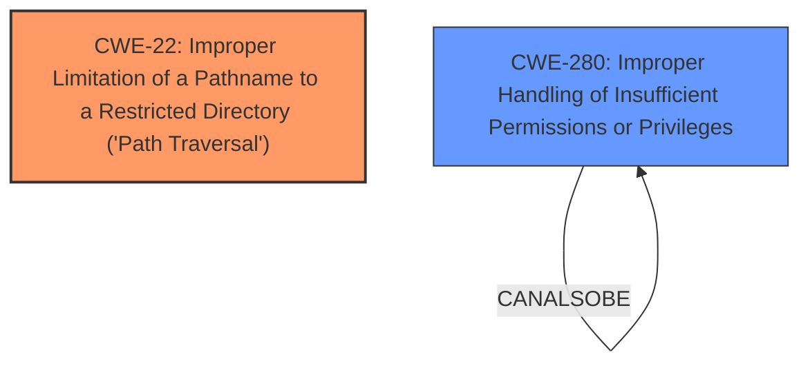

# Enhanced Analysis for CVE-2025-46619

# Summary
| CWE ID | CWE Name | Confidence | CWE Abstraction Level | CWE Vulnerability Mapping Label | CWE-Vulnerability Mapping Notes |
|---|---|---|---|---|---|
| CWE-22 | Improper Limitation of a Pathname to a Restricted Directory ('Path Traversal') | 1.0 | Base | Allowed | Primary CWE - Root Cause |
| CWE-280 | Improper Handling of Insufficient Permissions or Privileges | 0.6 | Base | Allowed | Secondary Candidate |

## Evidence and Confidence

*   **Confidence Score:** 0.8
*   **Evidence Strength:** MEDIUM

## Relationship Analysis
The primary CWE selected is CWE-22, which represents the root cause of the vulnerability: a path traversal issue. This is a Base level CWE, providing a good level of specificity. While several other CWEs were considered, especially those related to privilege management and authorization, they were deemed less relevant as they describe the impact or a higher-level categorization rather than the root cause of the vulnerability.



## Vulnerability Chain
The vulnerability chain starts with **Improper Limitation of a Pathname to a Restricted Directory ('Path Traversal')** (CWE-22) due to which there's **unauthorized access to sensitive files**. Depending on the privileges, this can further lead to access to highly sensitive files. **Improper Handling of Insufficient Permissions or Privileges** (CWE-280) could be a secondary contributing factor or a consequence, as the system may not properly handle the situation when it encounters a file that requires higher privileges, leading to unexpected code paths.

## Summary of Analysis
The primary assessment is based on the provided evidence, specifically the vulnerability description which explicitly states that the issue could allow unauthorized access to sensitive files like `/etc/passwd` or `/etc/shadow`. The CVE reference summary also mentions "Local File Inclusion Vulnerability". This clearly points towards a path traversal issue, making CWE-22 the most appropriate primary classification.

The retriever results listed CWE-732 (Incorrect Permission Assignment for Critical Resource), CWE-798 (Use of Hard-coded Credentials) and CWE-259 (Use of Hard-coded Password) as possible candidates, but these do not directly address the root cause of the path traversal vulnerability. The issue stems from a failure to properly restrict the path, not necessarily from incorrect permission assignments on resources or the use of hardcoded credentials.

CWE-280 (Improper Handling of Insufficient Permissions or Privileges) was considered as a secondary CWE because the vulnerability description mentions that "Depending on the level of privileges, this vulnerability may grant access". This suggests that the system might not be correctly handling situations where the user has insufficient privileges to access the targeted files. However, the primary issue is the path traversal, so CWE-22 remains the primary classification.

The selected CWEs are at the optimal level of specificity because CWE-22 is a Base level CWE that directly describes the **root cause** of the vulnerability, while CWE-280 potentially describes a secondary aspect of the vulnerability related to privilege handling.

Relevant CWE Information:

# Enhanced Context (25 CWEs)
The following CWEs were identified as potentially relevant to this vulnerability:

## CWE-22: Improper Limitation of a Pathname to a Restricted Directory ('Path Traversal')
**Abstraction Level**: base
**Similarity Score**: 3.30
**Source**: graph

**Description**:
CWE-22: Improper Limitation of a Pathname to a Restricted Directory ('Path Traversal')

**Mapping Guidance**:
- Usage: Allowed
- Rationale: This CWE entry is at the Base level of abstraction, which is a preferred level of abstraction for mapping to the root causes of vulnerabilities.

**Relationships**:
- CANFOLLOW -> CWE-73
- PARENTOF -> CWE-36
- PARENTOF -> CWE-23
- CANFOLLOW -> CWE-20
- CANFOLLOW -> CWE-172

## CWE-280: Improper Handling of Insufficient Permissions or Privileges 
**Abstraction Level**: Base
**Similarity Score**: 2.49
**Source**: graph

**Description**:
The product does not handle or incorrectly handles when it has insufficient privileges to access resources or functionality as specified by their permissions. This may cause it to follow unexpected code paths that may leave the product in an invalid state.

**Mapping Guidance**:
- Usage: Allowed
- Rationale: This CWE entry is at the Base level of abstraction, which is a preferred level of abstraction for mapping to the root causes of vulnerabilities.

**Relationships**:
- CHILDOF -> CWE-755
- PARENTOF -> CWE-280
- PEEROF -> CWE-280
- CANALSOBE -> CWE-280

## CWE-22: Improper Limitation of a Pathname to a Restricted Directory ('Path Traversal')
The vulnerability allows unauthorized access to sensitive files by **improperly limiting pathnames**, fitting the description of CWE-22. This could allow attackers to bypass intended restrictions and access sensitive files.

## CWE-280: Improper Handling of Insufficient Permissions or Privileges
The vulnerability mentions that depending on the privilege level, access can be granted. This suggests that even if a user shouldn't have access, the system may not properly prevent it.

### Rejected CWEs:

*   **CWE-732 (Incorrect Permission Assignment for Critical Resource):** While the vulnerability results in unauthorized access, the root cause is not necessarily an incorrect permission assignment but rather the path traversal issue itself.
*   **CWE-798 (Use of Hard-coded Credentials) and CWE-259 (Use of Hard-coded Password):** There is no evidence to suggest that hard-coded credentials are involved in this vulnerability.
*   **CWE-497 (Exposure of Sensitive System Information to an Unauthorized Control Sphere):** This CWE is related to the exposure of sensitive system information, but the primary issue here is the path traversal that leads to unauthorized file access.
*   **CWE-306 (Missing Authentication for Critical Function):** The description doesn't indicate missing authentication as the root cause.
*   **CWE-284 (Improper Access Control):** This is a higher-level category and less specific than CWE-22.
*   **CWE-922 (Insecure Storage of Sensitive Information):** There is no indication that sensitive information is being stored insecurely.
*   **CWE-321 (Use of Hard-coded Cryptographic Key):** This is not relevant to the vulnerability description.


## CWE Relationship Analysis

Current CWEs represent these abstraction levels: .


### Vulnerability Chain Analysis

**Chain starting from CWE-321:**
- 321 (Use of Hard-coded Cryptographic Key) - ROOT


**Chain starting from CWE-280:**
- 280 (Improper Handling of Insufficient Permissions or Privileges ) - ROOT


### CWE Relationship Diagram

```mermaid
graph TD
    classDef primary fill:#f96,stroke:#333,stroke-width:2px
    classDef secondary fill:#69f,stroke:#333
    classDef tertiary fill:#9e9,stroke:#333
```