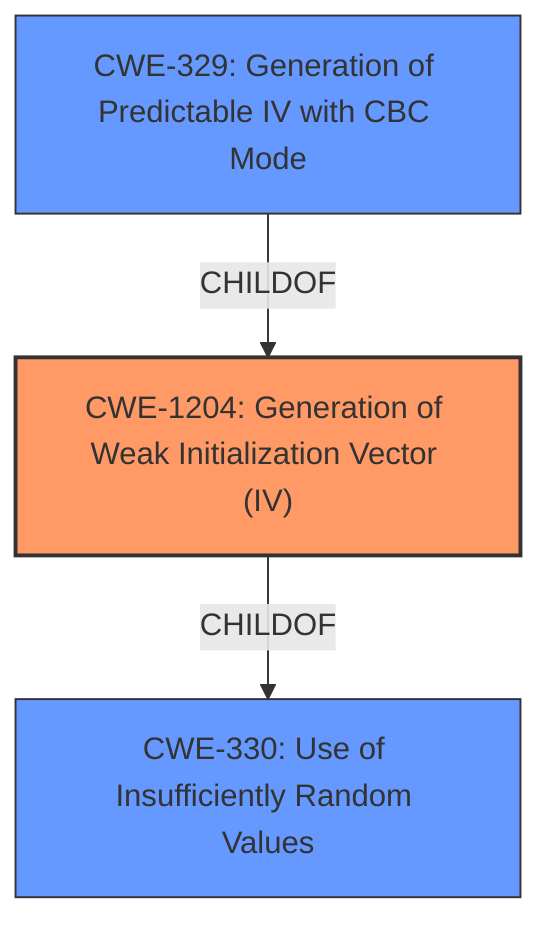

# Raw Analyzer Response for CVE-2025-46632

# Summary
| CWE ID | CWE Name | Confidence | CWE Abstraction Level | CWE Vulnerability Mapping Label | CWE-Vulnerability Mapping Notes |
|---|---|---|---|---|---|
| CWE-1204 | Generation of Weak Initialization Vector (IV) | 0.9 | Base | Allowed | Primary CWE. The **Initialization vector (IV) reuse** is the root cause. |

## Evidence and Confidence

*   **Confidence Score:** 0.9
*   **Evidence Strength:** HIGH

## Relationship Analysis
The primary relationship that impacted my decision was the parent-child relationship between CWE-1204 and its parent classes. However, the provided description is specific enough to warrant the selection of the base CWE-1204 itself.

## Vulnerability Chain
The vulnerability chain starts with the **Initialization vector (IV) reuse**, leading to the ability for an **attacker** to **discern information about or more easily decrypt encrypted messages between client and server**.

## Summary of Analysis
The analysis indicates a high confidence in assigning CWE-1204 as the primary CWE. The **root cause** of the vulnerability is the **Initialization vector (IV) reuse**. This directly leads to the impact of an attacker being able to discern information or decrypt messages.

The evidence supporting this decision is the "Vulnerability Description Key Phrases" which pinpoint "**Initialization vector (IV) reuse**" as the **rootcause**.

The retriever results also support this selection, with CWE-1204 having the highest score.

The CWE is at the optimal level of specificity because it directly describes the **root cause** of the vulnerability.

Relevant CWE Information:

# Enhanced Context (25 CWEs)
The following CWEs were identified as potentially relevant to this vulnerability:

## CWE-1204: Generation of Weak Initialization Vector (IV)
**Abstraction Level**: Base
**Similarity Score**: 0.78
**Source**: dense

**Description**:
The product uses a cryptographic primitive that uses an Initialization
			Vector (IV), but the product does not generate IVs that are
			sufficiently unpredictable or unique according to the expected
			cryptographic requirements for that primitive.
			

**Mapping Guidance**:
- Usage: Allowed
- Rationale: This CWE entry is at the Base level of abstraction, which is a preferred level of abstraction for mapping to the root causes of vulnerabilities.

**Technical Explanation:**

CWE-1204 (Generation of Weak Initialization Vector (IV)): This CWE describes a vulnerability where a cryptographic primitive uses an Initialization Vector (IV), but the IVs generated are not sufficiently unpredictable or unique, failing to meet the expected cryptographic requirements.

*   **Match:** The vulnerability description states "**Initialization vector (IV) reuse**", which directly aligns with CWE-1204.
*   **Security Implications:** An attacker can potentially discern information about or more easily decrypt encrypted messages between client and server.
*   **Relationships:** CWE-1204 is a Base level CWE.
*   **Mapping Guidance:** The usage is ALLOWED, and the rationale supports using Base level CWEs for root causes.
*   **Final Conclusion:** CWE-1204 is the most appropriate CWE as it directly reflects the **root cause** described in the vulnerability: **Initialization vector (IV) reuse**.