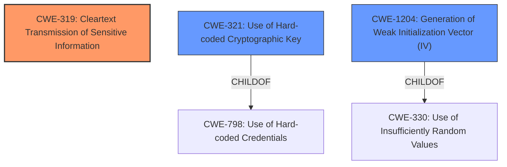

# Analysis Report for CVE-2025-46633

# Vulnerability Analysis Report: CVE-2025-46633

## Description

Cleartext transmission of sensitive information in the web management portal of the Tenda RX2 Pro 16.03.30.14 allows an attacker to decrypt traffic between the client and server by collecting the symmetric AES key from collected and/or observed traffic. The AES key in sent in cleartext in response to successful authentication. The IV is always EU5H62G9ICGRNI43.

## Vulnerability Description Key Phrases

- **Weakness:** cleartext transmission of sensitive information
- **Impact:** decrypt traffic
- **Attacker:** attacker
- **Product:** Tenda RX2 Pro
- **Version:** 16.03.30.14
- **Component:** web management portal

## Analysis (with Relationship Data)

# Summary
| CWE ID | CWE Name | Confidence | CWE Abstraction Level | CWE Vulnerability Mapping Label | CWE-Vulnerability Mapping Notes |
|---|---|---|---|---|---|
| CWE-319 | Cleartext Transmission of Sensitive Information | 1.0 | Base | Allowed | Primary CWE |
| CWE-321 | Use of Hard-coded Cryptographic Key | 0.7 | Variant | Allowed | Secondary Candidate |
| CWE-1204 | Generation of Weak Initialization Vector (IV) | 0.6 | Base | Allowed | Secondary Candidate |

## Evidence and Confidence

*   **Confidence Score:** 0.8
*   **Evidence Strength:** MEDIUM

## Relationship Analysis
The primary CWE is CWE-319, which directly addresses the **cleartext transmission of sensitive information**. CWE-321 and CWE-1204 are related because the use of a hard-coded cryptographic key and a weak IV contribute to the overall weakness of the encryption. The relationship is hierarchical, with CWE-321 being a variant of CWE-798 (Use of Hard-coded Credentials). CWE-1204 is related to CWE-330 (Use of Insufficiently Random Values).



## Vulnerability Chain
The vulnerability chain starts with the **cleartext transmission of the AES key**, which allows an attacker to **decrypt traffic**. The use of a hard-coded key (CWE-321) and a weak IV (CWE-1204) exacerbate the issue.

## Summary of Analysis
The primary weakness is the **cleartext transmission of sensitive information** (CWE-319), which is the root cause of the vulnerability. The use of a hard-coded key (CWE-321) and a weak IV (CWE-1204) contribute to the overall weakness but are not the primary cause. The selection of CWE-319 is based on the vulnerability description, which explicitly states that the AES key is sent in cleartext. The graph relationships helped identify related weaknesses, such as CWE-321 and CWE-1204, which are secondary candidates. The selected CWEs are at the optimal level of specificity, as they accurately represent the weaknesses described in the vulnerability description.

Relevant CWE Information:

**CWE-319: Cleartext Transmission of Sensitive Information**
The product transmits sensitive or security-critical data in cleartext in a communication channel that can be sniffed by unauthorized actors. The vulnerability description explicitly states "**The AES key in sent in cleartext in response to successful authentication**"

**CWE-321: Use of Hard-coded Cryptographic Key**
The product uses a cryptographic key that is hard-coded, which can be easily obtained by an attacker. While not explicitly stated, the context suggests that the symmetric AES key is hard-coded.

**CWE-1204: Generation of Weak Initialization Vector (IV)**
The product uses a weak initialization vector (IV) for encryption, which can make it easier for an attacker to decrypt the data. The vulnerability description states "**The IV is always EU5H62G9ICGRNI43**."

CWEs Considered but Not Used:

*   CWE-311: Missing Encryption of Sensitive Data - While related, the vulnerability description specifies that encryption *is* used, but the key is transmitted in cleartext, making CWE-319 a more accurate fit.
*   CWE-614: Sensitive Cookie in HTTPS Session Without 'Secure' Attribute - While relevant to the transmission of sensitive information, it specifically relates to cookies. This vulnerability is about the encryption key itself.
*   CWE-327: Use of a Broken or Risky Cryptographic Algorithm - This is a class-level CWE and less specific than other candidates.
*   CWE-522: Insufficiently Protected Credentials - This is a class-level CWE and does not directly address the transmission of sensitive information in cleartext.
*   CWE-294: Authentication Bypass by Capture-replay - This is not directly applicable, as the vulnerability is not about bypassing authentication.
*   CWE-312: Cleartext Storage of Sensitive Information - This is not applicable, as the vulnerability is about transmission, not storage.
*   CWE-472: External Control of Assumed-Immutable Web Parameter - This is not applicable, as the vulnerability is not about externally controlled parameters.
*   CWE-863: Incorrect Authorization - Not related since the issue is not related to authorization, but rather the transmission of a key.
*   CWE-285: Improper Authorization - Not related since the issue is not related to authorization, but rather the transmission of a key.
*   CWE-306: Missing Authentication for Critical Function - Authentication exists in this case.
*   CWE-1390: Weak Authentication - The authentication is not the main issue, it is what happens after authentication.


## CWE Relationship Analysis

Current CWEs represent these abstraction levels: .


### Vulnerability Chain Analysis

**Chain starting from CWE-1390:**
- 1390 (Weak Authentication) - ROOT


**Chain starting from CWE-321:**
- 321 (Use of Hard-coded Cryptographic Key) - ROOT


### CWE Relationship Diagram

```mermaid
graph TD
    classDef primary fill:#f96,stroke:#333,stroke-width:2px
    classDef secondary fill:#69f,stroke:#333
    classDef tertiary fill:#9e9,stroke:#333
```


*Report generated on 2025-07-15 01:31:54*
