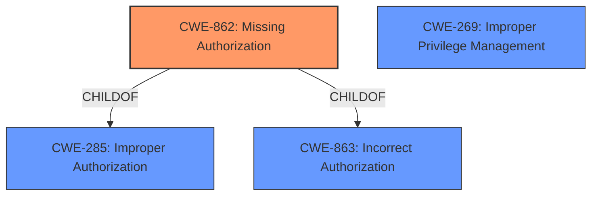

# Enhanced Analysis for CVE-2025-4672

# Summary
| CWE ID    | CWE Name                                     | Confidence | CWE Abstraction Level | CWE Vulnerability Mapping Label | CWE-Vulnerability Mapping Notes |
| :--------- | :------------------------------------------- | :--------- | :-------------------- | :------------------------------ | :------------------------------ |
| CWE-862     | Missing Authorization                        | 0.9        | Class                 | Allowed-with-Review             | Primary CWE                     |
| CWE-269     | Improper Privilege Management                | 0.6        | Class                 | Discouraged                     | Secondary Candidate             |

## Evidence and Confidence

*   **Confidence Score:** 0.9
*   **Evidence Strength:** HIGH

## Relationship Analysis
The primary relationship influencing the CWE selection is that CWE-862 [CWE-862: Missing Authorization] is a child of CWE-285 [CWE-285: Improper Authorization] and CWE-863 [CWE-863: Incorrect Authorization]. The vulnerability description clearly states that there is **improper authorization** but more specifically states that the **permission_callback() function** is missing authorization checks, which is a more specific case of **improper authorization**. CWE-862 provides a more precise classification as the authorization check is missing. CWE-269 [CWE-269: Improper Privilege Management] is related to the impact (Privilege Escalation) of the vulnerability but is not the root cause.



## Vulnerability Chain
The vulnerability chain starts with the **missing authorization** check in the `permission_callback()` function (CWE-862). This allows authenticated attackers with Contributor-level access and above to manipulate user meta, ultimately leading to privilege escalation. The chain can be summarized as follows:

1.  **Root Cause:** CWE-862 - Missing Authorization
2.  **Impact:** Privilege Escalation

## Summary of Analysis
The initial assessment, guided by the vulnerability description and retriever results, pointed towards authorization-related CWEs. The key phrase **"improper authorization"** in the vulnerability description was a strong indicator. The retriever results listed CWE-862 [CWE-862: Missing Authorization], CWE-863 [CWE-863: Incorrect Authorization], and CWE-285 [CWE-285: Improper Authorization] as potential candidates. However, upon closer examination and consideration of the "Authentication vs Authorization vs Access Control Guidance," it became clear that the core issue was a complete lack of authorization checks in the `permission_callback()` function, making CWE-862 the most accurate classification. The relationship analysis further solidified this decision, as CWE-862 is a more specific child of the broader CWE-285. CWE-269 [CWE-269: Improper Privilege Management] was considered due to the privilege escalation impact, but it was determined to be a secondary effect rather than the primary cause. The final selection of CWE-862 is based on the evidence that the `permission_callback()` function entirely **misses authorization**, allowing unauthorized access to sensitive user meta.

The evidence supporting this decision is the vulnerability description stating that the Offsprout Page Builder plugin is vulnerable to Privilege Escalation due to **improper authorization** placed on the permission_callback() function. This makes it possible for authenticated attackers to read, create, update or delete any user meta, including flipping their own wp_capabilities to administrator and fully escalate their privileges.


## CWE Relationship Analysis

Current CWEs represent these abstraction levels: .


### Vulnerability Chain Analysis

**Chain starting from CWE-863:**
- 863 (Incorrect Authorization) - ROOT


**Chain starting from CWE-269:**
- 269 (Improper Privilege Management) - ROOT


### CWE Relationship Diagram

```mermaid
graph TD
    classDef primary fill:#f96,stroke:#333,stroke-width:2px
    classDef secondary fill:#69f,stroke:#333
    classDef tertiary fill:#9e9,stroke:#333
```