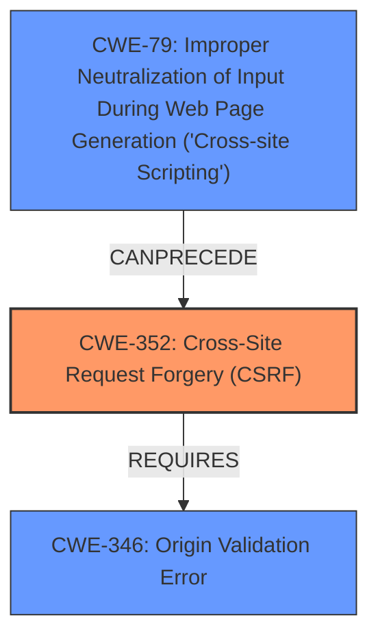

# Analysis Report for CVE-2025-46721

# Vulnerability Analysis Report: CVE-2025-46721

## Description

nosurf is cross-site request forgery (CSRF) protection middleware for Go. A vulnerability in versions prior to 1.2.0 allows an attacker who controls content on the target site, or on a subdomain of the target site (either via **XSS**, or otherwise) to **bypass CSRF checks** and issue requests on users behalf. Due to misuse of the Go `net/http` library, nosurf categorizes all incoming requests as plain-text HTTP requests, in which case the `Referer` header is not checked to have the same origin as the target webpage. If the attacker has control over HTML contents on either the target website (e.g. `example.com`), or on a website hosted on a subdomain of the target (e.g. `attacker.example.com`), they will also be able to manipulate cookies set for the target website. By acquiring the secret CSRF token from the cookie, or overriding the cookie with a new token known to the attacker, `attacker.example.com` is able to craft cross-site requests to `example.com`. A patch for the issue was released in nosurf 1.2.0. In lieu of upgrading to a patched version of nosurf, users may additionally use another HTTP middleware to ensure that a non-safe HTTP request is coming from the same origin (e.g. by requiring a `Sec-Fetch-Site same-origin` header in the request).

## Vulnerability Description Key Phrases

- **Rootcause:** misuse of the Go net/http library
- **Weakness:** ['bypass CSRF checks', 'XSS']
- **Impact:** ['bypass CSRF checks', 'manipulate cookies']
- **Product:** nosurf
- **Version:** prior to 1.2.0

## Analysis (with Relationship Data)

# Summary
| CWE ID  | CWE Name                                                                    | Confidence | CWE Abstraction Level | CWE Vulnerability Mapping Label | CWE-Vulnerability Mapping Notes |
| :-------- | :-------------------------------------------------------------------------- | :--------- | :-------------------- | :------------------------------ | :------------------------------ |
| CWE-352   | Cross-Site Request Forgery (CSRF)                                         | 0.9        | Compound              | Primary                         | Allowed                         |
| CWE-79    | Improper Neutralization of Input During Web Page Generation ('Cross-site Scripting') | 0.7        | Base                  | Secondary                       | Allowed                         |

## Evidence and Confidence

*   **Confidence Score:** 0.8
*   **Evidence Strength:** HIGH

## Relationship Analysis

The primary CWE, CWE-352 [Cross-Site Request Forgery (CSRF)], is a compound weakness. The vulnerability description clearly indicates a **bypass of CSRF checks**, making it the most relevant classification. The secondary CWE, CWE-79 [Improper Neutralization of Input During Web Page Generation ('Cross-site Scripting')], is related because **XSS** can be used to exploit CSRF. There is also a dependency between CWE-352 and CWE-346 [Origin Validation Error] due to the improper origin validation, which could lead to CSRF.



## Vulnerability Chain

The vulnerability chain begins with a **misuse of the Go `net/http` library**, leading to the categorization of all incoming requests as plain-text HTTP requests. This leads to the **bypass of CSRF checks**. An attacker leverages **XSS** or control over a subdomain to **manipulate cookies** and craft cross-site requests. The final impact is the ability to **bypass CSRF checks** and issue requests on users' behalf.

**Root Cause:** Misuse of the Go `net/http` library
**Weakness 1:** **Bypass CSRF checks** due to improper request categorization
**Weakness 2:** Leveraging **XSS** or subdomain control to **manipulate cookies**.
**Impact:** Issuing requests on behalf of users.

## Summary of Analysis

The primary classification is CWE-352 [Cross-Site Request Forgery (CSRF)] due to the explicit mention of **bypassing CSRF checks**. This aligns directly with the definition of CWE-352, which involves insufficient verification of the request's origin. The vulnerability description states, "A vulnerability in versions prior to 1.2.0 allows an attacker who controls content on the target site, or on a subdomain of the target site (either via **XSS**, or otherwise) to **bypass CSRF checks** and issue requests on users behalf."

CWE-79 [Improper Neutralization of Input During Web Page Generation ('Cross-site Scripting')] is considered a secondary weakness because **XSS** is one of the methods used to exploit the CSRF vulnerability. The description mentions that an attacker can control content on the target site via **XSS**, which is a prerequisite for exploiting the CSRF vulnerability.

CWE-346 [Origin Validation Error] was considered because the description mentions that the `Referer` header is not checked, and also because CWE-352 REQUIRES CWE-346. However, since there is already a **bypass of CSRF checks**, and **XSS** involved, CWE-346 is not considered.

The selected CWEs are at the optimal level of specificity. CWE-352 is a compound weakness that accurately represents the high-level issue, while CWE-79 captures the method used to facilitate the attack.


## CWE Relationship Analysis

Current CWEs represent these abstraction levels: .


### Vulnerability Chain Analysis

**Chain starting from CWE-352:**
- 352 (Cross-Site Request Forgery (CSRF)) - ROOT


**Chain starting from CWE-79:**
- 79 (Improper Neutralization of Input During Web Page Generation ('Cross-site Scripting')) - ROOT


### CWE Relationship Diagram

```mermaid
graph TD
    classDef primary fill:#f96,stroke:#333,stroke-width:2px
    classDef secondary fill:#69f,stroke:#333
    classDef tertiary fill:#9e9,stroke:#333
```


*Report generated on 2025-07-15 01:34:46*
