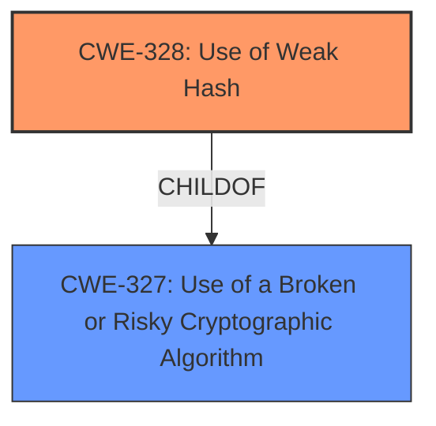

# Analysis for CVE-2025-46722

# Summary
| CWE ID | CWE Name | Confidence | CWE Abstraction Level | CWE Vulnerability Mapping Label | CWE-Vulnerability Mapping Notes |
|---|---|---|---|---|---|
| CWE-328 | Use of Weak Hash | 1.0 | Base | Primary | Allowed |

## Evidence and Confidence

*   **Confidence Score:** 1.0
*   **Evidence Strength:** HIGH

## Relationship Analysis
The primary CWE selected is CWE-328, which is at the Base level of abstraction, which is the preferred level. It has parent CWE-327, a Class, which is less specific.

## Vulnerability Chain
The vulnerability chain starts with the **use of a weak hash** (CWE-328). This leads to **hash collisions**, which then results in incorrect cache hits, data leakage, and security risks.

## Summary of Analysis
The vulnerability lies in the `MultiModalHasher` class, where the image hashing method uses only `obj.tobytes()` which returns the raw pixel data without including metadata. This can lead to **hash collisions**. The key evidence supporting this classification is: "As a result, two images of different sizes (e.g., 30x100 and 100x30) with the same pixel byte sequence could generate the same hash value,".

The Retriever Results listed CWE-328: Use of Weak Hash as the top candidate and it is a Base level CWE, which is the preferred level of abstraction. The alternative top candidates of CWE-407 and CWE-327 are Classes, which are less specific. Therefore, CWE-328 is the most appropriate.

Relevant CWE Information:

# Enhanced Context (25 CWEs)
The following CWEs were identified as potentially relevant to this vulnerability:

## CWE-328: Use of Weak Hash
**Abstraction Level**: Base
**Similarity Score**: 0.73
**Source**: dense

**Description**:
The product uses an algorithm that produces a digest (output value) that does not meet security expectations for a hash function that allows an adversary to reasonably determine the original input (preimage attack), find another input that can produce the same hash (2nd preimage attack), or find multiple inputs that evaluate to the same hash (birthday attack).

**Mapping Guidance**:
- Usage: Allowed
- Rationale: This CWE entry is at the Base level of abstraction, which is a preferred level of abstraction for mapping to the root causes of vulnerabilities.