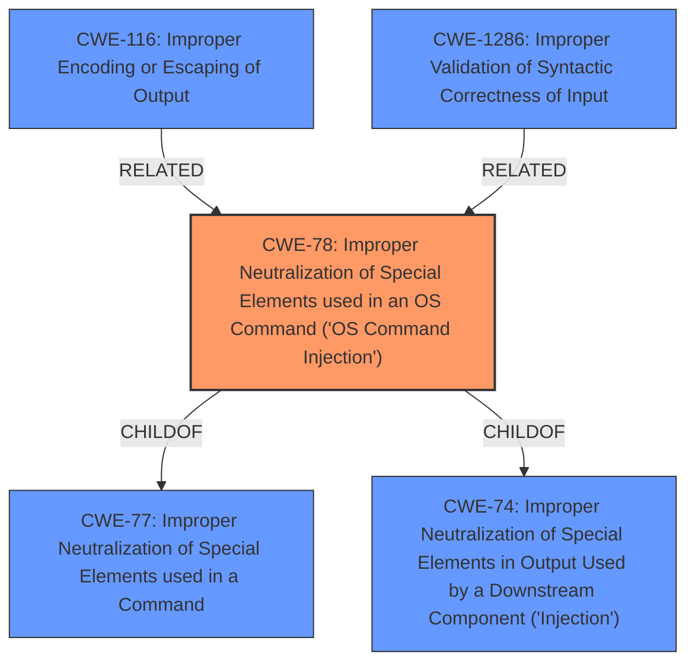

# Raw Analyzer Response for CVE-2025-46735

# Summary
| CWE ID | CWE Name | Confidence | CWE Abstraction Level | CWE Vulnerability Mapping Label | CWE-Vulnerability Mapping Notes |
|---|---|---|---|---|---|
| CWE-78 | Improper Neutralization of Special Elements used in an OS Command ('OS Command Injection') | 1 | Base | Primary | Allowed |
| CWE-116 | Improper Encoding or Escaping of Output | 0.7 | Class | Secondary | Allowed-with-Review |
| CWE-1286 | Improper Validation of Syntactic Correctness of Input | 0.7 | Base | Secondary | Allowed |

## Evidence and Confidence

*   **Confidence Score:** 0.9
*   **Evidence Strength:** HIGH

## Relationship Analysis
The primary weakness is CWE-78, which is a base-level CWE detailing the specific type of injection occurring. CWE-78 is a child of CWE-77 (Improper Neutralization of Special Elements used in a Command), and also a child of CWE-74 (Improper Neutralization of Special Elements in Output Used by a Downstream Component ('Injection')). The relationship shows that this is a specific type of command injection that is caused by **improper neutralization of special elements**. CWE-116 is a Class-level CWE that could contribute to the root cause, by failing to encode or escape the output. CWE-1286 is a base level CWE that could also contribute to the root cause by failing to validate the input.

## Vulnerability Chain
The vulnerability chain starts with the **lack of input sanitization** in the `windns_record` resource. This leads to the possibility of injecting OS commands via crafted input variables. The final impact is authenticated command injection in the underlying PowerShell command prompt.

Root Cause: **Improper input sanitization** (CWE-Other) -> **Improper Neutralization of Special Elements used in an OS Command** (CWE-78) -> Command Injection

## Summary of Analysis
The primary CWE is CWE-78 because the **root cause of the vulnerability** is that the `windns_record` resource **did not sanitize the input variables**, leading to OS Command Injection. This is supported by the "Vulnerability Description Key Phrases" section, which explicitly mentions "**did not sanitize the input variables**". The "CVE Reference Links Content Summary" also supports this by stating: "The `windns_record` resource did not sanitize the input variables" and "Improper input sanitization leading to authenticated command injection in the underlying PowerShell command prompt (CWE-77)".

The retriever results also list CWE-78 as a candidate.

CWE-116 (Improper Encoding or Escaping of Output) and CWE-1286 (Improper Validation of Syntactic Correctness of Input) are included as contributing factors.

The evidence and retriever results strongly support CWE-78 as the primary weakness.

CWEs Considered but Not Used:

*   CWE-77 (Improper Neutralization of Special Elements used in a Command): While mentioned in the CVE summary, CWE-78 is a more specific child of CWE-77 and accurately reflects the OS command injection.
*   CWE-74 (Improper Neutralization of Special Elements in Output Used by a Downstream Component ('Injection')): While a parent of CWE-78, it's a more general "Injection" weakness and less descriptive than CWE-78.
*   CWE-89 (Improper Neutralization of Special Elements used in an SQL Command ('SQL Injection')), CWE-90 (Improper Neutralization of Special Elements used in an LDAP Query ('LDAP Injection')), CWE-93 (Improper Neutralization of CRLF Sequences ('CRLF Injection')): These are all specific types of injection, but they are not relevant to the OS command injection vulnerability described.
*   CWE-94 (Improper Control of Generation of Code ('Code Injection')): This is a more general weakness related to code injection and less specific than the OS command injection described.
*   CWE-201 (Insertion of Sensitive Information Into Sent Data), CWE-212 (Improper Removal of Sensitive Information Before Storage or Transfer), CWE-226 (Sensitive Information in Resource Not Removed Before Reuse), CWE-497 (Exposure of Sensitive System Information to an Unauthorized Control Sphere): These are all related to information exposure and are not relevant to the command injection vulnerability described.
*   CWE-346 (Origin Validation Error), CWE-350 (Reliance on Reverse DNS Resolution for a Security-Critical Action), CWE-863 (Incorrect Authorization), CWE-923 (Improper Restriction of Communication Channel to Intended Endpoints): These relate to authentication and authorization issues, which are not central to this vulnerability.
*   CWE-117 (Improper Output Neutralization for Logs): This relates to logging, which is not relevant to the command injection vulnerability described.
*   CWE-138 (Improper Neutralization of Special Elements): This is a higher-level class that could apply, but CWE-78 is a more specific and accurate base-level CWE.
*   CWE-178 (Improper Handling of Case Sensitivity): Not directly related to the command injection aspect of this vulnerability.