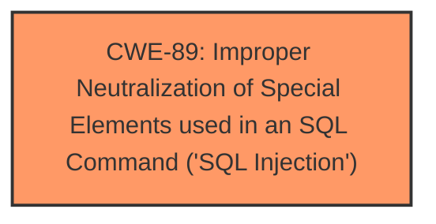

# Analysis Report for CVE-2025-4697

# Vulnerability Analysis Report: CVE-2025-4697

## Description

A vulnerability was found in PHPGurukul Directory Management System 2.0. It has been rated as critical. Affected by this issue is some unknown functionality of the file /admin/edit-directory.php. The manipulation of the argument editid leads to sql injection. The attack may be launched remotely. The exploit has been disclosed to the public and may be used.

## Vulnerability Description Key Phrases

- **Component:** /admin/edit-directory.php
- **Weakness:** sql injection, SQL injection
- **Product:** PHPGurukul Directory Management System
- **Version:** 2

## Analysis (with Relationship Data)

# Summary
| CWE ID | CWE Name | Confidence | CWE Abstraction Level | CWE Vulnerability Mapping Label | CWE-Vulnerability Mapping Notes |
|---|---|---|---|---|---|
| CWE-89 | Improper Neutralization of Special Elements used in an SQL Command ('SQL Injection') | 1.0 | Base | Primary | Allowed |

## Evidence and Confidence

*   **Confidence Score:** 1.0
*   **Evidence Strength:** HIGH

## Relationship Analysis
The primary relationship is that CWE-89 is a base level CWE, representing a specific type of injection vulnerability. No parent-child or chain relationships significantly impacted the decision in this case, as the description clearly points to SQL Injection as the root cause. The abstraction level of Base is appropriate, given the specific nature of the weakness.



## Vulnerability Chain
The vulnerability chain consists of:
1.  **Root Cause:** Improper neutralization of special elements in SQL commands (CWE-89) due to lack of input sanitization.
2.  **Impact:** SQL injection leading to unauthorized database access, data leakage, tampering, or complete system control.

## Summary of Analysis
The initial analysis based on the vulnerability description, key phrases, and CVE reference links content summary strongly suggests CWE-89 as the primary weakness. The vulnerability description explicitly mentions "**sql injection**" and the CVE reference summary confirms that the **root cause** is the lack of proper sanitization of the "editid" parameter, which allows attackers to inject malicious SQL code. The retriever results also ranked CWE-89 as the top match.
The final decision is based on the evidence which clearly points to SQL Injection (CWE-89) as the **root cause** of the vulnerability. The abstraction level is appropriate and specific.

Relevant CWE Information:

# Enhanced Context (25 CWEs)
The following CWEs were identified as potentially relevant to this vulnerability:

## CWE-89: Improper Neutralization of Special Elements used in an SQL Command ('SQL Injection')
**Abstraction Level**: Base
**Similarity Score**: 1.0
**Source**: dense

**Description**:
The product constructs all or part of an SQL command using externally-influenced input from an upstream component, but it does not neutralize or incorrectly neutralizes special elements that could modify the intended SQL command when it is sent to a downstream component. Without sufficient removal or quoting of SQL syntax in user-controllable inputs, the generated SQL query can cause those inputs to be interpreted as SQL instead of ordinary user data.

**Mapping Guidance**:
- Usage: Allowed
- Rationale: This CWE entry is at the Base level of abstraction, which is a preferred level of abstraction for mapping to the root causes of vulnerabilities.

## CWE-79: Improper Neutralization of Input During Web Page Generation ('Cross-site Scripting')
**Abstraction Level**: Base
**Similarity Score**: 0.421
**Source**: sparse

**Description**:
The product does not neutralize or incorrectly neutralizes user-controllable input before it is placed in output that is used as a web page that is served to other users.

**Mapping Guidance**:
- Usage: Allowed
- Rationale: This CWE entry is at the Base level of abstraction, which is a preferred level of abstraction for mapping to the root causes of vulnerabilities.

**Why CWE-79 was not selected:** Although XSS is a common web vulnerability, the vulnerability description specifies SQL Injection.

## CWE-434: Unrestricted Upload of File with Dangerous Type
**Abstraction Level**: Base
**Similarity Score**: 0.371
**Source**: sparse

**Description**:
The product allows the upload or transfer of dangerous file types that are automatically processed within its environment.

**Mapping Guidance**:
- Usage: Allowed
- Rationale: This CWE entry is at the Base level of abstraction, which is a preferred level of abstraction for mapping to the root causes of vulnerabilities.

**Why CWE-434 was not selected:** File uploads are not mentioned in the vulnerability description.

## CWE-1336: Improper Neutralization of Special Elements Used in a Template Engine
**Abstraction Level**: Base
**Similarity Score**: 0.362
**Source**: sparse

**Description**:
The product uses a template engine to insert or process externally-influenced input, but it does not neutralize or incorrectly neutralizes special elements or syntax that can be interpreted as template expressions or other code directives when processed by the engine.

**Mapping Guidance**:
- Usage: Allowed
- Rationale: This CWE entry is at the Base level of abstraction, which is a preferred level of abstraction for mapping to the root causes of vulnerabilities.

**Why CWE-1336 was not selected:** Template engines are not mentioned in the vulnerability description.

## CWE-117: Improper Output Neutralization for Logs
**Abstraction Level**: base
**Similarity Score**: 0.348
**Source**: sparse

**Description**:
CWE-117: Improper Output Neutralization for Logs

**Mapping Guidance**:
- Usage: Allowed
- Rationale: This CWE entry is at the Base level of abstraction, which is a preferred level of abstraction for mapping to the root causes of vulnerabilities.

**Why CWE-117 was not selected:** Logging is not mentioned in the vulnerability description.


## CWE Relationship Analysis

Current CWEs represent these abstraction levels: .


### Vulnerability Chain Analysis

**Chain starting from CWE-89:**
- 89 (Improper Neutralization of Special Elements used in an SQL Command ('SQL Injection')) - ROOT


**Chain starting from CWE-79:**
- 79 (Improper Neutralization of Input During Web Page Generation ('Cross-site Scripting')) - ROOT


### CWE Relationship Diagram

```mermaid
graph TD
    classDef primary fill:#f96,stroke:#333,stroke-width:2px
    classDef secondary fill:#69f,stroke:#333
    classDef tertiary fill:#9e9,stroke:#333
```


*Report generated on 2025-07-15 01:41:22*
