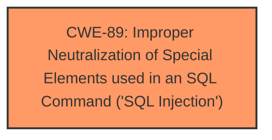

# Analysis Report for CVE-2025-4706

# Vulnerability Analysis Report: CVE-2025-4706

## Description

A vulnerability was found in projectworlds Online Examination System 1.0. It has been declared as critical. This vulnerability affects unknown code of the file /Procedure3b_yearwiseVisit.php. The manipulation of the argument Visit_year leads to **sql injection**. The attack can be initiated remotely. The exploit has been disclosed to the public and may be used.

## Vulnerability Description Key Phrases

- **Weakness:** sql injection
- **Product:** projectworlds Online Examination System
- **Version:** 1.0
- **Component:** /Procedure3b_yearwiseVisit.php

## Analysis (with Relationship Data)

# Summary
| CWE ID | CWE Name | Confidence | CWE Abstraction Level | CWE Vulnerability Mapping Label | CWE-Vulnerability Mapping Notes |
|---|---|---|---|---|---|
| CWE-89 | Improper Neutralization of Special Elements used in an SQL Command ('SQL Injection') | 1.0 | Base | Allowed | Primary CWE |

## Evidence and Confidence

*   **Confidence Score:** 1.0
*   **Evidence Strength:** HIGH

## Relationship Analysis
The primary relationship impacting the decision is the direct match of the vulnerability description to **CWE-89**'s definition. **CWE-89** is a base-level CWE, making it sufficiently specific. No child CWEs of **CWE-89** are considered because the description doesn't provide enough information to narrow it down further.



## Vulnerability Chain
The vulnerability chain is straightforward:

1.  **Root Cause:** **Improper Neutralization of Special Elements used in an SQL Command ('SQL Injection')** (**CWE-89**) due to the direct use of the 'Visit\_year' parameter in SQL queries without proper sanitization.
2.  **Impact:** Unauthorized database access, sensitive data leakage, data tampering, comprehensive system control, and service interruption.

## Summary of Analysis
The analysis is based on the provided evidence, which clearly indicates an SQL injection vulnerability. The vulnerability description states that the manipulation of the `Visit_year` argument leads to **sql injection**. The CVE reference links content summary further confirms this by stating that the root cause is the injection of malicious code from the `Visit_year` parameter directly into SQL queries without proper cleaning or validation. The mitigations suggested (prepared statements, input validation, minimizing database user permissions) are standard practices for preventing SQL injection.

The selection of **CWE-89** is at the optimal level of specificity because it directly addresses the root cause, which is the **improper neutralization** of special elements used in an SQL command. The retriever results also list **CWE-89** as the top combined result with a score of 1.0.

Relevant CWE Information:

# Enhanced Context (25 CWEs)
The following CWEs were identified as potentially relevant to this vulnerability:

## CWE-89: Improper Neutralization of Special Elements used in an SQL Command ('SQL Injection')
**Abstraction Level**: Base
**Similarity Score**: 0.77
**Source**: dense

**Description**:
The product constructs all or part of an SQL command using externally-influenced input from an upstream component, but it does not neutralize or incorrectly neutralizes special elements that could modify the intended SQL command when it is sent to a downstream component. Without sufficient removal or quoting of SQL syntax in user-controllable inputs, the generated SQL query can cause those inputs to be interpreted as SQL instead of ordinary user data.

**Mapping Guidance**:
- Usage: Allowed
- Rationale: This CWE entry is at the Base level of abstraction, which is a preferred level of abstraction for mapping to the root causes of vulnerabilities.

## CWE-89: Improper Neutralization of Special Elements used in an SQL Command ('SQL Injection')
**Abstraction Level**: Base
**Similarity Score**: 905.79
**Source**: sparse

**Description**:
The product constructs all or part of an SQL command using externally-influenced input from an upstream component, but it does not neutralize or incorrectly neutralizes special elements that could modify the intended SQL command when it is sent to a downstream component. Without sufficient removal or quoting of SQL syntax in user-controllable inputs, the generated SQL query can cause those inputs to be interpreted as SQL instead of ordinary user data.

**Mapping Guidance**:
- Usage: Allowed
- Rationale: This CWE entry is at the Base level of abstraction, which is a preferred level of abstraction for mapping to the root causes of vulnerabilities.

The vulnerability description clearly states that the vulnerability is an SQL injection. The root cause is the **improper neutralization** of special elements in an SQL command. The impact includes unauthorized database access, data leakage, and potential system control. Therefore, **CWE-89** is the most appropriate CWE. Other CWEs were considered but not selected because they don't precisely match the vulnerability. For example, CWE-79 (Cross-site Scripting) is related to web page generation, while CWE-74 (Injection) is a more general case.


## CWE Relationship Analysis

Current CWEs represent these abstraction levels: .


### Vulnerability Chain Analysis

**Chain starting from CWE-89:**
- 89 (Improper Neutralization of Special Elements used in an SQL Command ('SQL Injection')) - ROOT


**Chain starting from CWE-79:**
- 79 (Improper Neutralization of Input During Web Page Generation ('Cross-site Scripting')) - ROOT


### CWE Relationship Diagram

```mermaid
graph TD
    classDef primary fill:#f96,stroke:#333,stroke-width:2px
    classDef secondary fill:#69f,stroke:#333
    classDef tertiary fill:#9e9,stroke:#333
```


*Report generated on 2025-07-15 01:43:55*
