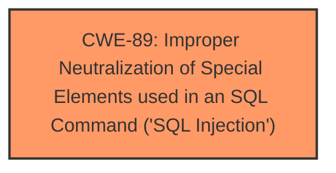

# Raw Analyzer Response for CVE-2025-4707

# Summary

| CWE ID | CWE Name | Confidence | CWE Abstraction Level | CWE Vulnerability Mapping Label | CWE-Vulnerability Mapping Notes |
|---|---|---|---|---|---|
| CWE-89 | Improper Neutralization of Special Elements used in an SQL Command ('SQL Injection') | 1.0 | Base | Allowed | Primary CWE: The vulnerability is a SQL Injection. |

## Evidence and Confidence

*   **Confidence Score:** 1.0
*   **Evidence Strength:** HIGH

## Relationship Analysis
The primary identified weakness is CWE-89, which is a base-level CWE. The retriever results also provided other CWEs like CWE-79, CWE-117, CWE-1336, and CWE-434. However, based on the vulnerability description and the provided CVE reference links content summary, the root cause is clearly a failure to neutralize special elements in an SQL command. Therefore, CWE-89 is the most accurate and specific representation of the vulnerability.

## Vulnerability Chain
The vulnerability chain starts with the **improper neutralization** of the 'prod_name' argument, which leads to **SQL injection**. This allows attackers to manipulate SQL queries, potentially leading to unauthorized database access, data leakage, data tampering, system control, or service interruption.

## Summary of Analysis
The initial analysis, based on the vulnerability description and the CVE reference links content summary, pointed strongly towards CWE-89 as the primary weakness. The vulnerability description key phrases explicitly mention "**sql injection**," and the CVE reference links content summary confirms that the **root cause** is the **lack of proper cleaning or validation** of the 'prod_name' parameter before using it in SQL queries. The provided evidence is: "The reason for this issue is that attackers inject malicious code from the parameter 'prod\_name' and use it directly in SQL queries **without the need for appropriate cleaning or validation**." The suggested mitigations, such as using prepared statements and input validation, further support the classification as CWE-89.

Other CWEs, such as CWE-79 (Cross-site Scripting), CWE-117 (Improper Output Neutralization for Logs), CWE-1336 (Improper Neutralization of Special Elements Used in a Template Engine), and CWE-434 (Unrestricted Upload of File with Dangerous Type), were considered but ultimately deemed less relevant because they did not directly address the **root cause** of the vulnerability.

The final decision to classify the vulnerability as CWE-89 is based on the explicit mention of SQL injection in the vulnerability description, the confirmation of this weakness in the CVE reference links content summary, and the alignment of the suggested mitigations with SQL injection vulnerabilities. The evidence is strong, and the classification is at the optimal level of specificity (Base).