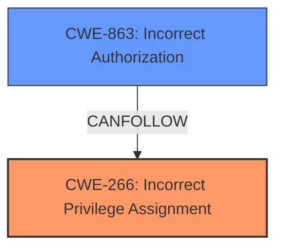

# Analysis for CVE-2025-47282

# Summary
| CWE ID | CWE Name | Confidence | CWE Abstraction Level | CWE Vulnerability Mapping Label | CWE-Vulnerability Mapping Notes |
|---|---|---|---|---|---|
| CWE-266 | Incorrect Privilege Assignment | 0.8 | Base | Allowed | Primary CWE. The root cause is the **incorrect assignment of privileges** that allows a user with admin privileges for a Gardener project or shoot cluster to obtain control over the seed cluster. |
| CWE-863 | Incorrect Authorization | 0.6 | Class | Allowed-with-Review | Secondary CWE. The **incorrect authorization** allows a user with administrative privileges for a Gardener project or a shoot cluster to obtain control over the seed cluster. |

## Evidence and Confidence

*   **Confidence Score:** 0.7
*   **Evidence Strength:** MEDIUM

## Relationship Analysis
The primary CWE is CWE-266, which represents the root cause of the vulnerability: the incorrect assignment of privileges. CWE-863 (Incorrect Authorization) is related as a consequence or contributing factor, as the **incorrect authorization** check allows the privilege escalation to occur. While CWE-863 is a Class-level CWE, it's included to highlight the authorization aspect of the vulnerability.

## Vulnerability Chain
The vulnerability chain starts with the **incorrect privilege assignment** (CWE-266). This leads to **incorrect authorization** (CWE-863), enabling a user with administrative privileges for a Gardener project or shoot cluster to gain control over the seed cluster.

## Summary of Analysis
The analysis is based on the provided evidence, specifically the CVE description and the analysis of CVE-2025-47282 content. The key phrase "user with administrative privileges for a Gardener project or a shoot cluster...obtain control over the seed cluster" strongly indicates a privilege management issue. The analysis of CVE-2025-47282 mentions "A malicious Google credential in a DNS secret can lead to privilege escalation," which further supports the privilege-related nature of the vulnerability.

The selection of CWE-266 is based on the guidance that highlights its relevance to scenarios where a user is assigned incorrect privileges due to misconfiguration or faulty logic. The provided guidance explicitly states: “A user created with the ‘guest’ role was assigned admin privileges due to a logic flaw.” In this case, a user with administrative privileges for a Gardener project is incorrectly granted control over the seed cluster.

CWE-863 is included as a secondary CWE because the vulnerability involves an **authorization** check that is performed incorrectly, leading to the privilege escalation.

The selected CWEs are at the optimal level of specificity because they directly address the root cause (**incorrect privilege assignment**) and a contributing factor (**incorrect authorization**). While higher-level CWEs like CWE-269 (Improper Privilege Management) could be considered, they are too generic and don't capture the specific nature of the vulnerability as effectively as CWE-266 and CWE-863.

Relevant CWE Information:

*   **CWE-266: Incorrect Privilege Assignment**: This aligns directly with the scenario described in the vulnerability, where a user with administrative privileges for a Gardener project or shoot cluster gains unauthorized control over the seed cluster. This is a Base level CWE, which is the preferred level.
*   **CWE-863: Incorrect Authorization**: This is relevant because the **incorrect assignment of privileges** leads to flawed authorization checks, allowing the user to perform actions they should not be authorized to perform. This is a Class level CWE, and might have more specific children that would be more appropriate.
*   **CWE-269: Improper Privilege Management**: While this CWE is related, it is too general and does not capture the specific root cause of the vulnerability as precisely as CWE-266. Also, CWE-269 is discouraged for use.
*   **CWE-285: Improper Authorization**: Similar to CWE-863, but less specific. CWE-863 is a better fit because it directly addresses the **incorrectness** of the authorization. Also, CWE-285 is discouraged for use.
*   **CWE-306: Missing Authentication for Critical Function**: This is not the primary issue, as the vulnerability focuses on privilege escalation due to **incorrect privilege assignment**, not a complete lack of authentication.
*   **CWE-923: Improper Restriction of Communication Channel to Intended Endpoints**: This is not directly related to the core issue of **privilege misassignment**.