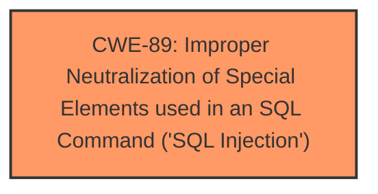

# Analysis for CVE-2025-4734

# Summary

| CWE ID  | CWE Name                                                                    | Confidence | CWE Abstraction Level | CWE Vulnerability Mapping Label | CWE-Vulnerability Mapping Notes |
|---------|-----------------------------------------------------------------------------|------------|-----------------------|---------------------------------|---------------------------------|
| CWE-89  | Improper Neutralization of Special Elements used in an SQL Command ('SQL Injection') | 1.0        | Base                  | Primary                           | Allowed                         |

## Evidence and Confidence

*   **Confidence Score:** 1.0
*   **Evidence Strength:** HIGH

## Relationship Analysis
The primary relationship influencing the decision is the direct match of the vulnerability description to CWE-89, which is a Base level CWE. There aren't other child or parent relationships that would cause me to choose a different CWE.

## Vulnerability Chain
The vulnerability chain starts with the **improper neutralization** of input, which leads to SQL injection.

## Summary of Analysis
The vulnerability description clearly states that the manipulation of the argument `id/name` leads to **sql injection** in `Campcodes Sales and Inventory System 1.0`. The CVE reference links content summary confirms that the **root cause** of the vulnerability is that attackers can inject malicious code from the parameter `name` and use it directly in SQL queries without appropriate cleaning or validation. The description provided aligns perfectly with CWE-89. The retriever results also identified CWE-89 as the top candidate.

Relevant CWE Information:

# Enhanced Context (25 CWEs)
The following CWEs were identified as potentially relevant to this vulnerability:

## CWE-89: Improper Neutralization of Special Elements used in an SQL Command ('SQL Injection')
**Abstraction Level**: Base
**Similarity Score**: 0.79
**Source**: dense

**Description**:
The product constructs all or part of an SQL command using externally-influenced input from an upstream component, but it does not neutralize or incorrectly neutralizes special elements that could modify the intended SQL command when it is sent to a downstream component. Without sufficient removal or quoting of SQL syntax in user-controllable inputs, the generated SQL query can cause those inputs to be interpreted as SQL instead of ordinary user data.

**Mapping Guidance**:
- Usage: Allowed
- Rationale: This CWE entry is at the Base level of abstraction, which is a preferred level of abstraction for mapping to the root causes of vulnerabilities.

## Technical Explanation for CWE-89
*   **How the vulnerability's details match the CWE's characteristics:** The vulnerability description states that the **manipulation of the argument id/name leads to sql injection**. The CVE reference links content summary confirms that the **root cause** of the vulnerability is that attackers can inject malicious code from the parameter `name` and use it directly in SQL queries without appropriate cleaning or validation. This directly aligns with the description of CWE-89: "The product constructs all or part of an SQL command using externally-influenced input from an upstream component, but it does not neutralize or incorrectly neutralizes special elements that could modify the intended SQL command."
*   **The security implications and potential impact:** The impact includes unauthorized database access, sensitive data leakage, data tampering, system control, and service interruption.
*   **Any parent-child relationships or chain patterns that influenced your mapping:** None
*   **Whether the weakness is primary or secondary in the vulnerability:** Primary.
*   **How the official MITRE mapping guidance influenced your decision:** The mapping guidance for CWE-89 states "Usage: Allowed" and "Rationale: This CWE entry is at the Base level of abstraction, which is a preferred level of abstraction for mapping to the root causes of vulnerabilities."

### Other CWEs Considered But Not Used
*   CWE-79: Improper Neutralization of Input During Web Page Generation ('Cross-site Scripting'): While there is **improper neutralization**, the issue is specific to SQL commands and not general web page generation.
*   CWE-434: Unrestricted Upload of File with Dangerous Type: Not related to the described vulnerability.
*   CWE-1336: Improper Neutralization of Special Elements Used in a Template Engine: Not related to template engines.
*   CWE-96: Improper Neutralization of Directives in Statically Saved Code ('Static Code Injection'): The issue is with SQL injection, not static code injection.
*   CWE-73: External Control of File Name or Path: Not related to file names or paths.
*   CWE-425: Direct Request ('Forced Browsing'): Not related to authorization issues.