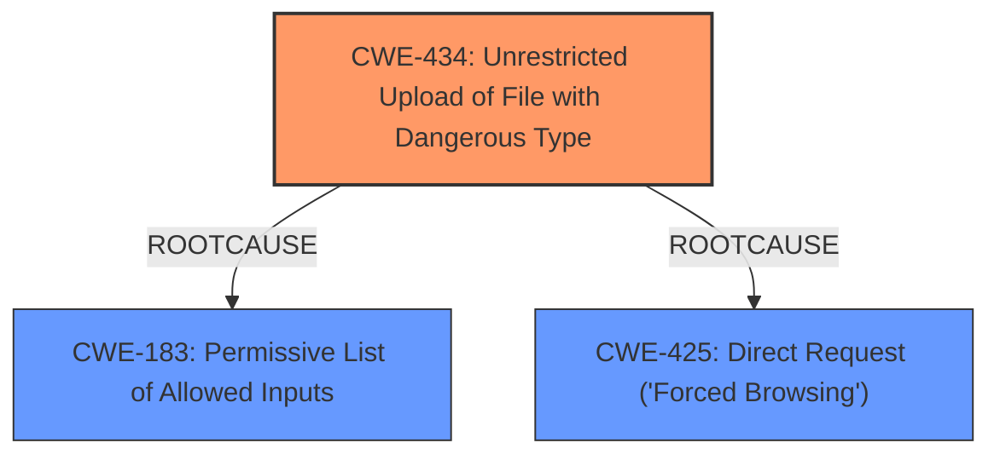

# Analysis Report for CVE-2025-4735

# Vulnerability Analysis Report: CVE-2025-4735

## Description

A vulnerability has been found in Campcodes Sales and Inventory System 1.0 and classified as critical. Affected by this vulnerability is an unknown functionality of the file /pages/product.php. The manipulation of the argument Picture leads to **unrestricted upload**. The attack can be launched remotely. The exploit has been disclosed to the public and may be used.

## Vulnerability Description Key Phrases

- **Weakness:** unrestricted upload
- **Vector:** manipulation of the argument Picture
- **Product:** Campcodes Sales and Inventory System
- **Version:** 1.0
- **Component:** /pages/product.php

## Analysis (with Relationship Data)

# Summary
| CWE ID | CWE Name | Confidence | CWE Abstraction Level | CWE Vulnerability Mapping Label | CWE-Vulnerability Mapping Notes |
|---|---|---|---|---|---|
| CWE-434 | Unrestricted Upload of File with Dangerous Type | 1.0 | Base | Allowed | Primary CWE: The vulnerability allows uploading files without proper restrictions, directly matching the CWE's description. |
| CWE-183 | Permissive List of Allowed Inputs | 0.6 | Base | Allowed | Secondary Candidate: The permissive list of allowed inputs can be a root cause that leads to the **unrestricted upload** |
| CWE-425 | Direct Request ('Forced Browsing') | 0.5 | Base | Allowed | Secondary Candidate: The web application does not adequately enforce appropriate authorization on all restricted URLs, scripts, or files. |

## Evidence and Confidence

*   **Confidence Score:** 0.9
*   **Evidence Strength:** HIGH

## Relationship Analysis
The primary CWE is CWE-434, which directly addresses the **unrestricted upload** vulnerability. CWE-183 and CWE-425 are considered as potential contributing factors.



## Vulnerability Chain
The vulnerability chain starts with the **unrestricted upload** (CWE-434) which may be due to a permissive list of allowed inputs (CWE-183) or missing authentication/authorization checks (CWE-425). The impact is the ability to upload malicious files, potentially leading to remote code execution.

## Summary of Analysis
The primary vulnerability is **unrestricted upload** of files, which is directly mapped to CWE-434. The evidence is strong, as the vulnerability description and the CVE reference links explicitly mention the ability to upload arbitrary files without proper restrictions. CWE-183 and CWE-425 are considered secondary candidates, as they can be contributing factors to the **unrestricted upload**.

*   "Affected by this vulnerability is an unknown functionality of the file /pages/product.php. The manipulation of the argument Picture leads to **unrestricted upload**."
*   "Root cause: Web application doesn't sanitize or filters the being uploaded, making it vulnerable to arbitrary file upload vulnerability"

The selection of CWE-434 is at the optimal level of specificity, as it directly addresses the **unrestricted upload** vulnerability. Other CWEs like CWE-79 and CWE-89 are not relevant, as they focus on different types of vulnerabilities (Cross-Site Scripting and SQL Injection, respectively). CWE-306 (Missing Authentication) and CWE-425 (Direct Request) are considered as possible contributing factors, but are not as direct as CWE-434.


## CWE Relationship Analysis

Current CWEs represent these abstraction levels: .


### Vulnerability Chain Analysis

**Chain starting from CWE-183:**
- 183 (Permissive List of Allowed Inputs) - ROOT


**Chain starting from CWE-89:**
- 89 (Improper Neutralization of Special Elements used in an SQL Command ('SQL Injection')) - ROOT


### CWE Relationship Diagram

```mermaid
graph TD
    classDef primary fill:#f96,stroke:#333,stroke-width:2px
    classDef secondary fill:#69f,stroke:#333
    classDef tertiary fill:#9e9,stroke:#333
```


*Report generated on 2025-07-15 01:57:31*
