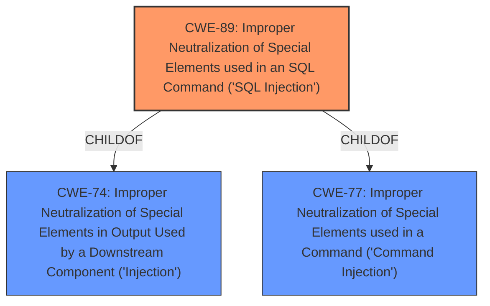

# Analysis Report for CVE-2025-4741

# Vulnerability Analysis Report: CVE-2025-4741

## Description

A vulnerability was found in Campcodes Sales and Inventory System 1.0. It has been rated as critical. This issue affects some unknown processing of the file /pages/purchase_add.php. The manipulation of the argument ID leads to **sql injection**. The attack may be initiated remotely. The exploit has been disclosed to the public and may be used.

## Vulnerability Description Key Phrases

- **Weakness:** sql injection
- **Vector:** argument ID
- **Product:** Campcodes Sales and Inventory System
- **Version:** 1
- **Component:** /pages/purchase_add.php

## Analysis (with Relationship Data)

# Summary
| CWE ID | CWE Name | Confidence | CWE Abstraction Level | CWE Vulnerability Mapping Label | CWE-Vulnerability Mapping Notes |
|---|---|---|---|---|---|
| CWE-89 | Improper Neutralization of Special Elements used in an SQL Command ('SQL Injection') | 1.0 | Base | Allowed | Primary CWE. The **SQL injection** vulnerability is directly caused by **improper neutralization** of special elements in an SQL command. |

## Evidence and Confidence

*   **Confidence Score:** 1.0
*   **Evidence Strength:** HIGH

## Relationship Analysis
The primary identified CWE is CWE-89.

*   CWE-89 is a Base level CWE, which is appropriate as it directly describes the root cause.
*   CWE-89 has parent CWEs like CWE-77: Improper Neutralization of Special Elements used in a Command ('Command Injection') and CWE-74: Improper Neutralization of Special Elements in Output Used by a Downstream Component ('Injection'), but these are less specific and more abstract than CWE-89.



## Vulnerability Chain
The vulnerability chain is straightforward:

1.  The root cause is **improper neutralization** of special elements in an SQL command (CWE-89).
2.  This leads to the execution of unintended SQL queries, potentially resulting in unauthorized data access, data modification, or other malicious actions.

## Summary of Analysis
The analysis is based on the vulnerability description and the CVE reference link content summary. The **SQL injection** vulnerability, caused by **improper neutralization** of the 'id' parameter in '/pages/purchase\_add.php', directly aligns with CWE-89.

*   The vulnerability description clearly states that the manipulation of the 'ID' argument leads to **SQL injection**.
*   The CVE reference link content summary confirms that the root cause is the **lack of proper input cleaning or validation** of the 'id' parameter before using it in SQL queries.
*   The provided payload example further strengthens the evidence for CWE-89.

The retriever results also strongly suggest CWE-89 as the most relevant. I considered other CWEs such as:

*   CWE-79: Improper Neutralization of Input During Web Page Generation ('Cross-site Scripting') - While neutralization is a common theme, this vulnerability isn't directly related to web page generation, making CWE-79 less appropriate.
*   CWE-74: Improper Neutralization of Special Elements in Output Used by a Downstream Component ('Injection') - This is a more general class of weakness that includes CWE-89, but CWE-89 is a better fit since it is more specific.

The selection of CWE-89 is at the optimal level of specificity because it accurately represents the root cause of the vulnerability.


## CWE Relationship Analysis

Current CWEs represent these abstraction levels: .


### Vulnerability Chain Analysis

**Chain starting from CWE-89:**
- 89 (Improper Neutralization of Special Elements used in an SQL Command ('SQL Injection')) - ROOT


**Chain starting from CWE-79:**
- 79 (Improper Neutralization of Input During Web Page Generation ('Cross-site Scripting')) - ROOT


### CWE Relationship Diagram

```mermaid
graph TD
    classDef primary fill:#f96,stroke:#333,stroke-width:2px
    classDef secondary fill:#69f,stroke:#333
    classDef tertiary fill:#9e9,stroke:#333
```


*Report generated on 2025-07-15 01:58:44*
