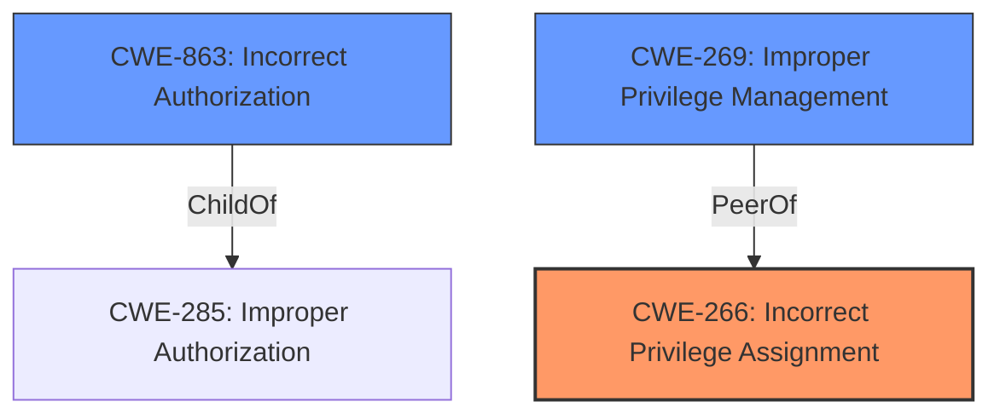

# Analysis for CVE-2025-47420

# Summary

| CWE ID    | CWE Name                                                       | Confidence | CWE Abstraction Level | CWE Vulnerability Mapping Label | CWE-Vulnerability Mapping Notes |
| :-------- | :------------------------------------------------------------- | :--------- | :-------------------- | :------------------------------ | :------------------------------ |
| CWE-266   | Incorrect Privilege Assignment                                 | 0.9        | Base                  | Primary CWE                     | Allowed                       |
| CWE-863   | Incorrect Authorization                                        | 0.7        | Class                 | Secondary Candidate             | Allowed-with-Review           |
| CWE-269   | Improper Privilege Management                                  | 0.6        | Class                 | Secondary Candidate             | Discouraged                    |

## Evidence and Confidence

*   **Confidence Score:** 0.8
*   **Evidence Strength:** MEDIUM

## Relationship Analysis

The primary CWE selected is CWE-266, which is a Base level CWE. The retriever results suggested other Class level CWEs such as CWE-863 and CWE-269. However, the guidance suggests that for privilege escalation scenarios, a more specific root cause should be identified if possible. CWE-266 describes an incorrect assignment of privileges, which aligns with the vulnerability description and is more specific than the Class-level CWEs. CWE-863, while relevant, is more general. CWE-269 is discouraged.

## Vulnerability Chain

The vulnerability chain starts with an **incorrect privilege assignment** (CWE-266), which then leads to **privilege escalation**. The ultimate impact is unauthorized access to resources or functionality.

## Summary of Analysis

The initial assessment, based on the vulnerability description mentioning **privilege escalation**, considered CWE-269 (Improper Privilege Management). However, the MITRE guidance explicitly discourages using CWE-269 as it only describes the technical impact and not the root cause. The release notes mention resolving vulnerabilities related to API permissions. Given this information, and the **weakness** being **privilege escalation**, CWE-266 (Incorrect Privilege Assignment) is the most appropriate primary CWE because the system is assigning privileges incorrectly to actors. CWE-863 is a secondary candidate if the authorization logic is present but flawed. The selection of CWE-266 is at the optimal level of specificity, being a Base level CWE and directly addressing the **root cause** of the **privilege escalation**.

Relevant CWE Information:

# Enhanced Context (25 CWEs)
The following CWEs were identified as potentially relevant to this vulnerability:

## Vulnerability Description
266 vulnerability in Crestron Automate VX allows **Privilege Escalation**.This issue affects Automate VX from 5.6.8161.21536 through 6.4.0.49.

### Vulnerability Description Key Phrases
- **weakness:** **privilege escalation**
- **product:** Crestron Automate VX
- **version:** 5.6.8161.21536 through 6.4.0.49

## CVE Reference Links Content Summary
CVE-2025-47420: PLACEHOLDER - Implement CVE description retrieval

The provided content details updates and release notes for Crestron's Automate VX software. It describes new features, fixed issues, and known issues across multiple versions (6.4.1.8 down to 5.6.8161.21536).

**Relevant Information (from 6.4.1.8 release notes):**

*   **Root cause of vulnerability:** The update addresses vulnerabilities identified as CVE-2025-20819, CVE-2025-20820, and CVE-2025-20821.
*   **Weaknesses/vulnerabilities present:** The release notes mention resolving vulnerabilities related to web configuration interface security (HTTPS connections), overlays on program video output, and API permissions.
*   **Impact of exploitation:** The impact isn't explicitly detailed, but the fixes suggest potential risks related to unauthorized access, information disclosure, or manipulation of system behavior.
*   **Attack vectors:** Not explicitly stated, but the vulnerabilities relate to web interface access and API usage.
*   **Required attacker capabilities/position:** Likely requires network access to the Automate VX system and potentially authenticated access to the web interface or API.
*   **Mitigation or fix:** Updating to Automate VX 6.4.1.8 (or later) is the recommended mitigation. The update enforces HTTPS connections by default, adds overlays for recording/debug mode indication, and addresses API permission issues.  Legacy connection mode can be disabled.