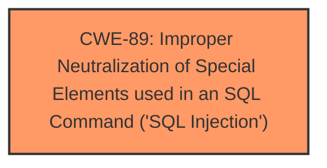

# Analysis Report for CVE-2025-4743

# Vulnerability Analysis Report: CVE-2025-4743

## Description

A vulnerability classified as critical was found in code-projects Employee Record System 1.0. Affected by this vulnerability is an unknown functionality of the file /dashboard/getData.php. The manipulation of the argument keywords leads to **sql injection**. The attack can be launched remotely. The exploit has been disclosed to the public and may be used.

## Vulnerability Description Key Phrases

- **Weakness:** sql injection
- **Vector:** manipulation of keywords
- **Product:** code-projects Employee Record System
- **Version:** 1
- **Component:** /dashboard/getData.php

## Analysis (with Relationship Data)

# Summary
| CWE ID | CWE Name | Confidence | CWE Abstraction Level | CWE Vulnerability Mapping Label | CWE-Vulnerability Mapping Notes |
|---|---|---|---|---|---|
| CWE-89 | Improper Neutralization of Special Elements used in an SQL Command ('SQL Injection') | 1.0 | Base | Allowed | Primary CWE: The vulnerability is explicitly described as an **SQL Injection** vulnerability. |

## Evidence and Confidence

*   **Confidence Score:** 1.0
*   **Evidence Strength:** HIGH

## Relationship Analysis
The primary relationship that influenced my decision was the direct match of the vulnerability description to CWE-89, which is a Base level CWE and thus preferred. No other relationships (parent-child, chain, peer) were deemed relevant enough to warrant consideration of alternative CWEs.



## Vulnerability Chain
The vulnerability chain is straightforward:
1.  The **root cause** is **improper neutralization** of special elements used in an SQL command (CWE-89).
2.  The **impact** is the ability to manipulate SQL queries.

## Summary of Analysis
The vulnerability description explicitly states that the vulnerability is an **SQL Injection** in the `/dashboard/getData.php` file, where manipulation of the `keywords` argument leads to the vulnerability. This directly corresponds to CWE-89 [CWE-89: Improper Neutralization of Special Elements used in an SQL Command ('SQL Injection')]. The retriever results also strongly suggest CWE-89 as the primary candidate. The mapping guidance for CWE-89 indicates that its usage is "Allowed" and it is at the Base level of abstraction.

The other CWEs listed in the retriever results were considered but deemed less relevant. For example, CWE-79 [CWE-79: Improper Neutralization of Input During Web Page Generation ('Cross-site Scripting')] and CWE-434 [CWE-434: Unrestricted Upload of File with Dangerous Type] do not align with the explicit description of the vulnerability as an **SQL Injection**. CWE-74 [CWE-74: Improper Neutralization of Special Elements in Output Used by a Downstream Component ('Injection')] is a class level CWE, so CWE-89 is more specific and is preferred.

Relevant CWE Information:

# Enhanced Context (25 CWEs)
The following CWEs were identified as potentially relevant to this vulnerability:

## CWE-89: Improper Neutralization of Special Elements used in an SQL Command ('SQL Injection')
**Abstraction Level**: Base
**Similarity Score**: 0.78
**Source**: dense

**Description**:
The product constructs all or part of an SQL command using externally-influenced input from an upstream component, but it does not neutralize or incorrectly neutralizes special elements that could modify the intended SQL command when it is sent to a downstream component. Without sufficient removal or quoting of SQL syntax in user-controllable inputs, the generated SQL query can cause those inputs to be interpreted as SQL instead of ordinary user data.

**Mapping Guidance**:
- Usage: Allowed
- Rationale: This CWE entry is at the Base level of abstraction, which is a preferred level of abstraction for mapping to the root causes of vulnerabilities.


## CWE Relationship Analysis

Current CWEs represent these abstraction levels: .


### Vulnerability Chain Analysis

**Chain starting from CWE-89:**
- 89 (Improper Neutralization of Special Elements used in an SQL Command ('SQL Injection')) - ROOT


**Chain starting from CWE-79:**
- 79 (Improper Neutralization of Input During Web Page Generation ('Cross-site Scripting')) - ROOT


### CWE Relationship Diagram

```mermaid
graph TD
    classDef primary fill:#f96,stroke:#333,stroke-width:2px
    classDef secondary fill:#69f,stroke:#333
    classDef tertiary fill:#9e9,stroke:#333
```


*Report generated on 2025-07-15 02:00:39*
