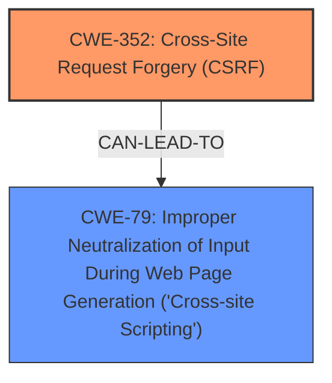

# Analysis Report for CVE-2025-47517

# Vulnerability Analysis Report: CVE-2025-47517

## Description

**Cross-Site Request Forgery** (CSRF) vulnerability in Scott Paterson Accept Donations with PayPal allows Stored XSS. This issue affects Accept Donations with PayPal from n/a through 1.4.5.

## Vulnerability Description Key Phrases

- **Weakness:** Cross-Site Request Forgery
- **Impact:** Stored XSS
- **Product:** Scott Paterson Accept Donations with PayPal
- **Version:** n/a through 1.4.5

## Analysis (with Relationship Data)

# Summary

| CWE ID  | CWE Name                                                                     | Confidence | CWE Abstraction Level | CWE Vulnerability Mapping Label | CWE-Vulnerability Mapping Notes |
| :------- | :--------------------------------------------------------------------------- | :--------- | :-------------------- | :------------------------------ | :------------------------------ |
| CWE-352 | Cross-Site Request Forgery (CSRF)                                          | 1.0        | Compound              | Primary                         | Allowed                       |
| CWE-79  | Improper Neutralization of Input During Web Page Generation ('Cross-site Scripting') | 0.75       | Base                  | Secondary                       | Allowed                       |

## Evidence and Confidence

*   **Confidence Score:** 0.875
*   **Evidence Strength:** MEDIUM

## Relationship Analysis

The primary weakness is CWE-352 [Cross-Site Request Forgery (CSRF)]. The attack can lead to Stored XSS (CWE-79 [Improper Neutralization of Input During Web Page Generation ('Cross-site Scripting')]). Therefore, CWE-79 [Improper Neutralization of Input During Web Page Generation ('Cross-site Scripting')] can be a consequence of a successful CWE-352 [Cross-Site Request Forgery (CSRF)] attack in this scenario.



## Vulnerability Chain

The vulnerability chain starts with a **Cross-Site Request Forgery** (CSRF) **weakness** (CWE-352 [Cross-Site Request Forgery (CSRF)]). An attacker exploits this CSRF to inject malicious input, leading to Stored XSS (CWE-79 [Improper Neutralization of Input During Web Page Generation ('Cross-site Scripting')]). Thus, the chain is CSRF -> Stored XSS.

## Summary of Analysis

The primary **weakness** is **Cross-Site Request Forgery** (CSRF) as stated in the **Vulnerability Description Key Phrases** and the **CVE Reference Links Content Summary**. The vulnerability leads to Stored XSS, making it a secondary concern in the context of the primary **weakness**. The evidence for CSRF as the primary cause is strong, but the link to XSS is less clear.

The description states: "**Cross-Site Request Forgery** (CSRF) vulnerability in Scott Paterson Accept Donations with PayPal allows Stored XSS."

I am selecting CWE-352 [Cross-Site Request Forgery (CSRF)] as the primary weakness because it is the direct vulnerability described. I am including CWE-79 [Improper Neutralization of Input During Web Page Generation ('Cross-site Scripting')] as a secondary weakness because the CSRF **weakness** leads to Stored XSS.

CWE-89 [Improper Neutralization of Special Elements used in an SQL Command ('SQL Injection')], CWE-918 [Server-Side Request Forgery (SSRF)], CWE-434 [Unrestricted Upload of File with Dangerous Type], CWE-1004 [Sensitive Cookie Without 'HttpOnly' Flag], CWE-601 [URL Redirection to Untrusted Site ('Open Redirect')], CWE-116 [Improper Encoding or Escaping of Output], CWE-472 [External Control of Assumed-Immutable Web Parameter], and CWE-73 [External Control of File Name or Path] were considered but not selected. They do not align with the vulnerability description of CSRF leading to Stored XSS.


## CWE Relationship Analysis

Current CWEs represent these abstraction levels: .


### Vulnerability Chain Analysis

**Chain starting from CWE-89:**
- 89 (Improper Neutralization of Special Elements used in an SQL Command ('SQL Injection')) - ROOT


**Chain starting from CWE-116:**
- 116 (Improper Encoding or Escaping of Output) - ROOT


### CWE Relationship Diagram

```mermaid
graph TD
    classDef primary fill:#f96,stroke:#333,stroke-width:2px
    classDef secondary fill:#69f,stroke:#333
    classDef tertiary fill:#9e9,stroke:#333
```


*Report generated on 2025-07-15 02:02:44*
