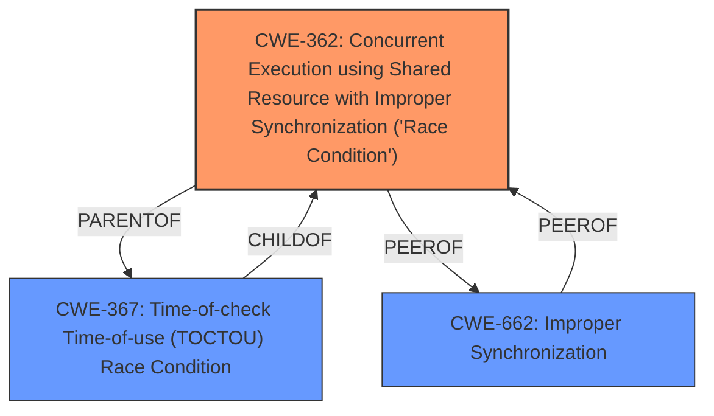

# Raw Analyzer Response for CVE-2025-47545

# Summary
| CWE ID | CWE Name | Confidence | CWE Abstraction Level | CWE Vulnerability Mapping Label | CWE-Vulnerability Mapping Notes |
|---|---|---|---|---|---|
| CWE-362 | Concurrent Execution using Shared Resource with Improper Synchronization ('Race Condition') | 1.0 | Class | Allowed-with-Review | Primary CWE. The product contains a concurrent code sequence that requires temporary, exclusive access to a shared resource, but a timing window exists in which the shared resource can be modified by another code sequence operating concurrently. |
| CWE-367 | Time-of-check Time-of-use (TOCTOU) Race Condition | 0.7 | Base | Allowed | Secondary Candidate. The product checks the state of a resource before using that resource, but the resource's state can change between the check and the use in a way that invalidates the results of the check. |
| CWE-662 | Improper Synchronization | 0.6 | Class | Discouraged | Secondary Candidate. The product utilizes multiple threads or processes to allow temporary access to a shared resource that can only be exclusive to one process at a time, but it does not properly synchronize these actions. |

## Evidence and Confidence

*   **Confidence Score:** 0.8
*   **Evidence Strength:** HIGH

## Relationship Analysis
The primary CWE selected is CWE-362, which is a Class-level CWE. While it's generally preferred to select Base or Variant level CWEs, the provided information doesn't give enough specifics to narrow it down further. CWE-362 has child CWEs like CWE-367 (Time-of-check Time-of-use Race Condition) which could be a better fit if more details were available. CWE-662 (Improper Synchronization) is also related as it's a general case of synchronization issues, and CWE-362 is a specific type of improper synchronization. These peer and hierarchical relationships were considered, but the lack of detail led to keeping the classification at CWE-362 for now.

## Vulnerability Chain
The vulnerability chain starts with the **improper synchronization** of shared resources, leading to a **race condition**. The impact is that an attacker can leverage this **race condition** to potentially manipulate data or control program flow.

## Summary of Analysis
The primary weakness is a **Race Condition** due to **improper synchronization** when accessing shared resources.

The vulnerability description clearly states "Concurrent Execution using Shared Resource with Improper Synchronization (**Race Condition**)". This, coupled with the "Root cause of vulnerability: **Race Condition**" from the CVE Reference Links Content Summary, strongly supports the selection of CWE-362.

CWE-362 is a Class-level CWE, and the mapping guidance suggests that Base-level children might be more appropriate. CWE-367 (Time-of-check Time-of-use Race Condition) is a Base-level child of CWE-362. If we had more information suggesting a TOCTOU vulnerability, CWE-367 would be a better fit. However, without more details, CWE-362 is the most accurate and specific classification possible.

CWE-662 (Improper Synchronization) was considered as a more general case, but the description explicitly mentions a **Race Condition**, making CWE-362 more appropriate.

Relevant CWE Information:

# Enhanced Context (25 CWEs)

## CWE-366: Race Condition within a Thread
**Abstraction Level**: Base
**Similarity Score**: 0.67
**Source**: dense

**Description**:
If two threads of execution use a resource simultaneously, there exists the possibility that resources may be used while invalid, in turn making the state of execution undefined.

**Mapping Guidance**:
- Usage: Allowed
- Rationale: This CWE entry is at the Base level of abstraction, which is a preferred level of abstraction for mapping to the root causes of vulnerabilities.

*Not selected:* This is more specific and requires evidence that the race condition happens within a thread.

## CWE-367: Time-of-check Time-of-use (TOCTOU) Race Condition
**Abstraction Level**: Base
**Similarity Score**: 0.67
**Source**: dense

**Description**:
The product checks the state of a resource before using that resource, but the resource's state can change between the check and the use in a way that invalidates the results of the check. This can cause the product to perform invalid actions when the resource is in an unexpected state.

**Mapping Guidance**:
- Usage: Allowed
- Rationale: This CWE entry is at the Base level of abstraction, which is a preferred level of abstraction for mapping to the root causes of vulnerabilities.

*Candidate, but not selected as primary:* This is a subtype of race condition, but the description doesn't specifically mention a check and then a use, so it might not be accurate.

## CWE-362: Concurrent Execution using Shared Resource with Improper Synchronization ('Race Condition')
**Abstraction Level**: Class
**Similarity Score**: 0.65
**Source**: dense

**Description**:
The product contains a concurrent code sequence that requires temporary, exclusive access to a shared resource, but a timing window exists in which the shared resource can be modified by another code sequence operating concurrently.

**Mapping Guidance**:
- Usage: Allowed-with-Review
- Rationale: This CWE entry is a Class and might have Base-level children that would be more appropriate

*Selected as Primary CWE:* The description clearly mentions "Race Condition" and "Improper Synchronization".

## CWE-368: Context Switching Race Condition
**Abstraction Level**: Base
**Similarity Score**: 0.63
**Source**: dense

**Description**:
A product performs a series of non-atomic actions to switch between contexts that cross privilege or other security boundaries, but a race condition allows an attacker to modify or misrepresent the product's behavior during the switch.

**Mapping Guidance**:
- Usage: Allowed
- Rationale: This CWE entry is at the Base level of abstraction, which is a preferred level of abstraction for mapping to the root causes of vulnerabilities.

*Not selected:* Requires context switching, not in description.

## CWE-363: Race Condition Enabling Link Following
**Abstraction Level**: Base
**Similarity Score**: 0.63
**Source**: dense

**Description**:
The product checks the status of a file or directory before accessing it, which produces a race condition in which the file can be replaced with a link before the access is performed, causing the product to access the wrong file.

**Mapping Guidance**:
- Usage: Allowed
- Rationale: This CWE entry is at the Base level of abstraction, which is a preferred level of abstraction for mapping to the root causes of vulnerabilities.

*Not selected:* Requires link following, not in description.

## CWE-208: Observable Timing Discrepancy
**Abstraction Level**: Base
**Similarity Score**: 0.63
**Source**: dense

**Description**:
Two separate operations in a product require different amounts of time to complete, in a way that is observable to an actor and reveals security-relevant information about the state of the product, such as whether a particular operation was successful or not.

**Mapping Guidance**:
- Usage: Allowed
- Rationale: This CWE entry is at the Base level of abstraction, which is a preferred level of abstraction for mapping to the root causes of vulnerabilities.

*Not selected:* Not about timing discrepancy

## CWE-662: Improper Synchronization
**Abstraction Level**: Class
**Similarity Score**: 0.63
**Source**: dense

**Description**:
The product utilizes multiple threads or processes to allow temporary access to a shared resource that can only be exclusive to one process at a time, but it does not properly synchronize these actions, which might cause simultaneous accesses of this resource by multiple threads or processes.

**Mapping Guidance**:
- Usage: Discouraged
- Rationale: This CWE entry is a level-1 Class (i.e., a child of a Pillar). It might have lower-level children that would be more appropriate

*Secondary Candidate:* This is a more general case and the description is more specific.

## CWE-667: Improper Locking
**Abstraction Level**: Class
**Similarity Score**: 0.62
**Source**: dense

**Description**:
The product does not properly acquire or release a lock on a resource,