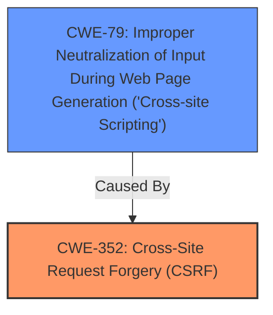

# Analysis for CVE-2025-47685

# Summary
| CWE ID | CWE Name | Confidence | CWE Abstraction Level | CWE Vulnerability Mapping Label | CWE-Vulnerability Mapping Notes |
|---|---|---|---|---|---|
| CWE-352 | Cross-Site Request Forgery (CSRF) | 0.9 | Compound | Primary | Allowed |
| CWE-79 | Improper Neutralization of Input During Web Page Generation ('Cross-site Scripting') | 0.8 | Base | Secondary | Allowed |

## Evidence and Confidence

*   **Confidence Score:** 0.85
*   **Evidence Strength:** HIGH

## Relationship Analysis
The primary weakness is CWE-352 [Cross-Site Request Forgery (CSRF)], which is a compound weakness. The secondary weakness is CWE-79 [Improper Neutralization of Input During Web Page Generation ('Cross-site Scripting')], which is caused by the **lack of CSRF protection**. This relationship indicates that the **lack of CSRF protection** allows for XSS attacks.

## Vulnerability Chain
The vulnerability chain starts with the **lack of CSRF protection** (CWE-352) which allows for Stored **XSS** (CWE-79).

## Summary of Analysis
The primary weakness is the **lack of CSRF protection** (CWE-352). The vulnerability description explicitly mentions "Cross-Site Request Forgery (CSRF) vulnerability" and the "rootcause: **lack of CSRF protection**". This aligns with the definition of CWE-352. The **XSS** (CWE-79) is a secondary weakness that can be exploited due to the **lack of CSRF protection**. The "weakness: **XSS**" and "impact: cross-site scripting" found in the Vulnerability Description Key Phrases also supports the inclusion of CWE-79. The evidence directly supports the selection of CWE-352 as the primary weakness and CWE-79 as a secondary weakness, and both are at the optimal level of specificity.

Relevant CWE Information:

# Enhanced Context (25 CWEs)
The following CWEs were identified as potentially relevant to this vulnerability:

## CWE-79: Improper Neutralization of Input During Web Page Generation ('Cross-site Scripting')
**Abstraction Level**: Base
**Similarity Score**: 0.76
**Source**: dense

**Description**:
The product does not neutralize or incorrectly neutralizes user-controllable input before it is placed in output that is used as a web page that is served to other users.

**Mapping Guidance**:
- Usage: Allowed
- Rationale: This CWE entry is at the Base level of abstraction, which is a preferred level of abstraction for mapping to the root causes of vulnerabilities.

## Technical Explanation for CWE-352
*   **How the vulnerability's details match the CWE's characteristics:** The vulnerability description explicitly mentions "Cross-Site Request Forgery (CSRF) vulnerability" and the "rootcause: **lack of CSRF protection**". This aligns directly with the definition of CWE-352, which involves insufficient verification of whether a request was intentionally provided by the user.
*   **The security implications and potential impact:** A successful CSRF attack can force a user to perform actions they did not intend to, potentially leading to unauthorized access, data modification, or other harmful consequences.
*   **Any parent-child relationships or chain patterns that influenced your mapping:** N/A
*   **Whether the weakness is primary or secondary in the vulnerability:** Primary.
*   **How the official MITRE mapping guidance influenced your decision:** The MITRE mapping guidance allows for the use of CWE-352, even though it is a Compound weakness. The rationale states that it is a well-known composite of multiple weaknesses that must all occur simultaneously.

## Technical Explanation for CWE-79
*   **How the vulnerability's details match the CWE's characteristics:** The **lack of CSRF protection** allows for the exploitation of Stored **XSS**, which means user-controllable input is not properly neutralized before being placed in a web page, as stated by the vulnerability description.
*   **The security implications and potential impact:** **XSS** can lead to arbitrary code execution in the user's browser, session hijacking, or defacement of the website.
*   **Any parent-child relationships or chain patterns that influenced your mapping:** CWE-79 is a consequence of the **lack of CSRF protection** (CWE-352).
*   **Whether the weakness is primary or secondary in the vulnerability:** Secondary.
*   **How the official MITRE mapping guidance influenced your decision:** The MITRE mapping guidance allows for the use of CWE-79, as it is a Base weakness.

## CWEs Considered but Not Used
*   CWE-80: Improper Neutralization of Script-Related HTML Tags in a Web Page (Basic XSS) - Considered but CWE-79 is more general and accurately describes the vulnerability.
*   CWE-434: Unrestricted Upload of File with Dangerous Type - Not applicable as the vulnerability does not involve file uploads.
*   CWE-116: Improper Encoding or Escaping of Output - While encoding issues might be present, the primary cause is **lack of CSRF protection** leading to **XSS**, making CWE-79 a better fit.
*   CWE-601: URL Redirection to Untrusted Site ('Open Redirect') - Not applicable as the vulnerability does not involve URL redirection.
*   CWE-918: Server-Side Request Forgery (SSRF) - Not applicable as the vulnerability does not involve server-side requests.
*   CWE-89: Improper Neutralization of Special Elements used in an SQL Command ('SQL Injection') - Not applicable as the vulnerability does not involve SQL commands.
*   CWE-73: External Control of File Name or Path - Not applicable as the vulnerability does not involve file paths.
*   CWE-425: Direct Request ('Forced Browsing') - Not directly applicable. While CSRF involves unauthorized actions, it is specifically about forcing a user to perform actions they didn't intend, making CWE-352 a better fit.
*   CWE-472: External Control of Assumed-Immutable Web Parameter - While potentially related, the core issue is the **lack of CSRF protection**, not the external control of parameters.
*   CWE-1336: Improper Neutralization of Special Elements Used in a Template Engine - Not applicable as there is no mention of Template engine usage.
*   CWE-1004: Sensitive Cookie Without 'HttpOnly' Flag - Not applicable as there is no mention of cookies being used.
*   CWE-93: Improper Neutralization of CRLF Sequences ('CRLF Injection') - Not applicable as the vulnerability does not involve CRLF injection.
*   CWE-494: Download of Code Without Integrity Check - Not applicable as the vulnerability does not involve downloads.
*   CWE-184: Incomplete List of Disallowed Inputs - Not applicable as the vulnerability does not involve blacklisting.
*   CWE-183: Permissive List of Allowed Inputs - Not applicable as the vulnerability does not involve whitelisting.
*   CWE-22: Improper Limitation of a Pathname to a Restricted Directory ('Path Traversal') - Not applicable as the vulnerability does not involve file paths.
*   CWE-41: Improper Resolution of Path Equivalence - Not applicable as the vulnerability does not involve file paths.