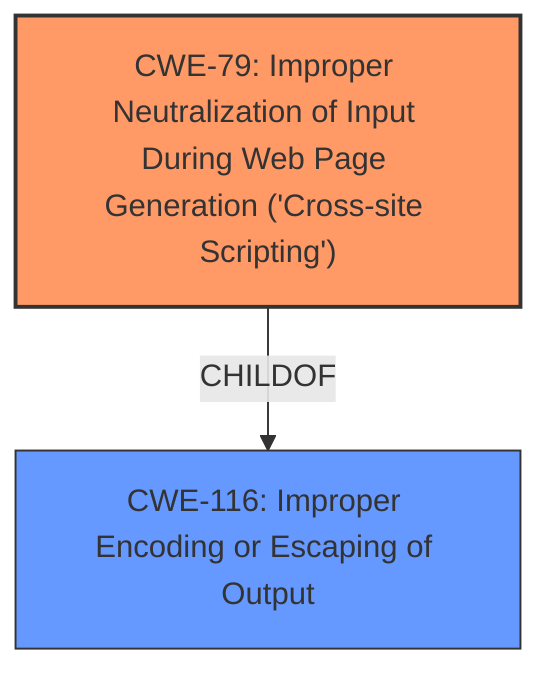

# Enhanced Analysis for CVE-2025-47828

# Summary
| CWE ID | CWE Name | Confidence | CWE Abstraction Level | CWE Vulnerability Mapping Label | CWE-Vulnerability Mapping Notes |
|---|---|---|---|---|---|
| CWE-79 | Improper Neutralization of Input During Web Page Generation ('Cross-site Scripting') | 0.9 | Base | Allowed | Primary CWE. The **omission of sanitizeHtml call** directly leads to the possibility of XSS. |
| CWE-116 | Improper Encoding or Escaping of Output | 0.6 | Class | Allowed-with-Review | Secondary CWE. The lack of sanitization can be seen as a failure to properly encode output before rendering it in a web page. |

## Evidence and Confidence

*   **Confidence Score:** 0.8
*   **Evidence Strength:** MEDIUM

## Relationship Analysis
The primary relationship considered was that CWE-79 (Improper Neutralization of Input During Web Page Generation ('Cross-site Scripting')) is a base-level CWE that directly addresses the vulnerability described. CWE-116 (Improper Encoding or Escaping of Output) is a class-level CWE that is a more general form of the same issue. The vulnerability can be seen as a specific case of improper output encoding, but the XSS aspect is more directly captured by CWE-79.



## Vulnerability Chain
The vulnerability chain starts with the **omission of a sanitizeHtml call**. This leads to the possibility of injecting malicious scripts, which then results in Cross-Site Scripting (XSS).
1.  **Root Cause:** Missing sanitizeHtml call.
2.  **Weakness:** Improper Neutralization of Input During Web Page Generation ('Cross-site Scripting') (CWE-79).
3.  **Impact:** Cross-Site Scripting, potentially leading to malicious script execution in the user's browser.

## Summary of Analysis
The initial analysis focused on identifying the root cause described in the vulnerability description: the **omission of sanitizeHtml call** for plain text strings. The retriever results suggested several CWEs, but CWE-79 (Improper Neutralization of Input During Web Page Generation ('Cross-site Scripting')) stood out as the most relevant due to its direct relation to XSS vulnerabilities.

The relationship analysis further solidified this decision. While CWE-116 (Improper Encoding or Escaping of Output) is also relevant, it's a higher-level class. CWE-79 provides a more specific and accurate representation of the vulnerability.

The evidence from the vulnerability description, particularly the phrase "**omits a sanitizeHtml call**," directly supports the mapping to CWE-79. This omission means that user-supplied input is not being properly neutralized before being included in a web page, leading to the possibility of XSS attacks.

The decision to select CWE-79 is based on its specificity, the direct connection to the vulnerability description, and the MITRE mapping guidance that allows for its usage at the Base level of abstraction. The overall confidence in this assessment is high due to the clear evidence and the well-defined nature of the vulnerability.

Relevant CWE Information:

# Enhanced Context (25 CWEs)
The following CWEs were identified as potentially relevant to this vulnerability:

## CWE-80: Improper Neutralization of Script-Related HTML Tags in a Web Page (Basic XSS)
**Abstraction Level**: Variant
**Similarity Score**: 0.75
**Source**: dense

**Description**:
The product receives input from an upstream component, but it does not neutralize or incorrectly neutralizes special characters such as "<", ">", and "&" that could be interpreted as web-scripting elements when they are sent to a downstream component that processes web pages.

**Mapping Guidance**:
- Usage: Allowed
- Rationale: This CWE entry is at the Variant level of abstraction, which is a preferred level of abstraction for mapping to the root causes of vulnerabilities.

*Did not select because* This is very similar to CWE-79, but focuses on script-related HTML tags. Since the description is about plain text strings, it's not a direct match, though it is related.

## CWE-212: Improper Removal of Sensitive Information Before Storage or Transfer
**Abstraction Level**: Base
**Similarity Score**: 0.75
**Source**: dense

**Description**:
The product stores, transfers, or shares a resource that contains sensitive information, but it does not properly remove that information before the product makes the resource available to unauthorized actors.

**Mapping Guidance**:
- Usage: Allowed
- Rationale: This CWE entry is at the Base level of abstraction, which is a preferred level of abstraction for mapping to the root causes of vulnerabilities.

*Did not select because* This CWE is not applicable as the vulnerability is not about sensitive information, but about the lack of sanitization of plain text strings.

## CWE-138: Improper Neutralization of Special Elements
**Abstraction Level**: Class
**Similarity Score**: 0.74
**Source**: dense

**Description**:
The product receives input from an upstream component, but it does not neutralize or incorrectly neutralizes special elements that could be interpreted as control elements or syntactic markers when they are sent to a downstream component.

**Mapping Guidance**:
- Usage: Discouraged
- Rationale: This CWE entry is a level-1 Class (i.e., a child of a Pillar). It might have lower-level children that would be more appropriate

*Did not select because* This CWE is too generic. CWE-79 is a more specific child that is more relevant.

## CWE-116: Improper Encoding or Escaping of Output
**Abstraction Level**: Class
**Similarity Score**: 0.73
**Source**: dense

**Description**:
The product prepares a structured message for communication with another component, but encoding or escaping of the data is either missing or done incorrectly. As a result, the intended structure of the message is not preserved.

**Mapping Guidance**:
- Usage: Allowed-with-Review
- Rationale: This CWE entry is a Class and might have Base-level children that would be more appropriate

*Selected as secondary because* While it could be a more general form of the issue, CWE-79 is a more appropriate Base-level child.

## CWE-1286: Improper Validation of Syntactic Correctness of Input
**Abstraction Level**: Base
**Similarity Score**: 0.72
**Source**: dense

**Description**:
The product receives input that is expected to be well-formed - i.e., to comply with a certain syntax - but it does not validate or incorrectly validates that the input complies with the syntax.

**Mapping Guidance**:
- Usage: Allowed
- Rationale: This CWE entry is at the Base level of abstraction, which is a preferred level of abstraction for mapping to the root causes of vulnerabilities.

*Did not select because* It is related to input validation, but more focused on syntactical correctness. Sanitization is not necessarily syntax related.

## CWE-472: External Control of Assumed-Immutable Web Parameter
**Abstraction Level**: Base
**Similarity Score**: 0.72
**Source**: dense

**Description**:
The web application does not sufficiently verify inputs that are assumed to be immutable but are actually externally controllable, such as hidden form fields.

**Mapping Guidance**:
- Usage: Allowed
- Rationale: This CWE entry is at the Base level of abstraction, which is a preferred level of abstraction for mapping to the root causes of vulnerabilities.

*Did not select because* This is not about externally controlled immutable parameters.

## CWE-538: Insertion of Sensitive Information into Externally-Accessible File or Directory
**Abstraction Level**: Base
**Similarity Score**: 0.71
**Source**: dense

**Description**:
The product places sensitive information into files or directories that are accessible to actors who are allowed to have access to the files, but not to the sensitive information.

**Mapping Guidance**:
- Usage: Allowed
- Rationale: This CWE entry is at the Base level of abstraction, which is a preferred level of abstraction for mapping to the root causes of vulnerabilities.

*Did not select because* This vulnerability is not about sensitive information being inserted into a file.

## CWE-639: Authorization Bypass Through User-Controlled Key
**Abstraction Level**: Base
**Similarity Score**: 0.71
**Source**: dense

**Description**:
The system's authorization functionality does not prevent one user from gaining access to another user's data or record by modifying the key value identifying the data.

**Mapping Guidance**:
- Usage: Allowed
- Rationale: This CWE entry is at the Base level of abstraction, which is a preferred level of abstraction for mapping to the root causes of vulnerabilities.

*Did not select because* This vulnerability is not related to authorization bypass.

## CWE-184: Incomplete List of Disallowed Inputs
**Abstraction Level**: Base
**Similarity Score**:


## CWE Relationship Analysis

Current CWEs represent these abstraction levels: .


### Vulnerability Chain Analysis

**Chain starting from CWE-116:**
- 116 (Improper Encoding or Escaping of Output) - ROOT


**Chain starting from CWE-80:**
- 80 (Improper Neutralization of Script-Related HTML Tags in a Web Page (Basic XSS)) - ROOT


### CWE Relationship Diagram

```mermaid
graph TD
    classDef primary fill:#f96,stroke:#333,stroke-width:2px
    classDef secondary fill:#69f,stroke:#333
    classDef tertiary fill:#9e9,stroke:#333
```