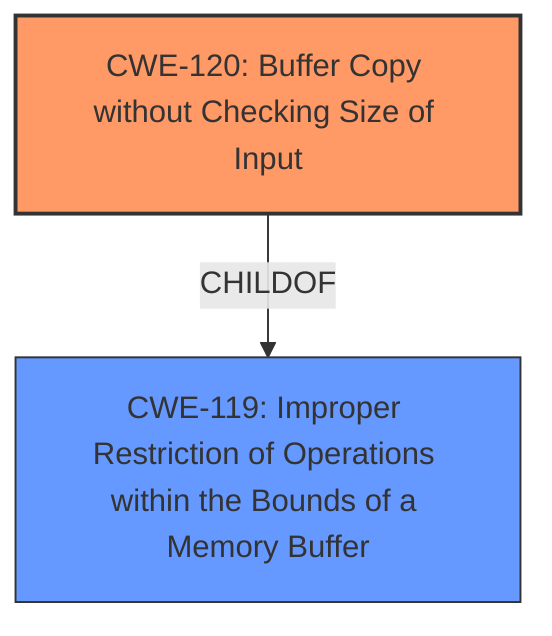

# Enhanced Analysis for CVE-2025-4791

# Summary
| CWE ID | CWE Name | Confidence | CWE Abstraction Level | CWE Vulnerability Mapping Label | CWE-Vulnerability Mapping Notes |
|---|---|---|---|---|---|
| CWE-120 | Buffer Copy without Checking Size of Input ('Classic Buffer Overflow') | 1.0 | Base | Allowed-with-Review | Primary CWE. The vulnerability is a classic buffer overflow due to not checking the size of the input when copying to a buffer. |
| CWE-119 | Improper Restriction of Operations within the Bounds of a Memory Buffer | 0.7 | Class | Discouraged | Secondary CWE. This is a broader category that encompasses buffer overflows. |

## Evidence and Confidence

*   **Confidence Score:** 0.9
*   **Evidence Strength:** HIGH

## Relationship Analysis
The primary CWE is CWE-120, which is a base level CWE and a more specific type of the class CWE-119. The vulnerability involves copying data into a buffer without checking the size of the input, leading to a buffer overflow. Therefore, CWE-120 is a more precise classification.



## Vulnerability Chain
The vulnerability chain starts with a lack of input validation, leading to a buffer overflow when copying data.
- **Root Cause:** **Lack of input validation** in HASH command handler.
- **Weakness:** CWE-120 Buffer Copy without Checking Size of Input
- **Impact:** Remote code execution

## Summary of Analysis
The primary weakness is a **buffer overflow** (CWE-120) caused by the FreeFloat FTP Server 1.0 **not checking the size of the input** provided to the HASH command handler. The provided content summary confirms this with the following quote: "The server does not properly validate the size of the input provided with the 'HASH' command, allowing an attacker to send a larger payload than the buffer can hold, overwriting adjacent memory regions." The exploit is remotely triggerable and publicly available. The relationship analysis indicates that CWE-120 is a child of CWE-119, making CWE-120 the more specific and appropriate choice for this vulnerability.

The retriever results also listed CWE-119 and CWE-120 as the top candidates.
CWE-119 is a class level of abstraction. CWE-120 is a base level of abstraction.

Other CWEs Considered:

*   CWE-190 (Integer Overflow or Wraparound): While integer overflows can sometimes lead to buffer overflows, the primary issue here is the lack of input validation, which directly causes the buffer overflow.
*   CWE-125 (Out-of-bounds Read): This is related to reading data outside the intended buffer, which is not the primary issue. The primary issue is related to writing outside of the intended buffer.
*   CWE-131 (Incorrect Calculation of Buffer Size): The root cause is not due to incorrect calculation of buffer size, but from not validating the size of the input before the buffer copy operation occurs.
*   CWE-1284 (Improper Validation of Specified Quantity in Input): This is a close match, however CWE-120 represents the actual buffer overflow condition.


## CWE Relationship Analysis

Current CWEs represent these abstraction levels: .


### Vulnerability Chain Analysis

**Chain starting from CWE-1284:**
- 1284 (Improper Validation of Specified Quantity in Input) - ROOT


**Chain starting from CWE-125:**
- 125 (Out-of-bounds Read) - ROOT


### CWE Relationship Diagram

```mermaid
graph TD
    classDef primary fill:#f96,stroke:#333,stroke-width:2px
    classDef secondary fill:#69f,stroke:#333
    classDef tertiary fill:#9e9,stroke:#333
```