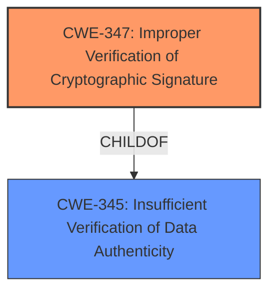

# Analysis Report for CVE-2025-47934

# Vulnerability Analysis Report: CVE-2025-47934

## Description

OpenPGP.js is a JavaScript implementation of the OpenPGP protocol. Startinf in version 5.0.1 and prior to versions 5.11.3 and 6.1.1, a maliciously modified message can be passed to either `openpgp.verify` or `openpgp.decrypt`, causing these functions to **return a valid signature verification result while returning data that was not actually signed**. This flaw allows signature verifications of inline (non-detached) signed messages (using `openpgp.verify`) and signed-and-encrypted messages (using `openpgp.decrypt` with `verificationKeys`) to be spoofed, since both functions return extracted data that may not match the data that was originally signed. Detached signature verifications are not affected, as no signed data is returned in that case. In order to spoof a message, the attacker needs a single valid message signature (inline or detached) as well as the plaintext data that was legitimately signed, and can then construct an inline-signed message or signed-and-encrypted message with any data of the attackers choice, which will appear as legitimately signed by affected versions of OpenPGP.js. In other words, any inline-signed message can be modified to return any other data (while still indicating that the signature was valid), and the same is true for signed+encrypted messages if the attacker can obtain a valid signature and encrypt a new message (of the attackers choice) together with that signature. The issue has been patched in versions 5.11.3 and 6.1.1. Some workarounds are available. When verifying inline-signed messages, extract the message and signature(s) from the message returned by `openpgp.readMessage`, and verify the(/each) signature as a detached signature by passing the signature and a new message containing only the data (created using `openpgp.createMessage`) to `openpgp.verify`. When decrypting and verifying signed+encrypted messages, decrypt and verify the message in two steps, by first calling `openpgp.decrypt` without `verificationKeys`, and then passing the returned signature(s) and a new message containing the decrypted data (created using `openpgp.createMessage`) to `openpgp.verify`.

## Vulnerability Description Key Phrases

- **Weakness:** return a valid signature verification result while returning data that was not actually signed
- **Impact:** spoof signature verifications
- **Vector:** maliciously modified message
- **Product:** OpenPGP.js
- **Version:** 5.0.1 to prior to 5.11.3 and 6.1.1
- **Component:** openpgp.verify or openpgp.decrypt

## Analysis (with Relationship Data)

# Summary
| CWE ID | CWE Name | Confidence | CWE Abstraction Level | CWE Vulnerability Mapping Label | CWE-Vulnerability Mapping Notes |
|---|---|---|---|---|---|
| CWE-347 | Improper Verification of Cryptographic Signature | 1.0 | Base | Allowed | Primary CWE: The root cause is the **improper verification of the cryptographic signature** which allows the attacker to spoof the signature. |

## Evidence and Confidence

*   **Confidence Score:** 1.0
*   **Evidence Strength:** HIGH

## Relationship Analysis
The primary CWE is CWE-347, "Improper Verification of Cryptographic Signature." This is a base-level CWE, which is appropriate. CWE-347 is a child of the class CWE-345 "Insufficient Verification of Data Authenticity", indicating that the root cause of the vulnerability involves a failure to adequately check the authenticity of data.



## Vulnerability Chain
The vulnerability chain starts with the **improper verification of the cryptographic signature (CWE-347)**. This leads to the ability to spoof signature verifications, allowing an attacker to modify messages and have them appear legitimately signed. The root cause is the **failure to properly validate the signature**, enabling the attacker to return data that was not actually signed.

## Summary of Analysis
The analysis is strongly based on the provided evidence, particularly the vulnerability description and the CVE reference links content summary. The vulnerability description clearly states that the functions `openpgp.verify` and `openpgp.decrypt` **return a valid signature verification result while returning data that was not actually signed**. The CVE reference links content summary reinforces this by stating that the root cause is that a maliciously modified message can cause these functions to return a valid signature even if the data is not signed. The retriever results also list CWE-347 as the top candidate.

The hierarchical relationships influenced the final selection by confirming that CWE-347 is at the appropriate level of specificity.

The selected CWE, CWE-347, is at the optimal level of specificity because it directly addresses the root cause of the vulnerability which is the **improper verification of the cryptographic signature**.

Relevant CWE Information:
- CWE-347: Improper Verification of Cryptographic Signature
  - The vulnerability description explicitly states that the functions return a valid signature verification result even when the data is not actually signed. This directly aligns with the description of CWE-347, which involves the product not verifying or incorrectly verifying the cryptographic signature for data.
  - The security implication is that an attacker can spoof signature verifications, leading to potentially severe consequences, such as accepting malicious data as legitimate.
  - CWE-347 is a child of CWE-345, Insufficient Verification of Data Authenticity.
  - The mapping guidance for CWE-347 allows its use at the Base level of abstraction.


## CWE Relationship Analysis

Current CWEs represent these abstraction levels: .


### Vulnerability Chain Analysis

**Chain starting from CWE-347:**
- 347 (Improper Verification of Cryptographic Signature) - ROOT


**Chain starting from CWE-345:**
- 345 (Insufficient Verification of Data Authenticity) - ROOT


### CWE Relationship Diagram

```mermaid
graph TD
    classDef primary fill:#f96,stroke:#333,stroke-width:2px
    classDef secondary fill:#69f,stroke:#333
    classDef tertiary fill:#9e9,stroke:#333
```


*Report generated on 2025-07-15 02:18:16*
