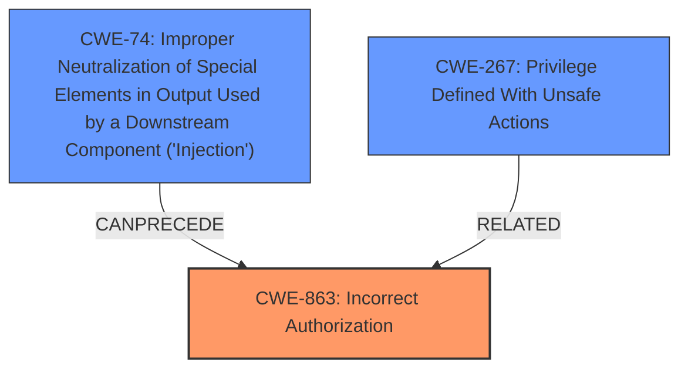

# Raw Analyzer Response for CVE-2025-47948

# Summary
| CWE ID | CWE Name | Confidence | CWE Abstraction Level | CWE Vulnerability Mapping Label | CWE-Vulnerability Mapping Notes |
|---|---|---|---|---|---|
| **CWE-863** | **Incorrect Authorization** | 0.9 | Class | Allowed-with-Review | Primary CWE: The application performs an authorization check, but it is flawed, allowing unauthorized access. |
| CWE-74 | Improper Neutralization of Special Elements in Output Used by a Downstream Component ('Injection') | 0.6 | Class | Discouraged | Secondary: The bot constructs a message using externally-influenced input, but it does not neutralize special elements. |
| CWE-267 | Privilege Defined With Unsafe Actions | 0.5 | Base | Allowed | Secondary: The bot's privileges allow actions that should not be triggered by unauthorized users. |

## Evidence and Confidence

*   **Confidence Score:** 0.7
*   **Evidence Strength:** MEDIUM

## Relationship Analysis
The primary relationship influencing the selection is that CWE-863 [CWE-863: Incorrect Authorization] is a class-level CWE that can be a parent to more specific authorization issues. While the vulnerability involves a specific type of injection (CWE-74 [CWE-74: Improper Neutralization of Special Elements in Output Used by a Downstream Component ('Injection')]), the core issue is that the authorization check is not correctly implemented, allowing unauthorized users to trigger privileged behavior. CWE-267 [CWE-267: Privilege Defined With Unsafe Actions] is related as the privileges granted to the bot are too broad, allowing for misuse via command injection. The abstraction levels guided the selection, favoring the class-level CWE-863 [CWE-863: Incorrect Authorization] because the specific implementation flaw isn't detailed enough to pinpoint a more specific Base-level CWE.

## Vulnerability Chain
The vulnerability chain starts with the **incorrect authorization** (CWE-863 [CWE-863: Incorrect Authorization]) within the bot's command processing. This leads to the ability to inject special elements (CWE-74 [CWE-74: Improper Neutralization of Special Elements in Output Used by a Downstream Component ('Injection')]) into the command, triggering unintended privileged actions. The bot possessing **unsafe privileges** (CWE-267 [CWE-267: Privilege Defined With Unsafe Actions]) completes the chain, enabling the unauthorized triggering of notifications.
  - The Primary CWE is CWE-863 [CWE-863: Incorrect Authorization]

## Summary of Analysis
The initial assessment focused on the command injection aspect, considering CWE-78 [CWE-78: Improper Neutralization of Special Elements used in an OS Command ('OS Command Injection')] or CWE-74 [CWE-74: Improper Neutralization of Special Elements in Output Used by a Downstream Component ('Injection')]. However, after critical review, it became clear that the root cause is the **incorrect authorization** (CWE-863 [CWE-863: Incorrect Authorization]). The bot allows the `/echo` command to mention all members in the chat without proper validation, bypassing permission controls.

The evidence from the vulnerability description states: "command echoing feature in the framework allows users to indirectly trigger privileged behavior by injecting special platform tags...an unauthorized user can use the `/echo` command to cause the bot to send a message that mentions all members in the chat, bypassing any permission controls." This clearly points to an authorization issue.

The relationship graph highlights the connection between injection and authorization, where the **improper neutralization** (CWE-74 [CWE-74: Improper Neutralization of Special Elements in Output Used by a Downstream Component ('Injection')]) can lead to the **incorrect authorization** (CWE-863 [CWE-863: Incorrect Authorization]).

The selected CWEs are at the optimal level of specificity. CWE-863 [CWE-863: Incorrect Authorization] captures the core flaw, while CWE-74 [CWE-74: Improper Neutralization of Special Elements in Output Used by a Downstream Component ('Injection')] and CWE-267 [CWE-267: Privilege Defined With Unsafe Actions] provide additional context on how the vulnerability is exploited.

Relevant CWE Information:

# Enhanced Context (25 CWEs)
The following CWEs were identified as potentially relevant to this vulnerability:

## CWE-863: Incorrect Authorization
**Abstraction Level**: Class
**Similarity Score**: 1918.76
**Source**: sparse

**Description**:
The product performs an authorization check when an actor attempts to access a resource or perform an action, but it does not correctly perform the check.

**Mapping Guidance**:
- Usage: Allowed-with-Review
- Rationale: This CWE entry is a Class and might have Base-level children that would be more appropriate

## CWE-74: Improper Neutralization of Special Elements in Output Used by a Downstream Component ('Injection')
**Abstraction Level**: Class
**Similarity Score**: 0.77
**Source**: dense

**Description**:
The product constructs all or part of a command, data structure, or record using externally-influenced input from an upstream component, but it does not neutralize or incorrectly neutralizes special elements that could modify how it is parsed or interpreted when it is sent to a downstream component.

**Mapping Guidance**:
- Usage: Discouraged
- Rationale: CWE-74 is high-level and often misused when lower-level weaknesses are more appropriate.