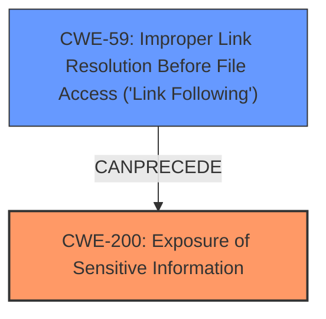

# Analysis Report for CVE-2025-48064

# Vulnerability Analysis Report: CVE-2025-48064

## Description

GitHub Desktop is an open-source, Electron-based GitHub app designed for git development. Prior to version 3.4.20-beta3, an attacker convincing a user to view a file in a commit of their making in the history view can cause information disclosure by means of Git attempting to access a network share. This affects GitHub Desktop users on Windows that view malicious commits in the history view. macOS users are not affected. When viewing a file diff in the history view GitHub Desktop will call `git log` or `git diff` with the object id (SHA) of the commit, the name of the file, and the old name of the file if the file has been renamed. As a security precaution Git will attempt to fully resolve the old and new path via `realpath`, traversing symlinks, to ensure that the resolved paths reside within the repository working directory. This can lead to Git attempting to access a path that resides on a network share (UNC path) and in doing so Windows will attempt to perform NTLM authentication which passes information such as the computer name, the currently signed in (Windows) user name, and an NTLM hash. GitHub Desktop 3.4.20 and later fix this vulnerability. The beta channel includes the fix in 3.4.20-beta3. As a workaround to use until upgrading is possible, only browse commits in the history view that comes from trusted sources.

## Vulnerability Description Key Phrases

- **Impact:** information disclosure
- **Product:** GitHub Desktop
- **Version:** Prior to version 3.4.20-beta3

## Analysis (with Relationship Data)

# Summary
| CWE ID | CWE Name | Confidence | CWE Abstraction Level | CWE Vulnerability Mapping Label | CWE-Vulnerability Mapping Notes |
|---|---|---|---|---|---|
| CWE-200 | Exposure of Sensitive Information | 0.9 | Base | Allowed | Primary CWE. The application exposes sensitive information (computer name, username, NTLM hash) when attempting to access a network share. |
| CWE-59 | Improper Link Resolution Before File Access ('Link Following') | 0.7 | Base | Allowed | Secondary CWE. The vulnerability involves Git attempting to access a network share due to path resolution, which aligns with the concept of improper link resolution. |

## Evidence and Confidence

*   **Confidence Score:** 0.8
*   **Evidence Strength:** HIGH

## Relationship Analysis
The primary CWE is CWE-200, representing the information disclosure vulnerability. CWE-59 is a related weakness where improper link resolution leads to unintended resource access. CWE-200 can be triggered by weaknesses like CWE-59, indicating a chain relationship. The abstraction levels are both Base, which is the preferred level.



## Vulnerability Chain
The vulnerability chain starts with a user viewing a malicious commit, which causes Git to attempt to resolve paths. This **improper** path resolution (CWE-59) leads to Git attempting to access a network share, triggering NTLM authentication, and ultimately resulting in the **exposure of sensitive information** (CWE-200).

## Summary of Analysis
The analysis identifies CWE-200 as the primary weakness due to the information disclosure impact. The vulnerability description and CVE details provide strong evidence for this classification. The retriever results and relationship analysis support this selection, with CWE-59 as a secondary weakness. The chosen CWEs are at the Base level of abstraction, providing the optimal level of specificity.

The vulnerability description clearly states that the **impact** is "information disclosure" when Git attempts to access a network share, which matches CWE-200. The CVE Reference Links Content Summary reinforces this by stating the **root cause** is "Git attempting to fully resolve old and new paths via `realpath`, traversing symlinks... This can lead to Git attempting to access a path that resides on a network share (UNC path)..." and that the **impact** is "Information disclosure. Windows will attempt to perform NTLM authentication, potentially revealing the computer name, currently signed-in Windows user name, and an NTLM hash."

Relevant CWE Information:

# Enhanced Context (25 CWEs)
The following CWEs were identified as potentially relevant to this vulnerability:

## CWE-212: Improper Removal of Sensitive Information Before Storage or Transfer
**Abstraction Level**: Base
**Similarity Score**: 0.81
**Source**: dense

**Description**:
The product stores, transfers, or shares a resource that contains sensitive information, but it does not properly remove that information before the product makes the resource available to unauthorized actors.

**Mapping Guidance**:
- Usage: Allowed
- Rationale: This CWE entry is at the Base level of abstraction, which is a preferred level of abstraction for mapping to the root causes of vulnerabilities.


## CWE-59: Improper Link Resolution Before File Access ('Link Following')
**Abstraction Level**: Base
**Similarity Score**: 0.79
**Source**: dense

**Description**:
The product attempts to access a file based on the filename, but it does not properly prevent that filename from identifying a link or shortcut that resolves to an unintended resource.

**Mapping Guidance**:
- Usage: Allowed
- Rationale: This CWE entry is at the Base level of abstraction, which is a preferred level of abstraction for mapping to the root causes of vulnerabilities.

## CWE-200: Insertion of Sensitive Information Into Sent Data
**Abstraction Level**: base
**Similarity Score**: 4.33
**Source**: graph

**Description**:
CWE-200: Insertion of Sensitive Information Into Sent Data

**Mapping Guidance**:
- Usage: Allowed
- Rationale: This CWE entry is at the Base level of abstraction, which is a preferred level of abstraction for mapping to the root causes of vulnerabilities.

**Relationships**:
- PARENTOF -> CWE-598
- CANFOLLOW -> CWE-226
- CANFOLLOW -> CWE-212
- CANALSOBE -> CWE-202
- CANALSOBE -> CWE-209

---
CWE-212 was considered but not used because the sensitive information is not stored or transferred in a way that makes it available to unauthorized actors. Instead, the sensitive information is exposed during the authentication attempt.

CWE-427 (Uncontrolled Search Path Element) and CWE-78 (Improper Neutralization of Special Elements used in an OS Command ('OS Command Injection')) were considered but not selected because the vulnerability isn't directly related to manipulating the search path or injecting commands. The core issue is the exposure of sensitive information when Git attempts to access a network share due to **improper** path resolution.


## CWE Relationship Analysis

Current CWEs represent these abstraction levels: .


### Vulnerability Chain Analysis

**Chain starting from CWE-427:**
- 427 (Uncontrolled Search Path Element) - ROOT


**Chain starting from CWE-226:**
- 226 (Sensitive Information in Resource Not Removed Before Reuse) - ROOT


### CWE Relationship Diagram

```mermaid
graph TD
    classDef primary fill:#f96,stroke:#333,stroke-width:2px
    classDef secondary fill:#69f,stroke:#333
    classDef tertiary fill:#9e9,stroke:#333
```


*Report generated on 2025-07-15 02:21:38*
