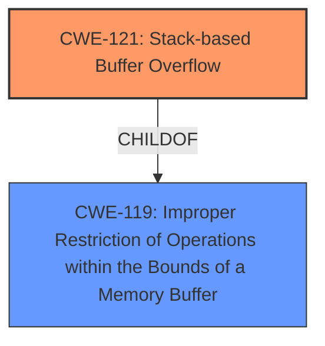

# Enhanced Analysis for CVE-2025-4809

# Summary
| CWE ID | CWE Name | Confidence | CWE Abstraction Level | CWE Vulnerability Mapping Label | CWE-Vulnerability Mapping Notes |
|---|---|---|---|---|---|
| CWE-121 | Stack-based Buffer Overflow | 1.0 | Variant | Allowed | Primary CWE |

## Evidence and Confidence

*   **Confidence Score:** 1.0
*   **Evidence Strength:** HIGH

## Relationship Analysis
The primary relationship influencing the CWE selection is the direct identification of "**stack-based buffer overflow**" in the vulnerability description. CWE-121 is a variant of the more general CWE-119 (Improper Restriction of Operations within the Bounds of a Memory Buffer). Given the specific "stack-based" nature, CWE-121 is the more appropriate and specific choice.



## Vulnerability Chain
The vulnerability chain starts with the **stack-based buffer overflow** due to the manipulation of the 'deviceList' argument in the 'fromSafeSetMacFilter' function, leading to potential remote code execution.
  - Root Cause: CWE-121 Stack-based Buffer Overflow
  - Impact: Remote Code Execution (implied)

## Summary of Analysis
The vulnerability description clearly states that the vulnerability is a "**stack-based buffer overflow**". The function 'fromSafeSetMacFilter' in the file '/goform/setMacFilterCfg' is vulnerable when manipulating the 'deviceList' argument. The evidence directly supports the selection of CWE-121 (Stack-based Buffer Overflow). The retriever results also list CWE-121 as a candidate, but the direct mention in the description makes it the most accurate choice. I am confident that CWE-121 is the correct mapping.

Relevant CWE Information:

# Enhanced Context (25 CWEs)
The following CWEs were identified as potentially relevant to this vulnerability:

## CWE-121: Stack-based Buffer Overflow
**Abstraction Level**: Variant
**Similarity Score**: 0.74
**Source**: dense

**Description**:
A stack-based buffer overflow condition is a condition where the buffer being overwritten is allocated on the stack (i.e., is a local variable or, rarely, a parameter to a function).

**Mapping Guidance**:
- Usage: Allowed
- Rationale: This CWE entry is at the Variant level of abstraction, which is a preferred level of abstraction for mapping to the root causes of vulnerabilities.

## CWE-119: Improper Restriction of Operations within the Bounds of a Memory Buffer
**Abstraction Level**: Class
**Similarity Score**: 0.70
**Source**: dense

**Description**:
The product performs operations on a memory buffer, but it reads from or writes to a memory location outside the buffer's intended boundary. This may result in read or write operations on unexpected memory locations that could be linked to other variables, data structures, or internal program data.

**Mapping Guidance**:
- Usage: Discouraged
- Rationale: CWE-119 is commonly misused in low-information vulnerability reports when lower-level CWEs could be used instead, or when more details about the vulnerability are available.

## CWE-120: Buffer Copy without Checking Size of Input ('Classic Buffer Overflow')
**Abstraction Level**: Base
**Similarity Score**: 0.74
**Source**: dense

**Description**:
The product copies an input buffer to an output buffer without verifying that the size of the input buffer is less than the size of the output buffer, leading to a buffer overflow.

**Mapping Guidance**:
- Usage: Allowed-with-Review
- Rationale: There are some indications that this CWE ID might be misused and selected simply because it mentions "buffer overflow" - an increasingly vague term. This CWE entry is only appropriate for "Buffer Copy" operations (not buffer reads), in which where there is no "Checking [the] Size of Input", and (by implication of the copy) writing past the end of the buffer.

### Considered but not used:

*   CWE-119 (Improper Restriction of Operations within the Bounds of a Memory Buffer): While related as a parent, it's too general. The vulnerability is specifically a stack-based buffer overflow.
*   CWE-120 (Buffer Copy without Checking Size of Input ('Classic Buffer Overflow')): This CWE is more specific to buffer copy operations without size checks. While buffer overflow is a factor, the "stack-based" aspect is more defining here.
*   CWE-190 (Integer Overflow or Wraparound): This is related to integer handling, which isn't the primary issue here.
*   CWE-78 (Improper Neutralization of Special Elements used in an OS Command ('OS Command Injection')): This is related to OS command injection, which is not the issue here.
*   CWE-79 (Improper Neutralization of Input During Web Page Generation ('Cross-site Scripting')): This is related to Cross-site Scripting, which is not the issue here.
*   CWE-89 (Improper Neutralization of Special Elements used in an SQL Command ('SQL Injection')): This is related to SQL injection, which is not the issue here.
*   CWE-125 (Out-of-bounds Read): This is related to reading beyond buffer boundaries, not writing in this particular case.
*   CWE-674 (Uncontrolled Recursion): This is related to uncontrolled recursion, which isn't described in the vulnerability.
*   CWE-128 (Wrap-around Error): This is related to wrap-around errors, which is not described in the vulnerability.


## CWE Relationship Analysis

Current CWEs represent these abstraction levels: .


### Vulnerability Chain Analysis

**Chain starting from CWE-89:**
- 89 (Improper Neutralization of Special Elements used in an SQL Command ('SQL Injection')) - ROOT


**Chain starting from CWE-121:**
- 121 (Stack-based Buffer Overflow) - ROOT


### CWE Relationship Diagram

```mermaid
graph TD
    classDef primary fill:#f96,stroke:#333,stroke-width:2px
    classDef secondary fill:#69f,stroke:#333
    classDef tertiary fill:#9e9,stroke:#333
```