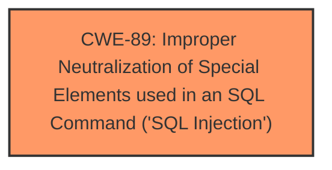

# Analysis for CVE-2025-4812

# Summary
| CWE ID | CWE Name | Confidence | CWE Abstraction Level | CWE Vulnerability Mapping Label | CWE-Vulnerability Mapping Notes |
|---|---|---|---|---|---|
| CWE-89 | Improper Neutralization of Special Elements used in an SQL Command ('SQL Injection') | 1.0 | Base | Allowed | Primary CWE. The vulnerability description explicitly mentions **SQL injection** due to manipulation of the `mobilenumber` argument.|

## Evidence and Confidence

*   **Confidence Score:** 1.0
*   **Evidence Strength:** HIGH

## Relationship Analysis
The primary relationship to consider is that CWE-89 is a Base level CWE, which is the preferred level of abstraction. There are no child or parent relationships that impact the decision.

## Vulnerability Chain
The vulnerability chain consists of the following:
1.  **Root Cause:** Improper input validation and sanitization of the `mobilenumber` parameter, leading to the injection of malicious SQL code (CWE-89).
2.  **Impact:** Unauthorized access to the database, sensitive data leakage, data tampering, system control compromise, and service disruption.

## Summary of Analysis
The vulnerability description explicitly states that the manipulation of the `mobilenumber` argument leads to **SQL injection** in the `/profile.php` file of PHPGurukul Human Metapneumovirus Testing Management System 1.0. The CVE reference links content summary confirms this by highlighting the lack of proper validation or sanitization of the `mobilenumber` parameter as the root cause. The retriever results also list CWE-89 as the top candidate with a score of 1.0.

Given the explicit mention of **SQL injection** and the confirmation from the CVE reference, CWE-89 is the most appropriate CWE.

Other CWEs Considered:

*   CWE-79 (Improper Neutralization of Input During Web Page Generation ('Cross-site Scripting')): While input neutralization is relevant, the specific vulnerability is **SQL injection**, making CWE-89 a more precise fit.
*   CWE-434 (Unrestricted Upload of File with Dangerous Type): This CWE is not relevant because the vulnerability is not related to file uploads.
*   CWE-117 (Improper Output Neutralization for Logs): This CWE is not relevant because the vulnerability is not related to logging.
*   CWE-1336 (Improper Neutralization of Special Elements Used in a Template Engine): This CWE is not relevant because the vulnerability is not related to template engines.
*   CWE-96 (Improper Neutralization of Directives in Statically Saved Code ('Static Code Injection')): This CWE is not relevant because the vulnerability is not related to static code injection.
*   CWE-73 (External Control of File Name or Path): This CWE is not relevant because the vulnerability is not related to file path manipulation.