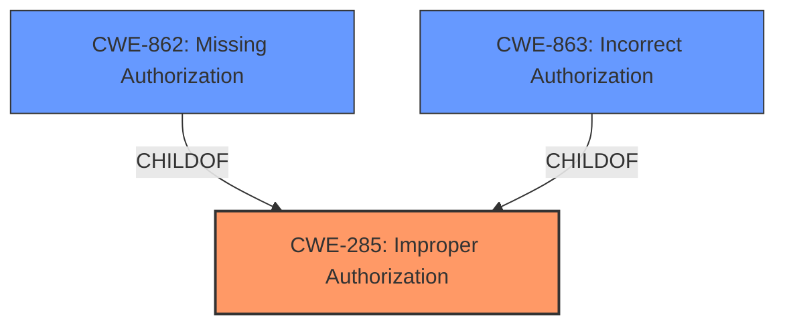

# Raw Analyzer Response for CVE-2025-4819

# Summary
| CWE ID  | CWE Name                                                                        | Confidence | CWE Abstraction Level | CWE Vulnerability Mapping Label | CWE-Vulnerability Mapping Notes |
| :-------- | :------------------------------------------------------------------------------ | :---------- | :---------------------- | :------------------------------ | :------------------------------ |
| CWE-285   | Improper Authorization                                                        | 0.95        | Class                   | Primary                         | Discouraged                    |
| CWE-863   | Incorrect Authorization                                                       | 0.75        | Class                   | Secondary                       | Allowed-with-Review            |
| CWE-862   | Missing Authorization                                                       | 0.65        | Base                   | Secondary                       | Allowed                     |

## Evidence and Confidence

*   **Confidence Score:** 0.85
*   **Evidence Strength:** HIGH

## Relationship Analysis
The primary CWE identified is CWE-285 Improper Authorization. This is a class-level CWE, and both CWE-863 Incorrect Authorization and CWE-862 Missing Authorization are children of CWE-285, offering more specific classifications. CWE-863 indicates an authorization check is present but flawed, while CWE-862 indicates a complete absence of authorization. These relationships helped refine the selection to address the **improper authorization** issue highlighted in the vulnerability description.

## Vulnerability Chain
The vulnerability chain begins with **improper authorization** (CWE-285). An attacker can manipulate the 'ids' argument, leading to unauthorized offline logout. The **missing** or **incorrect** authorization check (CWE-862 or CWE-863) allows this manipulation, ultimately resulting in a regular user being able to force an administrator to log off, leading to unauthorized access and potential compromise of the system.

## Summary of Analysis
The initial assessment identified **improper authorization** as the primary weakness. The retriever results and relationship analysis refined the selection, particularly the child relationships of CWE-285 (Improper Authorization). The vulnerability description and CVE content summary both point to an authorization issue, supporting the selection of CWE-285 as the primary CWE. Given the evidence, the final decision focuses on CWE-285, with consideration of CWE-863 and CWE-862 to represent the nuance of whether authorization was completely missing or implemented incorrectly.

Relevant CWE Information:

*   The vulnerability description states "**improper authorization**".
*   The CVE Reference Links Content Summary states "**Missing Authorization:** The application does not adequately verify if a user has the authority to log off another user."
*   The CVE Reference Links Content Summary states "The code allows users to log off other users, including administrators, by manipulating session IDs."

Based on this evidence, CWE-285 is the most appropriate primary CWE because the root cause is **improper authorization**.

CWE-863 (Incorrect Authorization) was considered as a more specific child of CWE-285. The evidence suggests that authorization checks might be present but flawed. Thus, it has been added as a secondary CWE.

CWE-862 (Missing Authorization) was considered as a more specific child of CWE-285. The evidence suggests the application does not adequately verify if a user has the authority to log off another user. Thus, it has been added as a secondary CWE.

CWE-306 (Missing Authentication for Critical Function) was considered but deemed less relevant, as the issue appears to be related to authorization (i.e., what an authenticated user can do) rather than authentication (i.e., verifying the user's identity). The documentation states that "the application does not adequately verify if a user has the authority to log off another user" which indicates that the user has already been authenticated, so it's not an authentication issue.

CWE-79 (Improper Neutralization of Input During Web Page Generation ('Cross-site Scripting')) was considered but deemed less relevant, as the issue is related to **improper authorization** rather than improper neutralization of input.

CWE-89 (Improper Neutralization of Special Elements used in an SQL Command ('SQL Injection')) was considered but deemed less relevant, as the issue is related to **improper authorization** rather than SQL injection.

CWE-78 (Improper Neutralization of Special Elements used in an OS Command ('OS Command Injection')) was considered but deemed less relevant, as the issue is related to **improper authorization** rather than OS command injection.

CWE-284 (Improper Access Control) was considered, but as the guidance suggests, it should be avoided if a more specific child CWE like 285, 862, or 863 is appropriate. Since authorization issues are the core of the vulnerability, CWE-285, CWE-862 and CWE-863 are preferred.