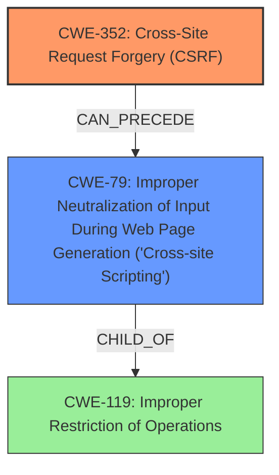

# Raw Analyzer Response for CVE-2025-48233

# Summary
| CWE ID | CWE Name | Confidence | CWE Abstraction Level | CWE Vulnerability Mapping Label | CWE-Vulnerability Mapping Notes |
|---|---|---|---|---|---|
| CWE-352 | Cross-Site Request Forgery (CSRF) | 1.0 | Compound | Primary | Allowed |
| CWE-79 | Improper Neutralization of Input During Web Page Generation ('Cross-site Scripting') | 1.0 | Base | Secondary | Allowed |

## Evidence and Confidence

*   **Confidence Score:** 1.0
*   **Evidence Strength:** HIGH

## Relationship Analysis
The vulnerability involves a **Cross-Site Request Forgery (CSRF)**, which allows for **Stored XSS (Cross-site scripting)**. CWE-352 is a compound weakness, and CWE-79 is a base weakness. CWE-79 is often caused by **improper neutralization of input**, which can be triggered via a **CSRF** attack in this case. The primary weakness is **CSRF** because it enables the **XSS**.

## Vulnerability Chain
The vulnerability chain starts with **CWE-352 [Cross-Site Request Forgery (CSRF)]**, where an attacker can **force higher privileged users to execute unwanted actions**. This leads to **CWE-79 [Improper Neutralization of Input During Web Page Generation ('Cross-site Scripting')]**, as the injected input is not properly neutralized, resulting in **stored XSS**.

## Summary of Analysis
The analysis indicates a high confidence in assigning CWE-352 and CWE-79. The vulnerability description clearly states that the **root cause** is a **Cross-Site Request Forgery (CSRF)**, leading to a **stored XSS vulnerability**.

Evidence:
- "**Cross-Site Request Forgery (CSRF)** vulnerability in affmngr Affiliates Manager Google reCAPTCHA Integration allows Stored XSS."
- "**rootcause:** **Cross-Site Request Forgery (CSRF)**"
- "**weakness:** **stored XSS**"

CWE-352 directly matches the stated **root cause**. CWE-79 is a consequence of the **CSRF** enabling the injection of malicious script due to **improper neutralization of input**. The retriever results also support CWE-79 as a highly relevant CWE.

CWEs considered but not used:
- CWE-601 [URL Redirection to Untrusted Site ('Open Redirect')] was considered because it's a common web vulnerability, but it doesn't fit the description as there's no redirection involved.
- CWE-89 [Improper Neutralization of Special Elements used in an SQL Command ('SQL Injection')] was considered but discarded as there is no mention of SQL injection.
- CWE-918 [Server-Side Request Forgery (SSRF)] was considered but discarded as there is no mention of server-side request forgery.
- CWE-434 [Unrestricted Upload of File with Dangerous Type] was considered but discarded as there is no file upload functionality mentioned.