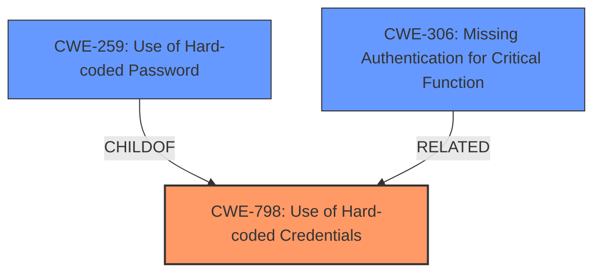

# Enhanced Analysis for CVE-2025-48413

# Summary
| CWE ID  | CWE Name                                                    | Confidence | CWE Abstraction Level | CWE Vulnerability Mapping Label | CWE-Vulnerability Mapping Notes |
| :-------- | :---------------------------------------------------------- | :--------- | :-------------------- | :------------------------------ | :------------------------------ |
| CWE-798   | Use of Hard-coded Credentials                               | 1.0        | Base                  | Primary                         | Allowed                         |
| CWE-259   | Use of Hard-coded Password                                  | 0.8        | Variant               | Secondary                       | Allowed                         |
| CWE-306   | Missing Authentication for Critical Function                | 0.6        | Base                  | Secondary                       | Allowed                         |

## Evidence and Confidence

*   **Confidence Score:** 0.9
*   **Evidence Strength:** HIGH

## Relationship Analysis
The primary CWE is CWE-798, which represents the **root cause** of the vulnerability: the use of hard-coded credentials. CWE-259, a variant of CWE-798, specifies that the hard-coded credential is a password. This relationship influenced the decision to include CWE-259 as a secondary CWE to provide more specificity. Also, the device can be logged into using these credentials, thus making it a Missing Authentication for Critical Function, CWE-306.



## Vulnerability Chain
The vulnerability chain starts with the **root cause**: the presence of **hard-coded password hashes** in `/etc/passwd` and `/etc/shadow` files (CWE-798). An attacker exploits this by using these credentials to log into the device, potentially through an SSH backdoor or physical access (UART shell), leading to a **missing authentication** issue (CWE-306).

## Summary of Analysis
The primary assessment is based on strong evidence from the vulnerability description and CVE reference. The **root cause** is clearly identified as the use of **hard-coded password hashes** for the root user (CWE-798). The use of CWE-259 is justified because the hard-coded credential is specifically a password, making it a more specific variant of CWE-798. The presence of these **hard-coded password hashes** allows the attacker to log into the system, thus missing authentication, CWE-306.

The selected CWEs are at the optimal level of specificity. CWE-798 captures the fundamental flaw, while CWE-259 provides more details about the type of credential.

Relevant CWE Information:

# Enhanced Context (25 CWEs)
The following CWEs were identified as potentially relevant to this vulnerability:

## CWE-798: Use of Hard-coded Credentials
**Abstraction Level**: Base
**Similarity Score**: 0.80
**Source**: dense

**Description**:
The product contains hard-coded credentials, such as a password or cryptographic key.

**Mapping Guidance**:
- Usage: Allowed
- Rationale: This CWE entry is at the Base level of abstraction, which is a preferred level of abstraction for mapping to the root causes of vulnerabilities.

## CWE-259: Use of Hard-coded Password
**Abstraction Level**: Variant
**Similarity Score**: 0.75
**Source**: dense

**Description**:
The product contains a hard-coded password, which it uses for its own inbound authentication or for outbound communication to external components.

**Mapping Guidance**:
- Usage: Allowed
- Rationale: This CWE entry is at the Variant level of abstraction, which is a preferred level of abstraction for mapping to the root causes of vulnerabilities.

## CWE-306: Missing Authentication for Critical Function
**Abstraction Level**: base
**Similarity Score**: 2.47
**Source**: graph

**Description**:
CWE-306: Missing Authentication for Critical Function

**Mapping Guidance**:
- Usage: Allowed
- Rationale: This CWE entry is at the Base level of abstraction, which is a preferred level of abstraction for mapping to the root causes of vulnerabilities.

## Vulnerability Description
The `/etc/passwd` and `/etc/shadow` files reveal **hard-coded password hashes** for the operating system root user. The credentials are shipped with the update files. There is no option for deleting or changing their passwords for an enduser. An attacker can use the credentials to log into the device. Authentication can be performed via SSH backdoor or likely via physical access (UART shell).

### Vulnerability Description Key Phrases
- **component:** /etc/passwd, /etc/shadow
- **rootcause:** **hard-coded password hashes**
- **impact:** log into the device
- **attacker:** attacker

## CVE Reference Links Content Summary
## Analysis of CVE-2025-48413 based on provided content:

The content is **RELEVANT** to CVE-2025-48413. Here's the extracted information:

**CVE ID:** CVE-2025-48413

**Root cause of vulnerability:**
The `/etc/passwd` and `/etc/shadow` files reveal **hard-coded password hashes** for the "root" user. These credentials are shipped with the update files, and there is no option for end-users to delete or change them.

**Weaknesses/vulnerabilities present:**
*   **Hard-coded credentials** for the root user.
*   Lack of password change functionality for the root user.

**Impact of exploitation:**
An attacker can use the credentials to log into the device. Authentication can be performed via the SSH backdoor or likely via physical access (UART shell).

**Attack vectors:**
*   Exploitation of **hardcoded credentials** via SSH.
*   Physical access to the device (UART shell).

**Required attacker capabilities/position:**
*   Access to the `/etc/passwd` and `/etc/shadow` files (potentially through firmware analysis or physical access).
*   Knowledge of how to exploit the root credentials.


## CWE Relationship Analysis

Current CWEs represent these abstraction levels: .


### Vulnerability Chain Analysis

**Chain starting from CWE-259:**
- 259 (Use of Hard-coded Password) - ROOT


**Chain starting from CWE-306:**
- 306 (Missing Authentication for Critical Function) - ROOT


### CWE Relationship Diagram

```mermaid
graph TD
    classDef primary fill:#f96,stroke:#333,stroke-width:2px
    classDef secondary fill:#69f,stroke:#333
    classDef tertiary fill:#9e9,stroke:#333
```