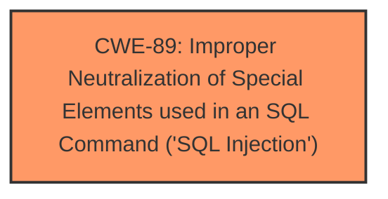

# Analysis for CVE-2025-4863

# Summary

| CWE ID | CWE Name | Confidence | CWE Abstraction Level | CWE Vulnerability Mapping Label | CWE-Vulnerability Mapping Notes |
|---|---|---|---|---|---|
| CWE-89 | Improper Neutralization of Special Elements used in an SQL Command ('SQL Injection') | 1.0 | Base | Allowed | Primary CWE |

## Evidence and Confidence

*   **Confidence Score:** 1.0
*   **Evidence Strength:** HIGH

## Relationship Analysis

The primary relationship influencing the decision is the direct match of the vulnerability description to the characteristics of CWE-89. The description explicitly mentions "**SQL injection**" as the **weakness**, and the CVE Reference Links Content Summary confirms this with details about the vulnerable `userId` parameter and the ability to read and manipulate data. CWE-89 is a Base level CWE, providing the right level of specificity for this vulnerability.

## Vulnerability Chain

The vulnerability chain starts with the **improper neutralization** of the `userId` argument which leads to **SQL injection**. An attacker can then use this to read, insert, update, or delete database records.

## Summary of Analysis

The analysis is based on the vulnerability description, which explicitly mentions "**SQL injection**" and the manipulation of the `userId` argument in the `/studentLogin/studentLogin.action` file. The CVE Reference Links Content Summary confirms that the `userId` parameter is vulnerable to SQL injection due to insufficient input validation or sanitization, allowing attackers to read and manipulate data. This directly aligns with the description of CWE-89, which focuses on the improper neutralization of special elements used in an SQL command.

The selection of CWE-89 is appropriate because it directly addresses the **root cause** of the vulnerability: the **improper neutralization** of input leading to SQL injection. It's a Base-level CWE, offering sufficient specificity.

Relevant CWE Information:

# Enhanced Context (25 CWEs)
The following CWEs were identified as potentially relevant to this vulnerability:

## CWE-89: Improper Neutralization of Special Elements used in an SQL Command ('SQL Injection')
**Abstraction Level**: Base
**Similarity Score**: 0.79
**Source**: dense

**Description**:
The product constructs all or part of an SQL command using externally-influenced input from an upstream component, but it does not neutralize or incorrectly neutralizes special elements that could modify the intended SQL command when it is sent to a downstream component. Without sufficient removal or quoting of SQL syntax in user-controllable inputs, the generated SQL query can cause those inputs to be interpreted as SQL instead of ordinary user data.

**Mapping Guidance**:
- Usage: Allowed
- Rationale: This CWE entry is at the Base level of abstraction, which is a preferred level of abstraction for mapping to the root causes of vulnerabilities.

**Why CWE-89 was selected:** The vulnerability description clearly indicates that manipulating the `userId` argument leads to **SQL injection**, making CWE-89 the most direct and accurate classification. The description of CWE-89 aligns perfectly with this scenario, where externally influenced input is used to construct an SQL command without proper neutralization.

## CWE-79: Improper Neutralization of Input During Web Page Generation ('Cross-site Scripting')
**Abstraction Level**: Base
**Similarity Score**: 0.77
**Source**: dense

**Description**:
The product does not neutralize or incorrectly neutralizes user-controllable input before it is placed in output that is used as a web page that is served to other users.

**Mapping Guidance**:
- Usage: Allowed
- Rationale: This CWE entry is at the Base level of abstraction, which is a preferred level of abstraction for mapping to the root causes of vulnerabilities.

**Why CWE-79 was NOT selected:** While improper neutralization is a general theme, the specific vulnerability is SQL injection, not cross-site scripting. Therefore, CWE-79 is not the appropriate classification.

## CWE-434: Unrestricted Upload of File with Dangerous Type
**Abstraction Level**: Base
**Similarity Score**: 0.78
**Source**: dense

**Description**:
The product allows the upload or transfer of dangerous file types that are automatically processed within its environment.

**Mapping Guidance**:
- Usage: Allowed
- Rationale: This CWE entry is at the Base level of abstraction, which is a preferred level of abstraction for mapping to the root causes of vulnerabilities.

**Why CWE-434 was NOT selected:** This CWE relates to file uploads, which is not relevant to the described vulnerability.

## CWE-425: Direct Request ('Forced Browsing')
**Abstraction Level**: Base
**Similarity Score**: 0.78
**Source**: dense

**Description**:
The web application does not adequately enforce appropriate authorization on all restricted URLs, scripts, or files.

**Mapping Guidance**:
- Usage: Allowed
- Rationale: This CWE entry is at the Base level of abstraction, which is a preferred level of abstraction for mapping to the root causes of vulnerabilities.

**Why CWE-425 was NOT selected:** The vulnerability description focuses on SQL injection, not authorization issues.

## CWE-116: Improper Encoding or Escaping of Output
**Abstraction Level**: Class
**Similarity Score**: 0.78
**Source**: dense

**Description**:
The product prepares a structured message for communication with another component, but encoding or escaping of the data is either missing or done incorrectly. As a result, the intended structure of the message is not preserved.

**Mapping Guidance**:
- Usage: Allowed-with-Review
- Rationale: This CWE entry is a Class and might have Base-level children that would be more appropriate

**Why CWE-116 was NOT selected:** While improper encoding/escaping could theoretically be related to SQL injection, CWE-89 is a more direct and specific classification.

## CWE-73: External Control of File Name or Path
**Abstraction Level**: base
**Similarity Score**: 5.03
**Source**: graph

**Description**:
CWE-73: External Control of File Name or Path

**Mapping Guidance**:
- Usage: Allowed
- Rationale: This CWE entry is at the Base level of abstraction, which is a preferred level of abstraction for mapping to the root causes of vulnerabilities.

**Why CWE-73 was NOT selected:** The vulnerability is related to SQL injection, not file path manipulation.