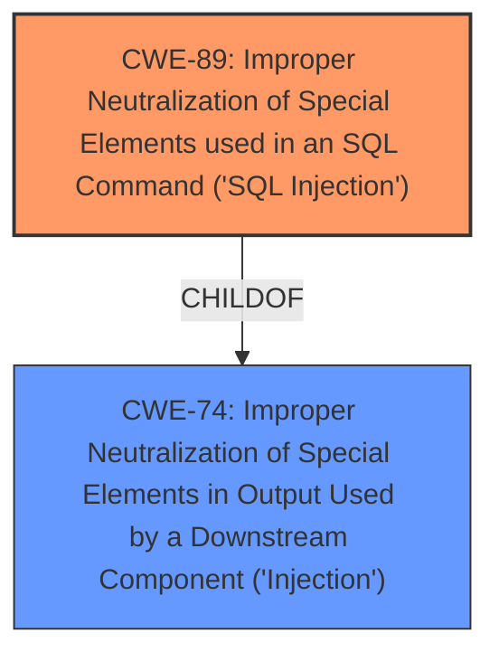

# Analysis for CVE-2025-4875

# Summary

| CWE ID | CWE Name | Confidence | CWE Abstraction Level | CWE Vulnerability Mapping Label | CWE-Vulnerability Mapping Notes |
|---|---|---|---|---|---|
| CWE-89 | Improper Neutralization of Special Elements used in an SQL Command ('SQL Injection') | 1.0 | Base | Allowed | Primary CWE |

## Evidence and Confidence

*   **Confidence Score:** 1.0
*   **Evidence Strength:** HIGH

## Relationship Analysis
The primary relationship observed is that CWE-89 stands alone as the root cause. While it is a child of CWE-74 (Improper Neutralization of Special Elements in Output Used by a Downstream Component ('Injection')), the base-level CWE-89 is more specific and appropriate. There are no clear chain relationships indicated in this description.

## Vulnerability Chain
The vulnerability chain starts with the **improper neutralization** of the email parameter, leading directly to **SQL Injection**. The impact of this is unauthorized database access, data tampering, and potential system compromise.

Root Cause: **Improper Neutralization** of the 'email' parameter -> CWE-89
Impact: SQL Injection leading to unauthorized access and data compromise.

## Summary of Analysis
The analysis is strongly based on the provided evidence, particularly the vulnerability description and the CVE Reference Links Content Summary, which explicitly identifies **SQL Injection** as the **weakness** due to **improper neutralization** of the email parameter in the `/forgot-password.php` file. The root cause is the lack of proper input validation and sanitization.

The retriever results strongly support CWE-89 as the primary candidate, with a score of 1.0. The relationship analysis shows that while CWE-89 has a parent in CWE-74 (Injection), CWE-89 is the more specific and appropriate choice.

The selection of CWE-89 is at the optimal level of specificity because it directly addresses the root cause described in the vulnerability, which is the **improper neutralization** of special elements in an SQL command.

Relevant CWE Information:

# Enhanced Context (25 CWEs)

## CWE-89: Improper Neutralization of Special Elements used in an SQL Command ('SQL Injection')
**Abstraction Level**: Base
**Similarity Score**: 0.77
**Source**: dense

**Description**:
The product constructs all or part of an SQL command using externally-influenced input from an upstream component, but it does not neutralize or incorrectly neutralizes special elements that could modify the intended SQL command when it is sent to a downstream component. Without sufficient removal or quoting of SQL syntax in user-controllable inputs, the generated SQL query can cause those inputs to be interpreted as SQL instead of ordinary user data.

**Mapping Guidance**:
- Usage: Allowed
- Rationale: This CWE entry is at the Base level of abstraction, which is a preferred level of abstraction for mapping to the root causes of vulnerabilities.

## CWE-89: Improper Neutralization of Special Elements used in an SQL Command ('SQL Injection')
**Abstraction Level**: Base
**Similarity Score**: 944.07
**Source**: sparse

**Description**:
The product constructs all or part of an SQL command using externally-influenced input from an upstream component, but it does not neutralize or incorrectly neutralizes special elements that could modify the intended SQL command when it is sent to a downstream component. Without sufficient removal or quoting of SQL syntax in user-controllable inputs, the generated SQL query can cause those inputs to be interpreted as SQL instead of ordinary user data.

**Mapping Guidance**:
- Usage: Allowed
- Rationale: This CWE entry is at the Base level of abstraction, which is a preferred level of abstraction for mapping to the root causes of vulnerabilities.

### CWE-89: Improper Neutralization of Special Elements used in an SQL Command ('SQL Injection')
This is the primary CWE. The vulnerability description states that the manipulation of the argument email leads to **sql injection**. The CVE reference summary states: "The vulnerability exists because the '/forgot-password.php' file does not properly clean or validate the 'email' parameter before using it in SQL queries, allowing attackers to inject malicious code." This aligns directly with the description of CWE-89, which involves the **improper neutralization** of special elements used in an SQL command. The usage is "Allowed" and the abstraction level is "Base," which is the preferred level.

### CWE-79: Improper Neutralization of Input During Web Page Generation ('Cross-site Scripting')
While this CWE appears in the Retriever Results, it is not relevant. The vulnerability is specifically related to **SQL Injection**, not Cross-site Scripting.

### CWE-434: Unrestricted Upload of File with Dangerous Type
This CWE is not relevant as the vulnerability does not involve file uploads.

### CWE-117: Improper Output Neutralization for Logs
This CWE is not relevant as the vulnerability is focused on the email parameter and SQL queries, not logging.

### CWE-1336: Improper Neutralization of Special Elements Used in a Template Engine
This CWE is not relevant as there is no mention of a template engine in the vulnerability description.

### CWE-74: Improper Neutralization of Special Elements in Output Used by a Downstream Component ('Injection')
This CWE is a Class-level CWE and is too general. CWE-89 is a more specific Base-level CWE and describes the exact type of injection occurring.

### CWE-471: Modification of Assumed-Immutable Data (MAID)
This CWE is not relevant to the described vulnerability.