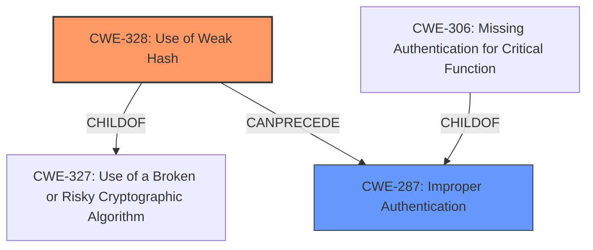

# Analysis for CVE-2025-48925

# Summary
| CWE ID | CWE Name | Confidence | CWE Abstraction Level | CWE Vulnerability Mapping Label | CWE-Vulnerability Mapping Notes |
|---|---|---|---|---|---|
| CWE-328 | Use of Weak Hash | 1.0 | Base | Primary | Allowed |
| CWE-287 | Improper Authentication | 0.5 | Class | Secondary | Discouraged |

## Evidence and Confidence

*   **Confidence Score:** 0.75
*   **Evidence Strength:** MEDIUM

## Relationship Analysis
The primary relationship influencing the selection was the hierarchical structure, specifically focusing on identifying the Base level CWE that accurately represented the use of MD5, a weak hashing algorithm. CWE-328 is a direct child of CWE-327 "Use of a Broken or Risky Cryptographic Algorithm" which is a class, while CWE-328 is a base.

## Vulnerability Chain
The vulnerability chain begins with the **weak client-side MD5 hashing** (CWE-328), leading to a potential **improper authentication** (CWE-287) because the **weak hash** is used as an authentication credential.

## Summary of Analysis
The initial assessment focused on identifying the most specific CWE that directly addresses the **root cause** of the vulnerability, which is the usage of MD5 hashing. The analysis considered both retriever results and complete CWE specifications to ensure proper classification. The primary CWE, CWE-328, represents the **root cause** due to its Base level of abstraction and direct match to the vulnerability description. The secondary CWE, CWE-287, was considered due to the potential impact on authentication but was ultimately deemed less relevant as the primary issue is the **weak hashing** algorithm. The selection is based on evidence from the "Vulnerability Description Key Phrases" section, specifically the phrase "**rootcause: weak client side MD5 hashing**". The relationships within the CWE structure, particularly the parent-child relationship between CWE-327 and CWE-328, influenced the decision to select the more specific Base level CWE.

Relevant CWE Information:

**CWE-328: Use of Weak Hash**
The product uses an algorithm that produces a digest (output value) that does not meet security expectations for a hash function that allows an adversary to reasonably determine the original input (preimage attack), find another input that can produce the same hash (2nd preimage attack), or find multiple inputs that evaluate to the same hash (birthday attack).
*   Usage: Allowed
*   Rationale: This CWE entry is at the Base level of abstraction, which is a preferred level of abstraction for mapping to the root causes of vulnerabilities.

**CWE-287: Improper Authentication**
When an actor claims to have a given identity, the product does not prove or insufficiently proves that the claim is correct.
*   Usage: Discouraged
*   Rationale: This CWE entry might be misused when lower-level CWE entries are likely to be applicable. It is a level-1 Class (i.e., a child of a Pillar).