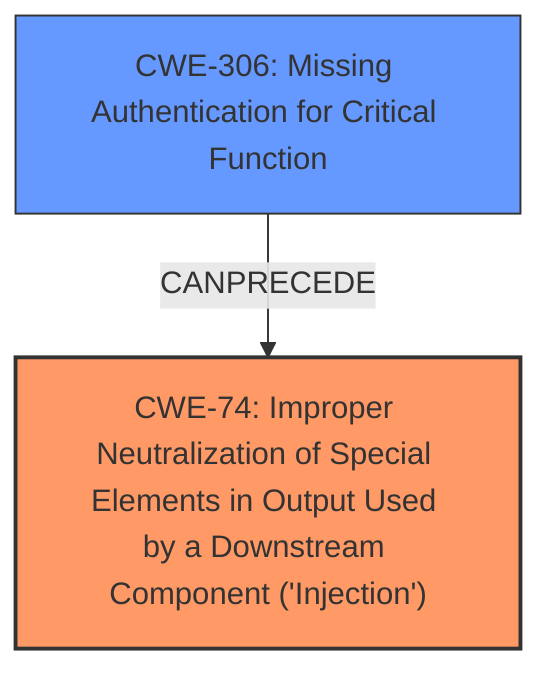

# Analysis for CVE-2025-48936

# Summary
| CWE ID | CWE Name | Confidence | CWE Abstraction Level | CWE Vulnerability Mapping Label | CWE-Vulnerability Mapping Notes |
|---|---|---|---|---|---|
| CWE-74 | Improper Neutralization of Special Elements in Output Used by a Downstream Component ('Injection') | 0.85 | Class | Allowed | Primary CWE. The **host header injection** allows the attacker to inject a malicious domain into the password reset link.|
| CWE-306 | Missing Authentication for Critical Function | 0.6 | Base | Allowed | Secondary candidate. The password reset mechanism lacks proper authentication checks, allowing unauthorized modification of the reset link.|

## Evidence and Confidence

*   **Confidence Score:** 0.7
*   **Evidence Strength:** MEDIUM

## Relationship Analysis
The primary CWE is CWE-74, which is a class-level weakness related to injection. CWE-306, a base-level weakness, is related to missing authentication. The vulnerability involves **host header injection** (CWE-74) leading to a malicious password reset link, which could be seen as stemming from a missing authentication check (CWE-306) on the header.

## Vulnerability Chain
The vulnerability chain starts with the **host header injection** (**weakness**) (CWE-74), which allows an attacker to manipulate the password reset link. This leads to the exposure of the secret reset code, and ultimately to unauthorized access to the user's account. The lack of authentication (CWE-306) on the password reset mechanism facilitates the injection.

## Summary of Analysis
The initial assessment identified CWE-74 as the primary weakness, stemming from the **host header injection** vulnerability. The content mentions that by manipulating the `Forwarded` or `X-Forwarded-Host` header an attacker can cause ZITADEL to generate a password reset link pointing to a malicious domain. This indicates an injection vulnerability. While the password reset mechanism is vulnerable and lacks sufficient authentication (CWE-306), the root cause is the **host header injection** leading to improper neutralization of special elements in the output.

The evidence from the vulnerability description key phrases includes:
- **weakness:** **host header injection**

The evidence from the CVE Reference Links Content Summary includes:
-   **Host Header Injection:** The vulnerability stems from insufficient validation of the `X-Forwarded-Proto` and `Forwarded` headers.

I considered CWE-306 because the password reset mechanism lacks proper authentication checks, but the root cause is the improper neutralization of special elements, making CWE-74 the more appropriate primary classification.

The selected CWEs are at the optimal level of specificity, with CWE-74 being a class-level weakness and CWE-306 being a base-level weakness.