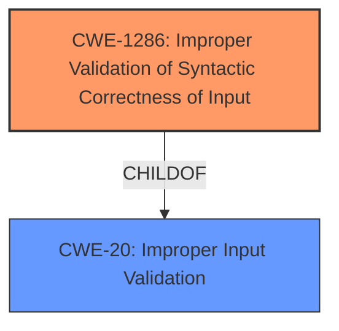

# Analysis for CVE-2025-48944

# Summary
| CWE ID | CWE Name | Confidence | CWE Abstraction Level | CWE Vulnerability Mapping Label | CWE-Vulnerability Mapping Notes |
|---|---|---|---|---|---|
| CWE-1286 | Improper Validation of Syntactic Correctness of Input | 0.9 | Base | Primary CWE | Allowed |
| CWE-20 | Improper Input Validation | 0.6 | Class | Secondary Candidate | Discouraged |

## Evidence and Confidence

*   **Confidence Score:** 0.9
*   **Evidence Strength:** HIGH

## Relationship Analysis
The primary CWE selected is CWE-1286, which is at the Base level of abstraction. CWE-20 is a parent Class of CWE-1286. While CWE-20 is a broader category, the vulnerability description specifically mentions the lack of syntactic correctness validation, making CWE-1286 a more precise fit.

## Vulnerability Chain
The vulnerability chain starts with **improper validation of unexpected or malformed input** (CWE-1286), leading to a crash of the inference worker.
- **Root Cause:** CWE-1286: Improper Validation of Syntactic Correctness of Input
- **Impact:** Denial of Service (DoS) due to the crash of the inference worker.

## Summary of Analysis
The primary CWE selected is CWE-1286 because the vulnerability description explicitly states that the vLLM backend **fails to validate unexpected or malformed input** in the "pattern" and "type" fields. This aligns directly with the description of CWE-1286, which focuses on the **improper validation of syntactic correctness of input**.

The evidence supporting this choice is:
*   "vLLM backend used with the /v1/chat/completions OpenAPI endpoint **fails to validate unexpected or malformed input** in the pattern and type fields"
*   "These inputs are **not validated** before being compiled or parsed, causing a crash of the inference worker with a single request."

CWE-20 was considered, but it is a more general class of weakness (**Improper Input Validation**). Since the description specifically mentions syntactic correctness, CWE-1286 is a more accurate and specific mapping.

Relevant CWE Information:

# Enhanced Context (25 CWEs)
The following CWEs were identified as potentially relevant to this vulnerability:

## CWE-1286: Improper Validation of Syntactic Correctness of Input
**Abstraction Level**: Base
**Similarity Score**: 0.71
**Source**: dense

**Description**:
The product receives input that is expected to be well-formed - i.e., to comply with a certain syntax - but it does not validate or incorrectly validates that the input complies with the syntax.

**Mapping Guidance**:
- Usage: Allowed
- Rationale: This CWE entry is at the Base level of abstraction, which is a preferred level of abstraction for mapping to the root causes of vulnerabilities.

## CWE-20: Improper Input Validation
**Abstraction Level**: Class
**Similarity Score**: 0.67
**Source**: dense

**Description**:
The product receives input or data, but it does
        not validate or incorrectly validates that the input has the
        properties that are required to process the data safely and
        correctly.

**Mapping Guidance**:
- Usage: Discouraged
- Rationale: CWE-20 is commonly misused in low-information vulnerability reports when lower-level CWEs could be used instead, or when more details about the vulnerability are available [REF-1287]. It is not useful for trend analysis. It is also a level-1 Class (i.e., a child of a Pillar).

###