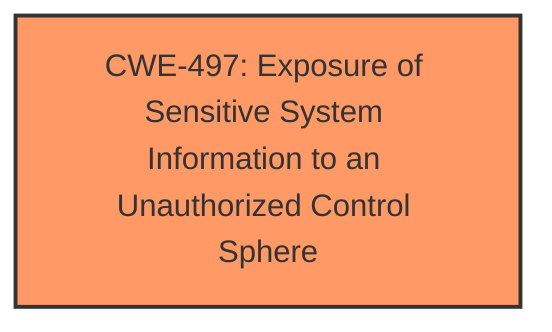

# Enhanced Analysis for CVE-2025-4901

# Summary
| CWE ID | CWE Name | Confidence | CWE Abstraction Level | CWE Vulnerability Mapping Label | CWE-Vulnerability Mapping Notes |
|---|---|---|---|---|---|
| CWE-497 | Exposure of Sensitive System Information to an Unauthorized Control Sphere | 0.7 | Base | Allowed | Primary CWE |

## Evidence and Confidence

*   **Confidence Score:** 0.7
*   **Evidence Strength:** LOW

## Relationship Analysis
CWE-497 is a Base level CWE which is generally preferred. There are no specific child or parent relationships mentioned that would influence a change in this selection.



## Vulnerability Chain
The vulnerability chain starts with a request to `/H5/state_view.data` and leads to **information disclosure**.

## Summary of Analysis
The vulnerability description states that the manipulation leads to **information disclosure**. The attack can only be done within the local network. The CVE Reference Links Content Summary section is "UNRELATED", so there's no additional information. Based on the retriever results and the vulnerability description, CWE-497 (Exposure of Sensitive System Information to an Unauthorized Control Sphere) seems to be the most appropriate. The description of CWE-497 states: "The product does not properly prevent sensitive system-level information from being accessed by unauthorized actors who do not have the same level of access to the underlying system as the product does."

Other CWEs Considered but Not Used:
*   CWE-78, CWE-89, CWE-79, CWE-22, CWE-306, CWE-184: These involve injection or path traversal which don't seem to fit the **information disclosure** aspect of this vulnerability.
*   CWE-425: Direct Request ('Forced Browsing'): This CWE suggests missing authorization, but the description only states **information disclosure** which suggests sensitive information is exposed without proper controls, but not necessarily a complete bypass of authorization.
*   CWE-755, CWE-912, CWE-923, CWE-790, CWE-134, CWE-74, CWE-116, CWE-322, CWE-73, CWE-494, CWE-705, CWE-522, CWE-1241, CWE-285: These do not clearly align with the described vulnerability.


## CWE Relationship Analysis

Current CWEs represent these abstraction levels: .


### Vulnerability Chain Analysis

**Chain starting from CWE-494:**
- 494 (Download of Code Without Integrity Check) - ROOT


**Chain starting from CWE-79:**
- 79 (Improper Neutralization of Input During Web Page Generation ('Cross-site Scripting')) - ROOT


### CWE Relationship Diagram

```mermaid
graph TD
    classDef primary fill:#f96,stroke:#333,stroke-width:2px
    classDef secondary fill:#69f,stroke:#333
    classDef tertiary fill:#9e9,stroke:#333
```