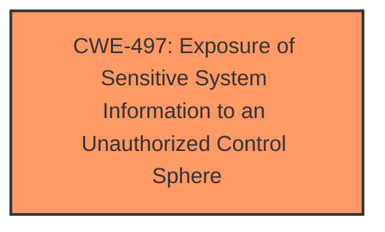

# Analysis Report for CVE-2025-4904

# Vulnerability Analysis Report: CVE-2025-4904

## Description

A vulnerability has been found in D-Link DI-7003GV2 24.04.18D1 R(68125) and classified as problematic. This vulnerability affects the function sub_41F0FC of the file /H5/webgl.data. The manipulation leads to information disclosure. The attack can be initiated remotely. The exploit has been disclosed to the public and may be used.

## Vulnerability Description Key Phrases

- **Impact:** information disclosure
- **Product:** D-Link DI-7003GV2
- **Version:** 24.04.18D1 R(68125)
- **Component:** sub_41F0FC in /H5/webgl.data

## Analysis (with Relationship Data)

# Summary
| CWE ID | CWE Name | Confidence | CWE Abstraction Level | CWE Vulnerability Mapping Label | CWE-Vulnerability Mapping Notes |
|---|---|---|---|---|---|
| CWE-497 | Exposure of Sensitive System Information to an Unauthorized Control Sphere | 0.8 | Base | Allowed | Primary CWE |

## Evidence and Confidence

*   **Confidence Score:** 0.8
*   **Evidence Strength:** MEDIUM

## Relationship Analysis
The primary CWE selected is CWE-497, which is a base-level CWE. There are no direct parent-child or chain relationships significantly impacting the decision in this case, given the limited information. The retriever results suggested several injection-related CWEs, which were deemed less relevant than CWE-497 due to the vulnerability being explicitly related to information disclosure.



## Vulnerability Chain
The vulnerability chain is relatively simple:
1.  The **root cause** is a mechanism within the D-Link device that exposes sensitive system information.
2.  The **impact** is information disclosure.

## Summary of Analysis
The primary focus of the vulnerability is the **information disclosure** caused by the manipulation of the `sub_41F0FC` function in `/H5/webgl.data`. The retriever results suggested several injection-related CWEs, such as CWE-79 (Improper Neutralization of Input During Web Page Generation ('Cross-site Scripting')), CWE-89 (Improper Neutralization of Special Elements used in an SQL Command ('SQL Injection')), and CWE-78 (Improper Neutralization of Special Elements used in an OS Command ('OS Command Injection')). However, these are less relevant as the vulnerability's core impact is the **disclosure of information**, not the execution of unintended commands or scripts.

CWE-497 (Exposure of Sensitive System Information to an Unauthorized Control Sphere) aligns well with this scenario. The vulnerability allows unauthorized actors to access sensitive system-level information. The description of CWE-497 directly matches the observed **information disclosure** impact.

CWE-425 (Direct Request ('Forced Browsing')) was considered but deemed less accurate. While unauthorized access might be involved, the primary issue is the exposure of sensitive information, not simply accessing restricted URLs.

Therefore, CWE-497 is the most appropriate primary CWE, as it directly addresses the **root cause** of the **information disclosure** vulnerability.

Relevant CWE Information:

# Enhanced Context (25 CWEs)
The following CWEs were identified as potentially relevant to this vulnerability:

## CWE-497: Exposure of Sensitive System Information to an Unauthorized Control Sphere
**Abstraction Level**: Base
**Similarity Score**: 0.75
**Source**: dense

**Description**:
The product does not properly prevent sensitive system-level information from being accessed by unauthorized actors who do not have the same level of access to the underlying system as the product does.

**Mapping Guidance**:
- Usage: Allowed
- Rationale: This CWE entry is at the Base level of abstraction, which is a preferred level of abstraction for mapping to the root causes of vulnerabilities.


## CWE Relationship Analysis

Current CWEs represent these abstraction levels: .


### Vulnerability Chain Analysis

**Chain starting from CWE-89:**
- 89 (Improper Neutralization of Special Elements used in an SQL Command ('SQL Injection')) - ROOT


**Chain starting from CWE-79:**
- 79 (Improper Neutralization of Input During Web Page Generation ('Cross-site Scripting')) - ROOT


### CWE Relationship Diagram

```mermaid
graph TD
    classDef primary fill:#f96,stroke:#333,stroke-width:2px
    classDef secondary fill:#69f,stroke:#333
    classDef tertiary fill:#9e9,stroke:#333
```


*Report generated on 2025-07-15 02:54:35*
