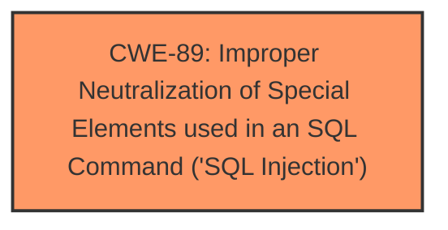

# Analysis Report for CVE-2025-4908

# Vulnerability Analysis Report: CVE-2025-4908

## Description

A vulnerability classified as critical has been found in PHPGurukul Daily Expense Tracker System 1.1. This affects an unknown part of the file /expense-datewise-reports-detailed.php. The manipulation of the argument fromdate/todate leads to sql injection. It is possible to initiate the attack remotely. The exploit has been disclosed to the public and may be used.

## Vulnerability Description Key Phrases

- **Component:** /expense-datewise-reports-detailed.php
- **Vector:** manipulation of the argument fromdate/todate
- **Weakness:** sql injection, sql injection
- **Product:** PHPGurukul Daily Expense Tracker System
- **Version:** 1

## Analysis (with Relationship Data)

# Summary

| CWE ID  | CWE Name                                                                  | Confidence | CWE Abstraction Level | CWE Vulnerability Mapping Label | CWE-Vulnerability Mapping Notes |
| :-------- | :------------------------------------------------------------------------ | :--------- | :---------------------- | :------------------------------ | :------------------------------ |
| CWE-89 | Improper Neutralization of Special Elements used in an SQL Command ('SQL Injection') | 1.0       | Base                    | Primary CWE                     | Allowed                       |

## Evidence and Confidence

*   **Confidence Score:** 1.0
*   **Evidence Strength:** HIGH

## Relationship Analysis

The primary relationship that impacts the decision is the direct match of the vulnerability description to the CWE-89 definition. The retriever results confirm this with a high similarity score. There are no other significant relationships. CWE-89 is a base-level CWE, which is the preferred level of abstraction.



## Vulnerability Chain

The vulnerability chain consists of the following:
1.  **Root Cause:** Improper neutralization of special elements in SQL commands (CWE-89).
2.  **Impact:** SQL injection leading to unauthorized access, data leakage, and potential system compromise.

## Summary of Analysis

The vulnerability description explicitly states that the vulnerability is due to **SQL Injection** in the `/expense-datewise-reports-detailed.php` file. The manipulation of the `fromdate` and `todate` arguments leads to the **SQL Injection**. The CVE reference content summary confirms that the root cause is the lack of proper sanitization or validation of user input.

The retriever results identify CWE-89 as the top candidate with a high similarity score. The description of CWE-89, "The product constructs all or part of an SQL command using externally-influenced input from an upstream component, but it does not neutralize or incorrectly neutralizes special elements that could modify the intended SQL command," perfectly matches the vulnerability. The suggested mitigation of employing prepared statements and parameter binding further supports this classification.

CWE-79 (Improper Neutralization of Input During Web Page Generation ('Cross-site Scripting')) was considered but rejected because the vulnerability is related to SQL commands, not web page generation.

CWE-434 (Unrestricted Upload of File with Dangerous Type) was also considered but is not relevant as the vulnerability is not related to file uploads.

CWE-89 is the most specific and accurate representation of the **SQL Injection** vulnerability. The confidence level is very high based on the clear evidence in the description and the retriever results. The CWE selected is at the optimal level of specificity, as it's a base-level CWE.


## CWE Relationship Analysis

Current CWEs represent these abstraction levels: .


### Vulnerability Chain Analysis

**Chain starting from CWE-89:**
- 89 (Improper Neutralization of Special Elements used in an SQL Command ('SQL Injection')) - ROOT


**Chain starting from CWE-79:**
- 79 (Improper Neutralization of Input During Web Page Generation ('Cross-site Scripting')) - ROOT


### CWE Relationship Diagram

```mermaid
graph TD
    classDef primary fill:#f96,stroke:#333,stroke-width:2px
    classDef secondary fill:#69f,stroke:#333
    classDef tertiary fill:#9e9,stroke:#333
```


*Report generated on 2025-07-15 02:55:44*
