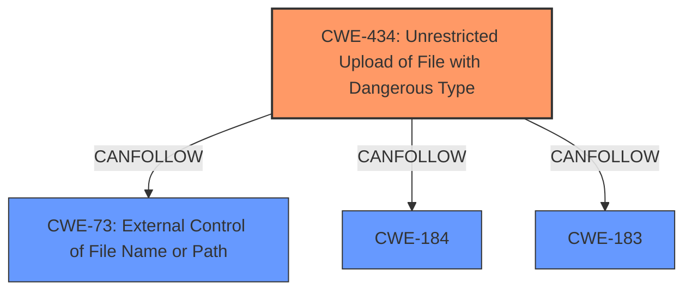

# Enhanced Analysis for CVE-2025-4926

# Summary
| CWE ID | CWE Name | Confidence | CWE Abstraction Level | CWE Vulnerability Mapping Label | CWE-Vulnerability Mapping Notes |
|---|---|---|---|---|---|
| CWE-434 | Unrestricted Upload of File with Dangerous Type | 1.0 | Base | Allowed | Primary CWE |

## Evidence and Confidence

*   **Confidence Score:** 1.0
*   **Evidence Strength:** HIGH

## Relationship Analysis
The primary relationship is that CWE-434 [CWE-434: Unrestricted Upload of File with Dangerous Type] is a base-level CWE, which is the preferred level of abstraction. There are also CANFOLLOW relationships with CWE-73 [CWE-73: External Control of File Name or Path], CWE-184, and CWE-183.



## Vulnerability Chain
The vulnerability chain starts with the **unrestricted upload** (**weakness**), which allows an attacker to upload a webshell. This leads to gaining control of the website server and further access to all data on the server. The root cause is the missing file extension validation.

## Summary of Analysis
The analysis is based on the vulnerability description, which states that the manipulation of the arguments img1/img2/img3/img4/img5 leads to **unrestricted upload**. The CVE Reference Links Content Summary confirms this by stating that the vulnerability stems from the absence of file extension validation.

CWE-434 [CWE-434: Unrestricted Upload of File with Dangerous Type] is the most appropriate CWE because it directly addresses the **unrestricted upload** vulnerability. The CWE description states: "The product allows the upload or transfer of dangerous file types that are automatically processed within its environment." This aligns with the vulnerability where an attacker can upload a webshell, which is then processed by the server, leading to further compromise.

Other CWEs Considered:

*   CWE-89 [CWE-89: Improper Neutralization of Special Elements used in an SQL Command ('SQL Injection')], CWE-79 [CWE-79: Improper Neutralization of Input During Web Page Generation ('Cross-site Scripting')], CWE-22 [CWE-22: Improper Limitation of a Pathname to a Restricted Directory ('Path Traversal')]: These are related to injection and path traversal vulnerabilities, but the primary issue here is the **unrestricted upload** itself, not how the uploaded file is processed or where it's stored.
*   CWE-73 [CWE-73: External Control of File Name or Path]: This is a related CWE, but CWE-434 [CWE-434: Unrestricted Upload of File with Dangerous Type] is more specific to the **unrestricted upload** issue.


## CWE Relationship Analysis

Current CWEs represent these abstraction levels: .


### Vulnerability Chain Analysis

**Chain starting from CWE-183:**
- 183 (Permissive List of Allowed Inputs) - ROOT


**Chain starting from CWE-89:**
- 89 (Improper Neutralization of Special Elements used in an SQL Command ('SQL Injection')) - ROOT


### CWE Relationship Diagram

```mermaid
graph TD
    classDef primary fill:#f96,stroke:#333,stroke-width:2px
    classDef secondary fill:#69f,stroke:#333
    classDef tertiary fill:#9e9,stroke:#333
```