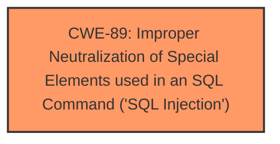

# Raw Analyzer Response for CVE-2025-4928

# Summary
| CWE ID | CWE Name | Confidence | CWE Abstraction Level | CWE Vulnerability Mapping Label | CWE-Vulnerability Mapping Notes |
|---|---|---|---|---|---|
| CWE-89 | Improper Neutralization of Special Elements used in an SQL Command ('SQL Injection') | 1.0 | Base | Allowed | Primary CWE. The vulnerability is due to **SQL injection** in the `/save_lawyer_edit_profile.php` file. |

## Evidence and Confidence

*   **Confidence Score:** 1.0
*   **Evidence Strength:** HIGH

## Relationship Analysis
The primary identified weakness is CWE-89. There are no parent-child or chain relationships that significantly influence this selection, as the description clearly points to an **SQL Injection** vulnerability due to the **lack of proper input validation**.

## Vulnerability Chain
The vulnerability chain is straightforward:

1.  **Root Cause:** **Improper input validation/sanitization** in `/save_lawyer_edit_profile.php`.
2.  **Weakness:** CWE-89 - **Improper Neutralization of Special Elements used in an SQL Command ('SQL Injection')**.
3.  **Impact:** Unauthorized database access, sensitive data leakage, data tampering, system control, service interruption.

## Summary of Analysis
The analysis is based on the provided evidence, which clearly states that there is an **SQL injection** vulnerability due to the **lack of proper input validation**.

The vulnerability description states: "This vulnerability affects unknown code of the file /save_lawyer_edit_profile.php. The manipulation leads to sql injection. The attack can be initiated remotely."

The CVE Reference Links Content Summary elaborates: "The root cause is the lack of proper input validation and sanitization of the `first_Name` parameter before it's used in SQL queries. This allows attackers to inject malicious SQL code."

CWE-89 is the most specific and accurate representation of this weakness. The other CWEs were considered but are not as directly relevant:

*   CWE-79 (Cross-site Scripting): While possible, the primary issue is with database interaction, not web page generation.
*   CWE-434 (Unrestricted Upload of File with Dangerous Type): Not relevant as the vulnerability is related to **SQL injection**, not file uploads.
*   CWE-74 (Improper Neutralization of Special Elements in Output Used by a Downstream Component ('Injection')): This is a more general class of injection vulnerabilities, and CWE-89 is a more specific and appropriate choice.

CWE-89 is at the optimal level of specificity (Base) for describing this vulnerability.

Relevant CWE Information:
* CWE-89: Improper Neutralization of Special Elements used in an SQL Command ('SQL Injection')