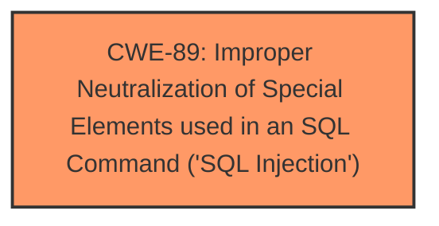

# Raw Analyzer Response for CVE-2025-4937

# Summary
| CWE ID | CWE Name | Confidence | CWE Abstraction Level | CWE Vulnerability Mapping Label | CWE-Vulnerability Mapping Notes |
|---|---|---|---|---|---|
| CWE-89 | Improper Neutralization of Special Elements used in an SQL Command ('SQL Injection') | 1.0 | Base | Primary | Allowed |

## Evidence and Confidence

*   **Confidence Score:** 1.0
*   **Evidence Strength:** HIGH

## Relationship Analysis
The primary relationship considered was the direct match of the vulnerability description to the CWE-89 description. No other hierarchical, chain, or peer relationships significantly influenced the decision, as the evidence strongly pointed to SQL Injection as the root cause. The abstraction level of Base was appropriate as it directly represents the weakness.

## Vulnerability Chain
The vulnerability chain consists of:
1.  **Root Cause:** **Improper Neutralization of Special Elements used in an SQL Command ('SQL Injection')** (CWE-89) due to the lack of proper input validation and sanitization when handling the `mobilenumber` argument in `/profile.php`.
2.  **Impact:** Allows an attacker to inject arbitrary SQL commands, potentially leading to data leakage, modification, or deletion.

## Summary of Analysis
The analysis is based on the vulnerability description, which clearly states that the manipulation of the `mobilenumber` argument leads to **SQL Injection**. The retriever results also strongly suggest CWE-89 as the primary candidate.

The evidence is explicitly stated in the Vulnerability Description: "The manipulation of the argument mobilenumber leads to **sql injection**."

The relationship analysis confirms that focusing on CWE-89 as the root cause is appropriate, given that it directly addresses the identified weakness.

The selection of CWE-89 is at the optimal level of specificity (Base), as it precisely describes the vulnerability.

Relevant CWE Information:

# Enhanced Context (25 CWEs)
The following CWEs were identified as potentially relevant to this vulnerability:

## CWE-89: Improper Neutralization of Special Elements used in an SQL Command ('SQL Injection')
**Abstraction Level**: Base
**Similarity Score**: 0.78
**Source**: dense

**Description**:
The product constructs all or part of an SQL command using externally-influenced input from an upstream component, but it does not neutralize or incorrectly neutralizes special elements that could modify the intended SQL command when it is sent to a downstream component. Without sufficient removal or quoting of SQL syntax in user-controllable inputs, the generated SQL query can cause those inputs to be interpreted as SQL instead of ordinary user data.

**Mapping Guidance**:
- Usage: Allowed
- Rationale: This CWE entry is at the Base level of abstraction, which is a preferred level of abstraction for mapping to the root causes of vulnerabilities.

## Technical Explanation for CWE-89

*   How the vulnerability's details match the CWE's characteristics: The vulnerability description states that manipulating the `mobilenumber` argument results in **SQL injection**. This aligns directly with CWE-89, which describes the failure to neutralize special elements in an SQL command, allowing attacker-controlled input to modify the SQL query.
*   The security implications and potential impact: An attacker can inject arbitrary SQL commands, potentially leading to unauthorized data access, modification, or deletion.
*   Any parent-child relationships or chain patterns that influenced your mapping: There are no relevant parent-child or chain patterns that influenced the mapping, as the vulnerability description directly points to SQL injection.
*   Whether the weakness is primary or secondary in the vulnerability: CWE-89 is the primary weakness, as it is the root cause of the vulnerability.
*   How the official MITRE mapping guidance influenced your decision: The MITRE mapping guidance allows for the usage of CWE-89, as it is at the Base level of abstraction.

## CWEs Considered But Not Used

*   **CWE-79 (Improper Neutralization of Input During Web Page Generation ('Cross-site Scripting'))**: While also present in the Retriever Results, this CWE is not appropriate because the vulnerability involves **SQL injection**, not cross-site scripting.
*   **CWE-434 (Unrestricted Upload of File with Dangerous Type)**: This CWE is unrelated to the vulnerability, which focuses on **SQL injection** through the manipulation of the `mobilenumber` argument.
*   **CWE-352 (Cross-Site Request Forgery (CSRF))**: This CWE is not relevant, as the vulnerability does not involve CSRF.
*   **CWE-1336 (Improper Neutralization of Special Elements Used in a Template Engine)**: This CWE is not applicable, as the vulnerability is related to **SQL injection**, not template engine injection.
*   **CWE-306 (Missing Authentication for Critical Function)**: This CWE is not relevant, as the vulnerability is an **SQL injection** issue, not a missing authentication issue.
*   **CWE-74 (Improper Neutralization of Special Elements in Output Used by a Downstream Component ('Injection'))**: This is a class-level CWE, and CWE-89 is a more specific base-level CWE that directly applies.
*   **CWE-96 (Improper Neutralization of Directives in Statically Saved Code ('Static Code Injection'))**: The vulnerability is **SQL injection**, not static code injection.
*   **CWE-73 (External Control of File Name or Path)**: This CWE is not relevant, as the vulnerability involves **SQL injection**, not file path manipulation.