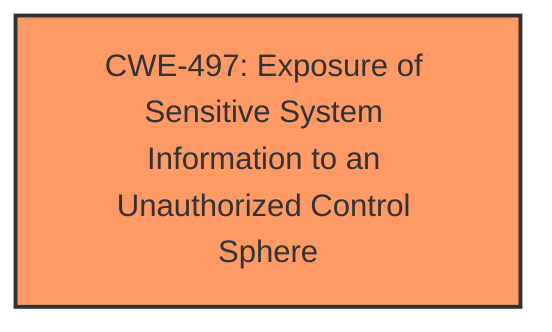

# Enhanced Analysis for CVE-2025-4977

# Summary
| CWE ID | CWE Name | Confidence | CWE Abstraction Level | CWE Vulnerability Mapping Label | CWE-Vulnerability Mapping Notes |
|---|---|---|---|---|---|
| CWE-497 | Exposure of Sensitive System Information to an Unauthorized Control Sphere | 0.75 | Base | Allowed | Primary CWE |

## Evidence and Confidence

*   **Confidence Score:** 0.75
*   **Evidence Strength:** LOW

## Relationship Analysis
The primary CWE, CWE-497, is a Base level weakness. There are no identified parent or child relationships that influenced the decision because of the limited evidence. The analysis is largely based on the description indicating that the vulnerability leads to information disclosure, suggesting a potential exposure of sensitive system information.



## Vulnerability Chain
The vulnerability chain starts with the **root cause**, which is the unspecified weakness in the /BRS_top.html file, leading to **information disclosure**. There are no details on the specific flaw, but the impact is clearly stated.

## Summary of Analysis
The analysis is primarily based on the limited information provided in the vulnerability description, specifically the phrase "**impact:** information disclosure". The **root cause** is an unspecified weakness in the `/BRS_top.html` file. Given the limited evidence, CWE-497 (Exposure of Sensitive System Information to an Unauthorized Control Sphere) seems the most appropriate.

The other CWEs listed in the **Retriever Results** were considered, but were discarded because of lack of evidence.

Relevant CWE Information:

# Enhanced Context (25 CWEs)
The following CWEs were identified as potentially relevant to this vulnerability:

## CWE-497: Exposure of Sensitive System Information to an Unauthorized Control Sphere
**Abstraction Level**: Base
**Similarity Score**: 0.76
**Source**: dense

**Description**:
The product does not properly prevent sensitive system-level information from being accessed by unauthorized actors who do not have the same level of access to the underlying system as the product does.

**Mapping Guidance**:
- Usage: Allowed
- Rationale: This CWE entry is at the Base level of abstraction, which is a preferred level of abstraction for mapping to the root causes of vulnerabilities.

The vulnerability description states "The manipulation leads to **information disclosure**." This aligns with the description of CWE-497, which involves exposing sensitive system-level information to unauthorized actors. The vulnerability is located in `/BRS_top.html`, suggesting that the disclosed information is accessible through a web interface. Since the vulnerability leads to information disclosure, and there is no more granular information, the base CWE is the best fit.


## CWE Relationship Analysis

Current CWEs represent these abstraction levels: .


### Vulnerability Chain Analysis

**Chain starting from CWE-497:**
- 497 (Exposure of Sensitive System Information to an Unauthorized Control Sphere) - ROOT


### CWE Relationship Diagram

```mermaid
graph TD
    classDef primary fill:#f96,stroke:#333,stroke-width:2px
    classDef secondary fill:#69f,stroke:#333
    classDef tertiary fill:#9e9,stroke:#333
```