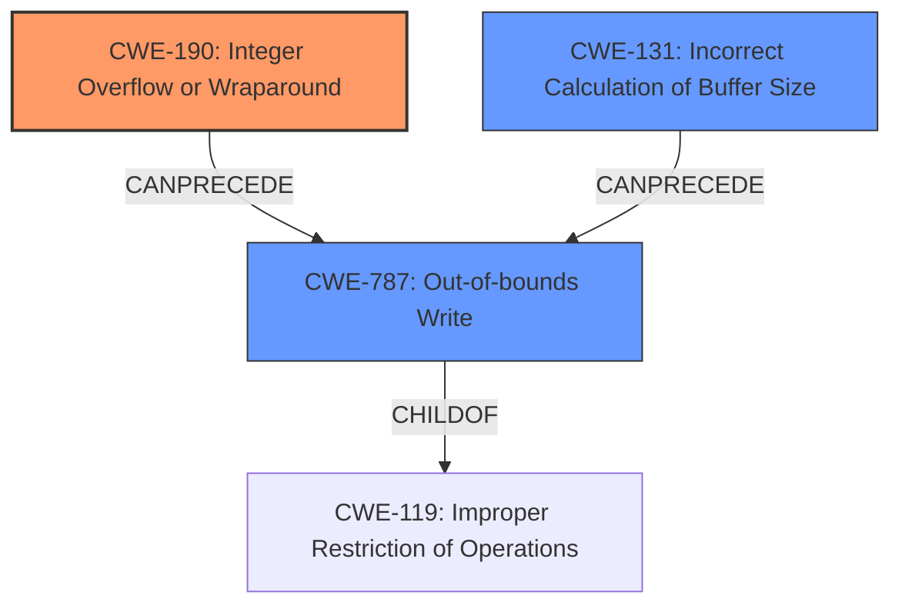

# Analysis for CVE-2025-5001

# Summary
| CWE ID | CWE Name | Confidence | CWE Abstraction Level | CWE Vulnerability Mapping Label | CWE-Vulnerability Mapping Notes |
|---|---|---|---|---|---|
| CWE-190 | Integer Overflow or Wraparound | 1.0 | Base | Allowed | Primary CWE |
| CWE-131 | Incorrect Calculation of Buffer Size | 0.7 | Base | Allowed | Secondary Candidate |
| CWE-787 | Out-of-bounds Write | 0.6 | Base | Allowed | Secondary Candidate |

## Evidence and Confidence

*   **Confidence Score:** 0.9
*   **Evidence Strength:** HIGH

## Relationship Analysis
The primary relationship is that **CWE-190** Integer Overflow can **CanPrecede** **CWE-787** Out-of-bounds Write, because an integer overflow can lead to an incorrectly calculated buffer size, resulting in an out-of-bounds write.
**CWE-131** Incorrect Calculation of Buffer Size is another potential cause leading to **CWE-787** Out-of-bounds Write.
The abstraction levels are all Base, which is the preferred level.

## Vulnerability Chain
The vulnerability chain starts with an **integer overflow** (CWE-190) when handling the `-l` argument. This **incorrectly calculates the buffer size** (CWE-131), leading to an **out-of-bounds write** (CWE-787) when `calloc` is used with the overflowed size. This causes a crash.

## Summary of Analysis
The primary **weakness** is the **integer overflow** when processing the `-l` argument, as stated in the Vulnerability Description Key Phrases and CVE Reference Links Content Summary: "Root cause of vulnerability: An integer overflow in the `pspp-convert` utility when handling the `-l` option".
This leads to a call to `calloc` with a very large size. The AddressSanitizer output pinpointed the `calloc` function as the source of the error.
**CWE-190** Integer Overflow or Wraparound is the most appropriate Primary CWE, with a confidence of 1.0.
The **integer overflow** leads to an **incorrect calculation of the buffer size** which then results in an **out-of-bounds write** when the undersized buffer is written to.
I considered the suggested alternative mappings, especially CWE-131 and CWE-787, because these may follow the **integer overflow**.
Based on the information, these secondary weaknesses are likely present with a confidence score of 0.7.
I am choosing the lowest level of abstraction (Base or Variant) that accurately represents the weakness.

Relevant CWE Information:

# Enhanced Context (25 CWEs)

## CWE-190: Integer Overflow or Wraparound
**Abstraction Level**: Base
**Similarity Score**: 0.75
**Source**: dense

**Description**:
The product performs a calculation that can
         produce an integer overflow or wraparound when the logic
         assumes that the resulting value will always be larger than
         the original value. This occurs when an integer value is
         incremented to a value that is too large to store in the
         associated representation. When this occurs, the value may
         become a very small or negative number.

**Mapping Guidance**:
- Usage: Allowed
- Rationale: This CWE entry is at the Base level of abstraction, which is a preferred level of abstraction for mapping to the root causes of vulnerabilities.

## CWE-131: Incorrect Calculation of Buffer Size
**Abstraction Level**: Base
**Similarity Score**: 0.74
**Source**: dense

**Description**:
The product does not correctly calculate the size to be used when allocating a buffer, which could lead to a buffer overflow.

**Mapping Guidance**:
- Usage: Allowed
- Rationale: This CWE entry is at the Base level of abstraction, which is a preferred level of abstraction for mapping to the root causes of vulnerabilities.

## CWE-787: Out-of-bounds Write
**Abstraction Level**: base
**Similarity Score**: 2.28
**Source**: graph

**Description**:
CWE-787: Out-of-bounds Write

**Mapping Guidance**:
- Usage: Allowed
- Rationale: This CWE entry is at the Base level of abstraction, which is a preferred level of abstraction for mapping to the root causes of vulnerabilities.