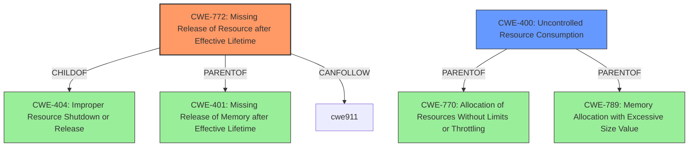

# Enhanced Analysis for CVE-2025-5024

# Summary

| CWE ID | CWE Name | Confidence | CWE Abstraction Level | CWE Vulnerability Mapping Label | CWE-Vulnerability Mapping Notes |
|---|---|---|---|---|---|
| CWE-772 | Missing Release of Resource after Effective Lifetime | 0.9 | Base | Allowed | Primary CWE |
| CWE-400 | Uncontrolled Resource Consumption | 0.7 | Class | Discouraged | Secondary Candidate |

## Evidence and Confidence

*   **Confidence Score:** 0.8
*   **Evidence Strength:** HIGH

## Relationship Analysis

The primary CWE selected is CWE-772, which is a base-level CWE, making it suitably specific. It is a child of CWE-404 (Improper Resource Shutdown or Release), and parent of CWE-401 (Missing Release of Memory after Effective Lifetime) and CWE-1091 (Missing Release of Lock). CWE-400 is a class-level CWE, making it less specific, and is a parent of CWE-770 and CWE-789.



## Vulnerability Chain

The vulnerability chain starts with malformed RDP PDUs, which lead to **uncontrolled resource consumption** and a **resource leak** (**CWE-772**). This results in the exhaustion of system resources, repeated crashing of the process, and the inability of gnome-remote-desktop to open files even after a restart.

## Summary of Analysis

The vulnerability description clearly states a **resource leak** which leads to resource exhaustion. The CVE reference link provides more details about the root cause being due to malformed RDP PDUs, which leads to **uncontrolled resource consumption**.

CWE-772 (Missing Release of Resource after Effective Lifetime) is the most appropriate primary CWE because it directly addresses the **resource leak** mentioned in the vulnerability description. The vulnerability description states "Once gnome-remote-desktop listens for RDP connections, an unauthenticated attacker can exhaust system resources and repeatedly crash the process. There may be a **resource leak** after many attacks, which will also result in gnome-remote-desktop no longer being able to open files even after it is restarted via systemd."

The evidence from "CVE Reference Links Content Summary" is:
*   "Root cause of vulnerability: The vulnerability is due to uncontrolled resource consumption caused by malformed RDP PDUs."
*   "Weaknesses/vulnerabilities present: Uncontrolled resource consumption and a resource leak."

The Retriever Results identified CWE-772 as a candidate.
*   CWE-772: Missing Release of Resource after Effective Lifetime - Base, Allowed

CWE-400 (Uncontrolled Resource Consumption) was considered as a secondary CWE because the analysis of the CVE reference links mentions uncontrolled resource consumption. However, CWE-400 is a class-level CWE and is discouraged for mapping.

The selected CWEs are at the optimal level of specificity, with CWE-772 being a base-level CWE.


## CWE Relationship Analysis

Current CWEs represent these abstraction levels: .


### Vulnerability Chain Analysis

**Chain starting from CWE-400:**
- 400 (Uncontrolled Resource Consumption) - ROOT


**Chain starting from CWE-770:**
- 770 (Allocation of Resources Without Limits or Throttling) - ROOT


### CWE Relationship Diagram

```mermaid
graph TD
    classDef primary fill:#f96,stroke:#333,stroke-width:2px
    classDef secondary fill:#69f,stroke:#333
    classDef tertiary fill:#9e9,stroke:#333
```