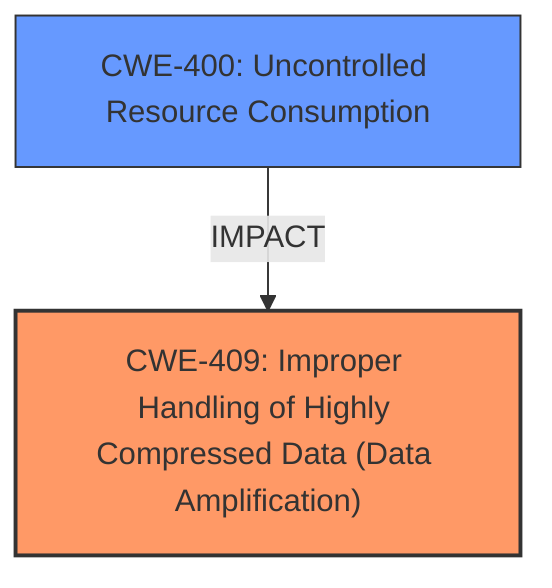

# Enhanced Analysis for CVE-2025-5031

# Summary
| CWE ID | CWE Name | Confidence | CWE Abstraction Level | CWE Vulnerability Mapping Label | CWE-Vulnerability Mapping Notes |
|---|---|---|---|---|---|
| CWE-409 | Improper Handling of Highly Compressed Data (Data Amplification) | 0.9 | Base | Allowed | Primary CWE - Root Cause|
| CWE-400 | Uncontrolled Resource Consumption | 0.7 | Base | Allowed-with-Review | Secondary - Impact|

## Evidence and Confidence

*   **Confidence Score:** 0.8
*   **Evidence Strength:** MEDIUM

## Relationship Analysis
The primary CWE is CWE-409, which directly addresses the improper handling of compressed data leading to amplification. CWE-400, Uncontrolled Resource Consumption, is a high-level consequence of the vulnerability. CWE-409 is a peer of other data amplification CWEs but is the best fit.



## Vulnerability Chain
The vulnerability chain starts with a specially crafted `wxapkg` file containing highly compressed data. The **lack of proper validation** of the file's internal metadata allows for data amplification, leading to excessive resource consumption (memory and disk space). This ultimately results in a denial-of-service condition or tool failure.

**Chain:**
1.  Malicious `wxapkg` file with compressed data.
2.  **Improper Handling of Highly Compressed Data (Data Amplification) (CWE-409)** due to **insufficient input validation**.
3.  **Uncontrolled Resource Consumption (CWE-400)**

## Summary of Analysis
The analysis primarily focuses on the provided vulnerability description and the "CVE Reference Links Content Summary". The key indicator is the "resource consumption" impact due to the processing of a malicious `wxapkg` file. The "CVE Reference Links Content Summary" solidifies this by mentioning the file format lacking sufficient validation leading to resource exhaustion, similar to a zip bomb.

CWE-409 (Improper Handling of Highly Compressed Data (Data Amplification)) is selected as the primary CWE because it directly addresses the root cause: the program's inability to handle compressed data properly, leading to data amplification and resource exhaustion. The suggested mitigations in the "CVE Reference Links Content Summary" such as enforcing limits on unpacked files and setting a maximum directory depth, directly align with preventing data amplification attacks. This matches the CWE description and examples where improper handling of compressed data causes denial-of-service.

CWE-400 (Uncontrolled Resource Consumption) is a secondary CWE, representing the impact of the vulnerability. While the vulnerability's description mentions "resource consumption," it's a consequence of the improper handling of compressed data.

The CWE selection is at the Base level, providing the most specific and accurate representation of the vulnerability's root cause and impact.

CWEs considered but not used:

*   CWE-79, CWE-89, CWE-117, CWE-1336: These relate to injection vulnerabilities, which is not the case here. The vulnerability is about how compressed data is handled, not about injecting malicious code.
*   CWE-434: This relates to unrestricted upload of dangerous file types. While a malicious file is involved, the core issue isn't the unrestricted upload but the improper handling of the file's contents after it has been uploaded or processed.
*   CWE-425: Relates to forced browsing, not related to the vulnerability.
*   CWE-73: External Control of File Name or Path, is not related to the vulnerability.
*   CWE-1325: Improperly Controlled Sequential Memory Allocation, is not related to the vulnerability.
*   CWE-789: Memory Allocation with Excessive Size Value, is not related to the vulnerability.
*   CWE-113: Improper Neutralization of CRLF Sequences in HTTP Headers ('HTTP Request/Response Splitting'), is not related to the vulnerability.
*   CWE-74: Improper Neutralization of Special Elements in Output Used by a Downstream Component ('Injection'), is not related to the vulnerability.
*   CWE-88: Improper Neutralization of Argument Delimiters in a Command ('Argument Injection'), is not related to the vulnerability.
*   CWE-184: Incomplete List of Disallowed Inputs, is not related to the vulnerability.
*   CWE-80: Improper Neutralization of Script-Related HTML Tags in a Web Page (Basic XSS), is not related to the vulnerability.
*   CWE-923: Improper Restriction of Communication Channel to Intended Endpoints, is not related to the vulnerability.
*   CWE-134: Use of Externally-Controlled Format String, is not related to the vulnerability.
*   CWE-116: Improper Encoding or Escaping of Output, is not related to the vulnerability.
*   CWE-252: Unchecked Return Value, is not directly linked as the root cause.


## CWE Relationship Analysis

Current CWEs represent these abstraction levels: .


### Vulnerability Chain Analysis

**Chain starting from CWE-400:**
- 400 (Uncontrolled Resource Consumption) - ROOT


**Chain starting from CWE-80:**
- 80 (Improper Neutralization of Script-Related HTML Tags in a Web Page (Basic XSS)) - ROOT


### CWE Relationship Diagram

```mermaid
graph TD
    classDef primary fill:#f96,stroke:#333,stroke-width:2px
    classDef secondary fill:#69f,stroke:#333
    classDef tertiary fill:#9e9,stroke:#333
```