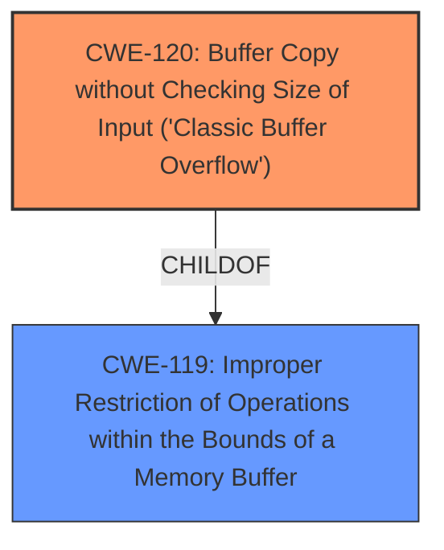

# Raw Analyzer Response for CVE-2025-5053

# Summary
| CWE ID | CWE Name | Confidence | CWE Abstraction Level | CWE Vulnerability Mapping Label | CWE-Vulnerability Mapping Notes |
|---|---|---|---|---|---|
| CWE-120 | Buffer Copy without Checking Size of Input ('Classic Buffer Overflow') | 1.0 | Base | Allowed-with-Review | Primary CWE |
| CWE-119 | Improper Restriction of Operations within the Bounds of a Memory Buffer | 0.7 | Class | Discouraged | Secondary Candidate |

## Evidence and Confidence

*   **Confidence Score:** 0.9
*   **Evidence Strength:** HIGH

## Relationship Analysis
The primary CWE identified is CWE-120, which is a base-level CWE. It is a child of CWE-119, which is a class-level CWE. CWE-120 is preferred over CWE-119 because it is more specific and accurately describes the vulnerability, which is a buffer copy without checking the size of the input. There are also chain relationships that could be considered as CWE-120 can follow CWE-456, CWE-416, CWE-231, and CWE-170. However, those would be later stages of an exploit and not the root cause.

## Vulnerability Chain
The vulnerability chain starts with the **improper handling of the MDIR command**, leading to **a buffer overflow** due to **missing input size validation**. This allows an attacker to overwrite memory and potentially execute arbitrary code.

## Summary of Analysis
The initial analysis identified the vulnerability as a **buffer overflow**, specifically due to the server's failure to check the size of the input when handling the `MDIR` command. The retriever results also pointed to CWE-120 as a potential match. The final conclusion is that CWE-120 accurately represents the **root cause of the vulnerability**, as it directly addresses the **buffer copy operation without size checking**.

The selection of CWE-120 is based on the following evidence:

*   The vulnerability description explicitly mentions a **buffer overflow** in the `MDIR` command handler.
*   The analysis of CVE-2025-5053 confirms that the server **does not properly validate the length of the input**.
*   The exploit involves sending a payload larger than the allocated buffer.

The retriever results show CWE-120 as a strong candidate, with a good similarity score. While CWE-119 is a parent of CWE-120, the latter is more specific and accurately captures the nature of the vulnerability.

The MITRE mapping guidance suggests that CWE-120 is allowed with review. This is because it can be misused if the vulnerability is not actually a buffer copy operation. However, in this case, the evidence clearly indicates that the vulnerability involves copying data into a buffer without proper size validation.

The level of specificity is optimal because it directly addresses the coding error that leads to the vulnerability.

Relevant CWE Information:

# Enhanced Context (25 CWEs)
The following CWEs were identified as potentially relevant to this vulnerability:

## CWE-193: Off-by-one Error
**Abstraction Level**: Base
**Similarity Score**: 0.74
**Source**: dense

**Description**:
A product calculates or uses an incorrect maximum or minimum value that is 1 more, or 1 less, than the correct value.
**Not Used:** This CWE does not apply because the issue is not an off-by-one error, but a general lack of input validation leading to a buffer overflow.

## CWE-131: Incorrect Calculation of Buffer Size
**Abstraction Level**: Base
**Similarity Score**: 0.74
**Source**: dense

**Description**:
The product does not correctly calculate the size to be used when allocating a buffer, which could lead to a buffer overflow.
**Not Used:** While related to buffer overflows, this CWE focuses on the incorrect calculation of the buffer size itself, whereas the current vulnerability is due to lack of input validation.

## CWE-434: Unrestricted Upload of File with Dangerous Type
**Abstraction Level**: Base
**Similarity Score**: 0.73
**Source**: dense

**Description**:
The product allows the upload or transfer of dangerous file types that are automatically processed within its environment.
**Not Used:** This CWE is specific to file uploads and is not relevant to the buffer overflow vulnerability in the `MDIR` command handler.

## CWE-191: Integer Underflow (Wrap or Wraparound)
**Abstraction Level**: Base
**Similarity Score**: 0.73
**Source**: dense

**Description**:
The product subtracts one value from another, such that the result is less than the minimum allowable integer value, which produces a value that is not equal to the correct result.
**Not Used:** This CWE relates to integer underflow, which is not the cause of the buffer overflow in this case.

## CWE-125: Out-of-bounds Read
**Abstraction Level**: Base
**Similarity Score**: 0.73
**Source**: dense

**Description**:
The product reads data past the end, or before the beginning, of the intended buffer.
**Not Used:** The vulnerability is a buffer overflow (write), not an out-of-bounds read.

## CWE-134: Use of Externally-Controlled Format String
**Abstraction Level**: Base
**Similarity Score**: 0.73
**Source**: dense

**Description**:
The product uses a function that accepts a format string as an argument, but the format string originates from an external source.
**Not Used:** This CWE is specific to format string vulnerabilities, which is not the case here.

## CWE-617: Reachable Assertion
**Abstraction Level**: Base
**Similarity Score**: 0.73
**Source**: dense

**Description**:
The product contains an assert() or similar statement that can be triggered by an attacker, which leads to an application exit or other behavior that is more severe than necessary.
**Not Used:** This CWE is not relevant to the buffer overflow vulnerability.

## CWE-824: Access of Uninitialized Pointer
**Abstraction Level**: Base
**Similarity Score**: 0.72
**Source**: dense

**Description**:
The product accesses or uses a pointer that has not been initialized.
**Not Used:** This CWE is not relevant to the buffer overflow vulnerability.

## CWE-789: Memory Allocation with Excessive Size Value
**Abstraction Level**: Variant
**Similarity Score**: 0.72
**Source**: dense

**Description**:
The product allocates memory based on an untrusted, large size value, but it does not ensure that the size is within expected limits, allowing arbitrary amounts of memory to be allocated.
**Not Used:** This CWE is not relevant to the buffer overflow vulnerability.

## CWE-346: Origin Validation Error
**Abstraction Level**: Class
**Similarity Score**: 0.72
**Source**: dense

**Description**:
The product does not properly verify that the source of data or communication is valid.
**Not Used:** This CWE is not relevant to the buffer overflow vulnerability.

## CWE-190: Integer Overflow or Wraparound
**Abstraction Level**: Base
**Similarity Score**: 1200.63
**Source**: sparse

**Description**:
The product performs a calculation that can
         produce an integer overflow or wraparound when the logic
         assumes that the resulting value will always be larger than
         the original value. This occurs when an integer value is
         incremented to a value that is too large to store in the
         associated representation. When this occurs, the value may
         become a very small or negative number.
**Not Used:** This CWE relates to integer overflow, which is not the cause of the buffer overflow in this case.

## CWE-125: Out-of-bounds Read
**Abstraction Level**: Base
**Similarity Score**: 1159.71
**Source**: sparse

**Description**:
The product reads data past the end, or before the beginning, of the intended buffer.
**Not Used:** The vulnerability is a buffer overflow (write), not an out-of-bounds read.

## CWE-1284: Improper Validation of Specified Quantity in Input
**Abstraction Level**: Base
**Similarity Score**: 1149.15
**Source**: sparse

**Description**:
The product receives input that is expected to specify a quantity (such as size or length), but it does not validate or incorrectly validates that the quantity has the required properties.
**Not Used:** Although this CWE relates to **improper validation**, CWE-120 is more specific and directly addresses the **buffer copy without checking size** aspect of this vulnerability.

## CWE-193: Off-by-one Error
**Abstraction Level