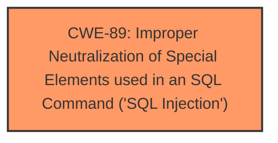

# Enhanced Analysis for CVE-2025-5079

# Summary
| CWE ID | CWE Name | Confidence | CWE Abstraction Level | CWE Vulnerability Mapping Label | CWE-Vulnerability Mapping Notes |
|---|---|---|---|---|---|
| CWE-89 | Improper Neutralization of Special Elements used in an SQL Command ('SQL Injection') | 1.0 | Base | Allowed | Primary CWE |

## Evidence and Confidence

*   **Confidence Score:** 1.0
*   **Evidence Strength:** HIGH

## Relationship Analysis
The primary relationship influencing the selection is that CWE-89 is a Base level CWE specifically designed for **SQL Injection** vulnerabilities. This offers the most precise classification, which is supported by strong evidence within the vulnerability description and supporting content.



## Vulnerability Chain
The vulnerability chain is straightforward:

1.  **Root Cause:** **Improper Neutralization** of special elements used in an SQL Command (**SQL Injection**, CWE-89) due to lack of input validation of the 'remark' parameter.
2.  **Impact:** The attacker can execute arbitrary SQL queries, leading to unauthorized data access, data tampering, and potential system compromise.

## Summary of Analysis
The analysis concludes that **CWE-89** (Improper Neutralization of Special Elements used in an SQL Command ('SQL Injection')) is the most appropriate CWE for this vulnerability. This determination is based on:

*   **Vulnerability Description:** The description explicitly states that the vulnerability is an **SQL Injection** vulnerability, affecting the `remark` argument in `/admin/updateorder.php`.
*   **CVE Reference Links Content Summary:** This section confirms that the root cause is insufficient user input validation of the 'remark' parameter, leading to the injection of malicious SQL queries.
*   **Retriever Results:** The retriever identifies **CWE-89** as the top candidate with a score of 1.0, indicating a strong match.
*   **CWE Specifications:** **CWE-89** directly addresses the vulnerability, where externally influenced input is used to construct an SQL command without proper neutralization of special elements.

The evidence overwhelmingly supports the classification of this vulnerability as **CWE-89**. The provided information clearly points to the **improper handling of user input** in the construction of SQL queries, which is the defining characteristic of **SQL Injection** vulnerabilities. The selection is further reinforced by the high relevance score from the retriever and the explicit mention of **SQL Injection** in the vulnerability description.

Other CWEs Considered:

*   CWE-79 (Improper Neutralization of Input During Web Page Generation ('Cross-site Scripting')): While also related to **improper neutralization** of input, this is specific to web page generation and XSS, which is not the case here.
*   CWE-74 (Improper Neutralization of Special Elements in Output Used by a Downstream Component ('Injection')): This is a more general "Injection" class. While the vulnerability involves injection, **CWE-89** is more specific to the type of injection (SQL).
*   CWE-1336 (Improper Neutralization of Special Elements Used in a Template Engine): It is not clear that a template engine is involved, so this is less precise.
*   CWE-117 (Improper Output Neutralization for Logs): This is specific to logging, and there is no indication that the vulnerability directly involves logging.


## CWE Relationship Analysis

Current CWEs represent these abstraction levels: .


### Vulnerability Chain Analysis

**Chain starting from CWE-89:**
- 89 (Improper Neutralization of Special Elements used in an SQL Command ('SQL Injection')) - ROOT


**Chain starting from CWE-79:**
- 79 (Improper Neutralization of Input During Web Page Generation ('Cross-site Scripting')) - ROOT


### CWE Relationship Diagram

```mermaid
graph TD
    classDef primary fill:#f96,stroke:#333,stroke-width:2px
    classDef secondary fill:#69f,stroke:#333
    classDef tertiary fill:#9e9,stroke:#333
```