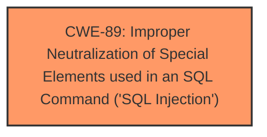

# Analysis for CVE-2025-5081

# Summary
| CWE ID | CWE Name | Confidence | CWE Abstraction Level | CWE Vulnerability Mapping Label | CWE-Vulnerability Mapping Notes |
|---|---|---|---|---|---|
| CWE-89 | Improper Neutralization of Special Elements used in an SQL Command ('SQL Injection') | 1.0 | Base | Allowed | Primary CWE. The vulnerability is caused by insufficient input validation leading to SQL injection. |

## Evidence and Confidence

*   **Confidence Score:** 1.0
*   **Evidence Strength:** HIGH

## Relationship Analysis
The primary relationship impacting the decision is the direct match between the vulnerability description and the definition of CWE-89. The vulnerability description explicitly states "**sql injection**" due to manipulation of the 'mobilenumber' argument, which aligns directly with CWE-89's focus on improper neutralization of special elements used in an SQL command. Other CWEs were considered, but none matched as closely as CWE-89.

## Vulnerability Chain
The vulnerability chain consists of the following:
1.  **Root Cause:** Insufficient input validation of the 'mobilenumber' parameter.
2.  **Weakness:** CWE-89 - Improper Neutralization of Special Elements used in an SQL Command ('SQL Injection').
3.  **Impact:** Unauthorized database access, sensitive data leakage, data tampering, comprehensive system control, and service interruption.

## Summary of Analysis
The analysis is based on the clear evidence provided in the vulnerability description and the CVE Reference Links Content Summary. The vulnerability is explicitly identified as an SQL injection vulnerability affecting the 'mobilenumber' parameter in the '/adminprofile.php' file. The provided evidence includes the attack vector (manipulation of the 'mobilenumber' argument), the root cause (**insufficient user input validation**), and the potential impact (unauthorized database access, sensitive data leakage, etc.). This evidence strongly supports the selection of CWE-89 as the primary CWE. The retriever results also list CWE-89 as the top candidate with a score of 1.0. The suggested repair in the CVE Reference Links Content Summary mentions prepared statements, parameter binding, and input validation which are all mitigations for SQL Injection. The relationships of other CWEs were considered, but none were as directly applicable as CWE-89. CWE-89 is at the optimal level of specificity (Base).

Relevant CWE Information:
CWE-89: Improper Neutralization of Special Elements used in an SQL Command ('SQL Injection')
The product constructs all or part of an SQL command using externally-influenced input from an upstream component, but it does not neutralize or incorrectly neutralizes special elements that could modify the intended SQL command when it is sent to a downstream component. Without sufficient removal or quoting of SQL syntax in user-controllable inputs, the generated SQL query can cause those inputs to be interpreted as SQL instead of ordinary user data.

Other CWEs Considered:

*   CWE-79 (Improper Neutralization of Input During Web Page Generation ('Cross-site Scripting')): While input neutralization is a general concept, the specific vulnerability involves SQL injection, making CWE-89 a more precise match.
*   CWE-74 (Improper Neutralization of Special Elements in Output Used by a Downstream Component ('Injection')): Similar to CWE-79, this is a broader category. SQL injection is a more specific type of injection.
*   CWE-78 (Improper Neutralization of Special Elements used in an OS Command ('OS Command Injection')): This CWE is specific to OS command injection, which is not the case here.
*   CWE-96 (Improper Neutralization of Directives in Statically Saved Code ('Static Code Injection')): Not applicable because the injection is not into statically saved code.
*   CWE-425 (Direct Request ('Forced Browsing')): Not applicable because the vulnerability isn't about bypassing authorization checks.
*   CWE-1336 (Improper Neutralization of Special Elements Used in a Template Engine): Not applicable because the injection is not in a template engine.
*   CWE-434 (Unrestricted Upload of File with Dangerous Type): Not applicable because the vulnerability is not related to file uploads.
*   CWE-116 (Improper Encoding or Escaping of Output): While encoding/escaping could be a potential mitigation, the core issue is the lack of proper input validation allowing SQL injection.