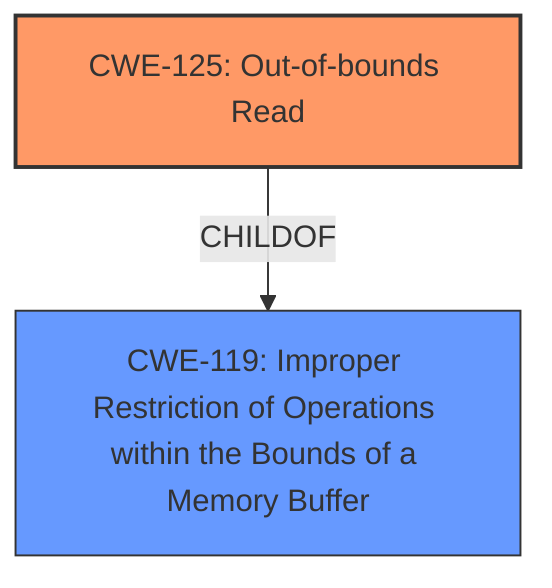

# Analysis Report for CVE-2025-5167

# Vulnerability Analysis Report: CVE-2025-5167

## Description

A vulnerability was found in Open Asset Import Library Assimp 5.4.3. It has been declared as problematic. Affected by this vulnerability is the function LWOImporterGetS0 in the library assimp/code/AssetLib/LWO/LWOLoader.h. The manipulation of the argument out leads to **out-of-bounds read**. The attack needs to be approached locally. The exploit has been disclosed to the public and may be used. The project decided to collect all Fuzzer bugs in a main-issue to address them in the future.

## Vulnerability Description Key Phrases

- **Weakness:** out-of-bounds read
- **Vector:** manipulation of argument out
- **Product:** Open Asset Import Library Assimp
- **Version:** 5.4.3
- **Component:** function LWOImporterGetS0 in assimp/code/AssetLib/LWO/LWOLoader.h

## Analysis (with Relationship Data)

# Summary
| CWE ID | CWE Name | Confidence | CWE Abstraction Level | CWE Vulnerability Mapping Label | CWE-Vulnerability Mapping Notes |
|---|---|---|---|---|---|
| CWE-125 | Out-of-bounds Read | 1.0 | Base | Allowed | Primary CWE |
| CWE-119 | Improper Restriction of Operations within the Bounds of a Memory Buffer | 0.7 | Class | Allowed | Secondary Candidate |

## Evidence and Confidence

*   **Confidence Score:** 0.9
*   **Evidence Strength:** HIGH

## Relationship Analysis
The primary CWE is CWE-125, Out-of-bounds Read. This is a base-level CWE. CWE-125 is a child of CWE-119, Improper Restriction of Operations within the Bounds of a Memory Buffer. Since there is an out-of-bounds read, it implies there was an improper restriction of operations within the bounds of a memory buffer.



## Vulnerability Chain
The vulnerability chain starts with the manipulation of the `out` argument in the function `LWOImporterGetS0`. This **manipulation** leads to an **out-of-bounds read**.

## Summary of Analysis
The vulnerability description clearly states that the manipulation of the argument `out` leads to an **out-of-bounds read**. The github content confirms the **root cause** of the vulnerability is a heap-buffer-overflow in `LWOImporter::GetS0`. The function checks the buffer size but still includes the one-past-the-end byte in the string `out` if the data isn't null-terminated. The **weakness** is reading beyond the allocated buffer.

The retriever results list CWE-125, Out-of-bounds Read, as a possible candidate. Given the information, CWE-125 is the most appropriate primary CWE.

CWE-119 is a parent of CWE-125.

I am selecting CWE-125 as the primary CWE because it specifically describes the **out-of-bounds read** condition.

Relevant CWE Information:

# Enhanced Context (25 CWEs)
The following CWEs were identified as potentially relevant to this vulnerability:

## CWE-125: Out-of-bounds Read
**Abstraction Level**: Base
**Similarity Score**: 0.74
**Source**: dense

**Description**:
The product reads data past the end, or before the beginning, of the intended buffer.

**Mapping Guidance**:
- Usage: Allowed
- Rationale: This CWE entry is at the Base level of abstraction, which is a preferred level of abstraction for mapping to the root causes of vulnerabilities.


## CWE Relationship Analysis

Current CWEs represent these abstraction levels: .


### Vulnerability Chain Analysis

**Chain starting from CWE-119:**
- 119 (Improper Restriction of Operations within the Bounds of a Memory Buffer) - ROOT


**Chain starting from CWE-125:**
- 125 (Out-of-bounds Read) - ROOT


### CWE Relationship Diagram

```mermaid
graph TD
    classDef primary fill:#f96,stroke:#333,stroke-width:2px
    classDef secondary fill:#69f,stroke:#333
    classDef tertiary fill:#9e9,stroke:#333
```


*Report generated on 2025-07-15 03:27:36*
