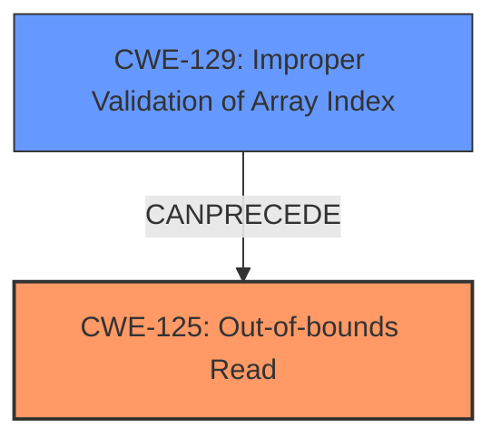

# Analysis Report for CVE-2025-5168

# Vulnerability Analysis Report: CVE-2025-5168

## Description

A vulnerability was found in Open Asset Import Library Assimp 5.4.3. It has been rated as problematic. Affected by this issue is the function MDLImporterImportUVCoordinate_3DGS_MDL345 of the file assimp/code/AssetLib/MDL/MDLLoader.cpp. The manipulation of the argument iIndex leads to **out-of-bounds read**. An attack has to be approached locally. The exploit has been disclosed to the public and may be used. The project decided to collect all Fuzzer bugs in a main-issue to address them in the future.

## Vulnerability Description Key Phrases

- **Weakness:** out-of-bounds read
- **Product:** Open Asset Import Library Assimp
- **Version:** 5.4.3
- **Component:** MDLImporterImportUVCoordinate_3DGS_MDL345 function of the file assimp/code/AssetLib/MDL/MDLLoader.cpp

## Analysis (with Relationship Data)

# Summary
| CWE ID | CWE Name | Confidence | CWE Abstraction Level | CWE Vulnerability Mapping Label | CWE-Vulnerability Mapping Notes |
|---|---|---|---|---|---|
| CWE-125 | Out-of-bounds Read | 1.0 | Base | Primary | Allowed |
| CWE-129 | Improper Validation of Array Index | 0.7 | Variant | Secondary | Allowed |

## Evidence and Confidence

*   **Confidence Score:** 0.85
*   **Evidence Strength:** HIGH

## Relationship Analysis
The primary weakness is **CWE-125 (Out-of-bounds Read)**, which directly aligns with the vulnerability description. **CWE-129 (Improper Validation of Array Index)** is a potential secondary weakness because the **out-of-bounds read** could be caused by improper validation of the array index. The relationship is that **CWE-129** could **CANPRECEDE** **CWE-125**. Both are at appropriate abstraction levels (Base and Variant, respectively).



## Vulnerability Chain
The vulnerability chain starts with an **improper array index validation** (**CWE-129**), potentially leading to an **out-of-bounds read** (**CWE-125**). The final impact is a crash or potential code execution.

## Summary of Analysis
The primary assessment is based on the vulnerability description which explicitly states an **out-of-bounds read** due to manipulation of `iIndex`. This aligns directly with **CWE-125**. The GitHub issue #6170 analysis provides additional context, indicating that the **root cause** is the incorrect check of `pcHeader->synctype` which leads to potentially large values for `iIndex`. This suggests that **CWE-129**, Improper Validation of Array Index, could be a contributing factor.

The selection of **CWE-125** is at the optimal level of specificity because the vulnerability description clearly describes an **out-of-bounds read**. **CWE-129** is a plausible contributing cause given that improper validation of an array index can lead to an **out-of-bounds read**.

Relevant CWE Information:

# Enhanced Context (25 CWEs)
The following CWEs were identified as potentially relevant to this vulnerability:

## CWE-125: Out-of-bounds Read
**Abstraction Level**: Base
**Similarity Score**: 0.76
**Source**: dense

**Description**:
The product reads data past the end, or before the beginning, of the intended buffer.

**Mapping Guidance**:
- Usage: Allowed
- Rationale: This CWE entry is at the Base level of abstraction, which is a preferred level of abstraction for mapping to the root causes of vulnerabilities.


## CWE-129: Improper Validation of Array Index
**Abstraction Level**: Variant
**Similarity Score**: 0.75
**Source**: dense

**Description**:
The product uses untrusted input when calculating or using an array index, but the product does not validate or incorrectly validates the index to ensure the index references a valid position within the array.

**Mapping Guidance**:
- Usage: Allowed
- Rationale: This CWE entry is at the Variant level of abstraction, which is a preferred level of abstraction for mapping to the root causes of vulnerabilities.

### Other CWEs Considered but Not Used
*   **CWE-787 (Out-of-bounds Write)**: While related to buffer overflows, the vulnerability description explicitly mentions an **out-of-bounds read**, making **CWE-125** a more accurate classification.
*   **CWE-122 (Heap-based Buffer Overflow)**: The description doesn't explicitly state a heap-based overflow.
*   **CWE-190 (Integer Overflow or Wraparound)** and **CWE-131 (Incorrect Calculation of Buffer Size)**: These are potential contributing factors, but there isn't enough information in the description to confidently assign them.
*   **CWE-823 (Use of Out-of-range Pointer Offset)** and **CWE-825 (Expired Pointer Dereference)**: These CWEs are related to pointer issues but don't directly align with the described **out-of-bounds read**.
*   **CWE-119 (Improper Restriction of Operations within the Bounds of a Memory Buffer)**: This is a broader category, and **CWE-125** is a more specific match.


## CWE Relationship Analysis

Current CWEs represent these abstraction levels: .


### Vulnerability Chain Analysis

**Chain starting from CWE-823:**
- 823 (Use of Out-of-range Pointer Offset) - ROOT


**Chain starting from CWE-125:**
- 125 (Out-of-bounds Read) - ROOT


### CWE Relationship Diagram

```mermaid
graph TD
    classDef primary fill:#f96,stroke:#333,stroke-width:2px
    classDef secondary fill:#69f,stroke:#333
    classDef tertiary fill:#9e9,stroke:#333
```


*Report generated on 2025-07-15 03:27:52*
