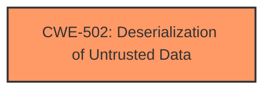

# Analysis for CVE-2025-5173

# Summary
| CWE ID | CWE Name | Confidence | CWE Abstraction Level | CWE Vulnerability Mapping Label | CWE-Vulnerability Mapping Notes |
|---|---|---|---|---|---|
| CWE-502 | Deserialization of Untrusted Data | 1.0 | Base | Primary | Allowed |

## Evidence and Confidence

*   **Confidence Score:** 1.0
*   **Evidence Strength:** HIGH

## Relationship Analysis
The primary CWE is CWE-502, which stands alone. There are no parent/child or chain relationships that seem directly applicable based on the information provided. The abstraction level is Base, which is the preferred level.

## Vulnerability Chain
The vulnerability chain is straightforward: the application deserializes untrusted data leading to potential remote code execution.

## Summary of Analysis
The analysis indicates a **deserialization** vulnerability due to the use of `torch.load` on untrusted data. The primary CWE is CWE-502 (Deserialization of Untrusted Data), which accurately describes the **weakness**. The evidence is strong, and the confidence is high.

The vulnerability description states: "The manipulation of the argument path leads to **deserialization**." The CVE Reference Links Content Summary states: "The `load` function uses `torch.load` to deserialize data from a specified path without validation. `torch.load` can execute arbitrary code when loading malicious pickle data." This confirms the presence of a **deserialization** vulnerability.

The Retriever Results list CWE-502 as a potential match, and its description aligns perfectly with the vulnerability. The other CWEs listed do not apply to this particular vulnerability.

The selected CWE is at the optimal level of specificity (Base).